# Design Document: Goal-Oriented Compaction

## Overview

**Goal-Oriented Compaction** fills in the `TODO(deferred)` body of the
`GoalOrientedCompaction` `CompactionStrategy` in
`crates/halter-runtime/src/goal_oriented_compaction.rs`. The `runtime-goal-tracking` spec
built the seam this strategy reads through (`CompactionContext::goal_log()` and the read-only
`GoalLog` handle) and shipped a safe skeleton that delegates every decision to `ModelSummary`.
This design specifies the real body — the part its "Flow 3" sketch and deferred
Requirements 11/12 left open.

The strategy compresses a session's live transcript window along the boundaries of its goal
tree. When goal tracking is on and the tree carries usable structure, it:

1. Reads the folded `GoalTree` through `ctx.goal_log().get_tree()` (read-only).
2. **Partitions** `ctx.state().messages` by the goal node that owns each message — a total,
   order-preserving partition with an explicit *unmapped* bucket for messages whose
   `goal_node` tag is `None` or names a node absent from the tree.
3. **Classifies** each partition as either **open frontier** (work still in flight) or
   **fully-closed subtree** (finished work), using only the tree it read.
4. **Preserves** open-frontier and unmapped messages **verbatim** (byte-identical).
5. **Distills** each fully-closed subtree's messages down to a single compact record —
   hypothesis + resolution + `subtree_hash`, optionally referencing an existing Tier 2 memory.
6. **Assembles** an order-preserving replacement window and returns it as `CompactionEffects`.

Everything else falls back to `ModelSummary` and produces the **identical** result the default
strategy would: `off` mode (`goal_log() == None`), a tree-read error, a **thin** tree
(`len() <= 1`), or a **largely-unmapped** transcript (mapped-coverage below a fixed fraction).
This gives the strategy its defining guarantee: **it is never worse than the default**. When it
cannot construct a replacement window that retains every open-frontier and unmapped message, it
falls back rather than emit a lossy or larger window.

The pass is a **pure, read-only function** of the message window and the tree it read. It
appends no `Goal` payload, mutates neither the goal tree nor the goal event log, sends nothing
to any provider (the distillation is assembled locally, not model-written), and changes no
persisted format.

This document combines a high-level view (architecture, components, data models, the compact
flow) with a low-level view (Rust type sketches, function signatures, and algorithmic
pseudocode). Code sketches use Rust to match the workspace; they are illustrative contracts,
not final APIs. It follows the `halter-goals` / `runtime-goal-tracking` design-doc style for
consistency.

### Scope

In scope (this feature):

- The `GoalOrientedCompaction::compact` body: partition, classify, preserve, distill, assemble.
- The **fallback decision logic**: off-mode, tree-read error, thin tree, largely-unmapped —
  all yielding the identical `ModelSummary` result; `Manual`-trigger error propagation vs
  `Automatic` graceful degradation.
- The **Distillation** representation and how it materializes as message(s) in the replacement
  window.
- The optional **Tier 2 memory reference** in a distillation (lookup only; no authoring).
- The **totality guarantee** (never worse than default; fall back rather than lossy/larger).
- **Determinism / read-only purity.**

Out of scope / non-goals:

- **The seam is reused, not re-specified.** `CompactionContext::goal_log()` and `GoalLog`
  (`get_tree`, `goal_events`) exist and are honored as-is (prior spec's Requirement 11).
- **No provider/server-side auto-compaction** — the standing `CompactionStrategy` prohibition
  holds; this runs only under the runtime-owned trigger, exactly like `ModelSummary`.
- **No change to attribution, the active-goal stack, the goal tool, or `subtree_hash` inputs** —
  owned by `runtime-goal-tracking` / `halter-goals`, consumed unchanged.
- **No redesign of Tier 2** — a distillation may *reference* an existing memory by id; this
  spec does not author, rank, or invalidate memories.
- **Off mode is untouched** — `goal_log()` returns `None` and the byte-identical `ModelSummary`
  path is taken, exactly as the skeleton does today.

This feature makes **no revisions to other crates**. It is entirely additive within
`halter-runtime`, replacing the deferred body and its conservative `thin_or_unmapped` heuristic
with the full algorithm, and reusing `ModelSummary`, the `GoalLog` seam, the folded `GoalTree`
(`halter-protocol::goals`, re-exported by `halter-goals`), the goal-tagged `SessionEventPayload`
variants, and the Tier 2 `MemoryStore::has_memory_for((node_id, subtree_hash))` lookup.

## Architecture

`GoalOrientedCompaction` is a `CompactionStrategy` the runtime installs when
`[context].goal_tracking = auto`. The runtime owns *when* compaction runs (the token ledger,
the two trigger points); the strategy owns *what happens*. It is a **pure reader**: it reads the
live `SessionState` window and the session's folded goal tree through the per-session
`CompactionContext`, and emits a `CompactionEffects` replacement window. It holds a
`ModelSummary` as its fallback and defers to it on every non-goal-oriented path.

```mermaid
graph TD
    subgraph Runtime["halter-runtime (owns WHEN)"]
        LEDGER[Token ledger reaches threshold<br/>Automatic / Manual / Rollover]
        TRIG[Compaction trigger at a<br/>consistent context boundary]
    end

    subgraph Strategy["GoalOrientedCompaction (owns WHAT)"]
        COMPACT["compact(ctx)"]
        GATE{goal_log&#40;&#41; Some?<br/>tree readable?<br/>usable &#40;not thin/unmapped&#41;?}
        PART[Partition messages by owning goal_node]
        CLASS[Classify: open frontier vs fully-closed subtree]
        BUILD[Preserve open+unmapped verbatim,<br/>distill closed subtrees,<br/>assemble order-preserving window]
        TOTAL{Totality holds &&<br/>window not larger?}
        FB[ModelSummary fallback]
    end

    subgraph Ctx["CompactionContext (per-session seam)"]
        STATE["state&#40;&#41;.messages<br/>(live window)"]
        GLOG["goal_log&#40;&#41; -> Option&lt;GoalLog&gt;"]
        TRG["trigger&#40;&#41;"]
    end

    subgraph Goals["halter-goals / halter-protocol::goals (read-only)"]
        TREE["GoalLog::get_tree&#40;&#41; -> GoalTree"]
        EVENTS["GoalLog::goal_events&#40;&#41; / log replay<br/>MessageItem.goal_node tags"]
        MEM["MemoryStore::has_memory_for&#40;node,hash&#41;<br/>(optional Tier 2 ref)"]
    end

    LEDGER --> TRIG --> COMPACT
    COMPACT --> GATE
    GATE -->|No| FB
    GATE -->|Yes| PART --> CLASS --> BUILD --> TOTAL
    TOTAL -->|No| FB
    TOTAL -->|Yes| EFF[CompactionEffects]
    FB --> EFF
    EFF --> TRIG

    COMPACT -.reads.-> STATE
    COMPACT -.reads.-> GLOG
    COMPACT -.reads.-> TRG
    GLOG -.-> TREE
    GLOG -.-> EVENTS
    PART -.reads tags.-> EVENTS
    BUILD -.optional lookup.-> MEM
```



**One decision surface, one fallback.** Every path that is not a successful goal-oriented
rewrite converges on the *same* `ModelSummary` call with the *same* `CompactionContext`, so the
result is identical to the default. The only paths that differ from the default are (a) a
successful distillation and (b) the trigger-specific error behavior the `CompactionStrategy`
contract already mandates (propagate for `Manual`, degrade to a warning for `Automatic`).

**Reads, never writes.** The strategy touches only reads on the seam (`get_tree`, log replay
for tags, an optional `has_memory_for` lookup). It never calls `ctx.append`, `ctx.infer`, or
`ctx.record` on the goal-oriented path (those would append to the log); the distillation is a
locally-built `Message`. `ModelSummary`, on the fallback path, is free to use those as it does
today.

**Separation of concerns.**

| Concern | Owner | Notes |
| --- | --- | --- |
| When compaction runs, trigger semantics | Runtime | Unchanged; `window_policy` delegates to `ModelSummary` |
| Which node owns a message | `goal_node` tag on the shared log | Source of truth; strategy never infers from content |
| Goal semantics, `subtree_hash`, closure | `halter-goals` | Consumed read-only; `subtree_hash` inputs unchanged |
| Tier 2 memory identity | `halter-goals` Tier 2 | Strategy only *reads* `has_memory_for` |
| Partition / classify / distill / assemble | `GoalOrientedCompaction` | This design |
| Model-written summary fallback | `ModelSummary` | Reused unchanged |

## Components and Interfaces

### Component 1: `GoalOrientedCompaction` (the strategy)

**Purpose:** Compress the transcript along goal boundaries, or fall back to `ModelSummary`.

The struct is unchanged from the skeleton — a unit-like strategy holding its `ModelSummary`
fallback. `window_policy`, `tools`, and `prompt_segments` continue to delegate verbatim to the
fallback (Requirement 1.1, 1.2): the strategy adds no thresholds, tools, or prompt segments.
Only `compact` gains a body.

```rust
#[derive(Debug, Clone, Copy, Default)]
pub struct GoalOrientedCompaction {
    fallback: ModelSummary,
}

#[async_trait]
impl CompactionStrategy for GoalOrientedCompaction {
    fn window_policy(&self) -> WindowPolicy { self.fallback.window_policy() } // R1.1
    fn tools(&self) -> Vec<Arc<dyn Tool>> { self.fallback.tools() }           // R1.2
    fn prompt_segments(&self) -> Vec<PromptSegment> { self.fallback.prompt_segments() } // R1.2

    async fn compact(&self, ctx: CompactionContext<'_>)
        -> anyhow::Result<Option<CompactionEffects>>;
}
```

**`compact` responsibilities (in order):**

1. **Off-mode gate.** `let Some(goal_log) = ctx.goal_log() else { return fallback }`
   (Requirement 1.3, 7.2). No goal-store call is made.
2. **Read the tree.** `goal_log.get_tree().await`; on `Err`, fall back for this pass without
   failing it (Requirement 2.3, 9.1).
3. **Thin gate.** `tree.len() <= 1` → fall back (Requirement 6.1, 6.2). A legacy log yields an
   empty tree and takes this path (Requirement 9.4).
4. **Read owning-node tags.** Replay the session log to correlate each message with its
   `goal_node` tag (Requirement 2.2); build the partition.
5. **Unmapped gate.** If mapped-coverage < `MAPPED_COVERAGE_THRESHOLD`, fall back
   (Requirement 6.3, 6.4).
6. **Classify + build.** Preserve open-frontier + unmapped verbatim; distill fully-closed
   subtrees; assemble an order-preserving window.
7. **Totality gate.** If totality cannot be met or the window would be larger than the
   original, fall back (Requirement 7.1, 7.3, 7.4).
8. Return `Some(CompactionEffects { .. })`.

### Component 2: The owning-node reader (message → `goal_node`)

**Purpose:** For each `Message` in `ctx.state().messages`, determine its owning `GoalNodeId`
(or *unmapped*), using the `goal_node` tag as the sole source of truth (Requirement 2.2, 8.3).

The `goal_node` tag lives on the `SessionEventPayload::MessageItem { message, goal_node }`
event, **not** on the provider-visible `Message` (that is the `runtime-goal-tracking` decision:
the tag is never provider-visible). Each `Message` carries a stable `MessageId`. So the reader
correlates messages to tags by message id:

```rust
/// Map every message id in the log to the goal node that owned its emitting
/// event. Built by replaying the session log's MessageItem payloads (read-only).
/// A message whose event carried `goal_node = None`, or that has no MessageItem
/// event, is absent from the map (=> unmapped).
async fn owning_nodes(goal_log: &GoalLog<'_>)
    -> Result<HashMap<MessageId, GoalNodeId>, GoalStoreError>;
```

Implementation note: `GoalLog::goal_events()` returns only `Goal` payloads; the owning-node map
needs the `MessageItem` tags, which come from the **same** shared log. The reader replays the
session log once (the same `SessionStore::replay` `goal_events()` uses) and keeps
`MessageItem { message, goal_node: Some(n) }`, recording `message.id() -> n`. This is the one
place the strategy reads transcript-event tags; it is a pure read.

**Ownership resolution for a message `m`:**

- `owning.get(m.id())` is `Some(n)` **and** `tree.contains(&n)` → owner is node `n` (mapped).
- otherwise (`None`, or `n` absent from the folded tree) → **unmapped** (Requirement 3.4).

Ownership never depends on message content, wall-clock time, or collection iteration order
(Requirement 8.3).

### Component 3: The partition

**Purpose:** Split the window into per-node buckets plus one unmapped bucket, totally and
order-preservingly (Requirement 3).

See § Data Models for the `Partition` structure. The partition assigns each message to exactly
one bucket (Requirement 3.1) such that concatenating the buckets in original order reproduces
the window with no loss and no duplication (Requirement 3.2). Buckets retain each message's
original window index so relative order can be reconstructed on assembly (Requirement 3.3, 5.5).

### Component 4: The frontier classifier

**Purpose:** Decide, for each mapped node, whether it is **on the open frontier** or the root of
(or inside) a **fully-closed subtree** (Requirement 4.2, 5).

A node `n` is **on the open frontier** iff `n`, or **any descendant** of `n` in the folded tree,
has `resolution == Open` **or** carries no `subtree_hash` (Requirement 4.2). Equivalently, a
node is **fully-closed** iff every node in its subtree has a non-`Open` resolution and the
subtree root carries a stamped `subtree_hash`.

```rust
/// Whether `n` is on the open frontier: n or any descendant is Open or lacks a
/// subtree_hash. Pure over the folded tree.
fn on_open_frontier(tree: &GoalTree, n: &GoalNodeId) -> bool;

/// The maximal fully-closed subtree roots: closed nodes whose parent is either
/// absent, the tree root path, or itself on the open frontier — i.e. the
/// highest closed ancestor. Distillation happens per maximal closed subtree so
/// a closed parent subsumes its closed children into one distillation.
fn closed_subtree_roots(tree: &GoalTree) -> Vec<GoalNodeId>;
```

To classify a *message*: a mapped message is **open-frontier** iff its owning node is on the
open frontier; otherwise its owning node lies within some fully-closed subtree, and the message
is a candidate for distillation under that subtree's maximal closed root.

The classification is a **pure function of the tree the pass read** (Requirement 4.4, 8.1): if a
subtree closes only after the read, this pass still treated its nodes as open-frontier, because
it reads a single immutable `GoalTree` snapshot.

### Component 5: The distiller

**Purpose:** Replace the messages owned by one maximal fully-closed subtree with a single
`Distillation` message (Requirement 5).

For a maximal closed subtree root `r`, the distiller reads from `tree.node(r)`:

- `hypothesis` (required),
- `resolution` (non-`Open`, guaranteed by fully-closed),
- `subtree_hash` (required for a distillation; if somehow absent, **do not distill** — retain
  verbatim instead, Requirement 9.2),
- optionally, a Tier 2 `MemoryId` via `has_memory_for((r, subtree_hash))` when the strategy has
  a memory store handle (Requirement 5.3).

It renders these into one `Message` (see § Data Models, *Distillation materialization*). The
distiller never touches open-frontier nodes (Requirement 5.4).

### Component 6: The assembler + totality gate

**Purpose:** Produce the order-preserving replacement window and enforce the never-worse-than
guarantee (Requirement 5.5, 7).

The assembler walks the original window once. For each message it either (a) emits it verbatim
(open-frontier or unmapped), or (b) emits the subtree's single `Distillation` **at the position
of that subtree's first message** and drops the subtree's remaining messages. This preserves the
relative order of all retained messages and every distillation (Requirement 3.3, 5.5).

The **totality gate** then checks the invariants and falls back if any fails
(Requirement 7.1, 7.3, 7.4):

- every open-frontier message and every unmapped message from the original window is present
  verbatim in the output, and
- `output.len() <= original.len()` (a distillation collapses ≥1 messages into exactly 1, so a
  non-degenerate distillation strictly shrinks; the gate makes the guarantee explicit and
  defensive).

If the gate fails, or if no subtree was actually distilled (nothing to gain), the strategy falls
back to `ModelSummary`, guaranteeing it is never worse than the default.

### Reused seam: `CompactionContext` / `GoalLog` (prior spec, unchanged)

The strategy reads through the existing per-session context:

- `ctx.goal_log() -> Option<GoalLog<'_>>` — `Some` under `auto`, `None` under `off`.
- `GoalLog::get_tree() -> Result<GoalTree, GoalStoreError>` — folded tree (read-only).
- `GoalLog::goal_events()` / the underlying `SessionStore::replay` — the goal-tagged events; the
  owning-node reader replays the shared log to recover `MessageItem` tags.
- `ctx.state() -> &SessionState` — `state().messages` is the window to rewrite.
- `ctx.trigger() -> CompactionTrigger` — distinguishes `Manual` (propagate errors) from
  `Automatic`/`Rollover` (degrade).

No new accessor is required; the seam added by `runtime-goal-tracking` is sufficient.

## Data Models

### `Owner` — the resolved ownership of a message

```rust
/// The resolved owner of one message in the window. `Node(n)` only when the
/// tag names a node present in the folded tree; every other case is Unmapped.
enum Owner {
    Node(GoalNodeId),
    Unmapped, // tag None, or tag names a node absent from the folded tree (R3.4)
}
```

### `Partition` — the message window split by owner

```rust
/// A total, order-preserving partition of the window. `entries[i]` describes
/// the original message at index `i`; `mapped_count / entries.len()` is the
/// mapped-coverage fraction used by the unmapped gate (R6.3).
struct Partition {
    /// One entry per original message, in original order (R3.2, R3.3).
    entries: Vec<PartitionEntry>,
    /// Count of entries whose owner resolved to a node in the tree.
    mapped_count: usize,
}

struct PartitionEntry {
    index: usize,        // original position in the window (R3.3, R5.5)
    owner: Owner,        // Node(n) or Unmapped (R3.1, R3.4)
}

impl Partition {
    /// Mapped-coverage in [0, 1]. Empty window => 1.0 (nothing unmapped),
    /// but a thin/empty tree is already handled upstream.
    fn mapped_coverage(&self) -> f64 {
        if self.entries.is_empty() { 1.0 }
        else { self.mapped_count as f64 / self.entries.len() as f64 }
    }
}
```

The concatenation of the messages referenced by `entries` in index order is exactly the original
window (Property P-partition / Requirement 3.2): `entries` is a permutation-free, gap-free
listing of `0..window.len()`.

### `Distillation` — the compact replacement for a closed subtree

```rust
/// The compact record that replaces a fully-closed subtree's messages. Built
/// purely from the folded tree node (never model-written), so the pass sends
/// nothing to a provider (R2.4, security).
struct Distillation {
    node_id: GoalNodeId,
    hypothesis: String,          // subtree root hypothesis (R5.2)
    resolution: Resolution,      // non-Open, guaranteed fully-closed (R5.2)
    subtree_hash: SubtreeHash,   // identity/reference token (R5.2); required (R9.2)
    memory: Option<MemoryId>,    // optional Tier 2 ref, has_memory_for (R5.3)
    /// Position at which the distillation is placed in the replacement window:
    /// the original index of the subtree's first message (R5.5).
    anchor_index: usize,
}
```

**Distillation materialization.** A `Distillation` becomes exactly **one** `Message` in the
replacement window — a single user-role message (the same role `ModelSummary`'s checkpoint uses,
which every provider accepts and which sits in the strongest attention position). Its text is a
stable, deterministic rendering:

```text
[goal ✓ Accepted] <hypothesis>
resolution: Accepted
subtree: <subtree_hash>
memory: <memory_id>            # only when has_memory_for returned Some
```

The rendering is a pure function of the `Distillation` fields (no timestamps, no iteration-order
dependence), so two passes over the same tree+window produce byte-identical output
(Requirement 8.1). Because one distillation replaces one-or-more original messages with exactly
one message, the replacement window is never larger than the original (Requirement 7.3).

```rust
fn render_distillation(d: &Distillation) -> Message; // deterministic; user-role
```

### `CompactionEffects` (reused, unchanged)

The goal-oriented result reuses the existing `CompactionEffects` (from `crate::context`):

```rust
CompactionEffects {
    messages: replacement_window,          // preserved verbatim + distillation messages
    compacted_context: CompactedContext::default(), // no provider-native prefix; goal path is local
    result: CompactionResult {
        compacted_count,                    // number of original messages replaced by distillations
        summary,                            // e.g. "Distilled N closed goal subtrees; kept M open/unmapped messages."
    },
    usage: Usage::default(),               // no provider call on the goal path
}
```

`compacted_context` is left `default()` because the goal path builds no provider-native
compaction prefix — it rewrites only the message window. On the fallback path, `ModelSummary`
sets these fields as it does today. The runtime applies the effects via
`CompactionEffects::apply_for_policy`, identical to the fallback.

### Fixed configuration constants

```rust
/// The mapped-coverage threshold: below this fraction of the window mapping to
/// a node in the folded tree, the transcript is "largely unmapped" and the pass
/// falls back to ModelSummary (R6.3, R6.4). A fixed fraction in [0, 1], applied
/// identically on every pass (R6.4). Chosen conservative: goal-oriented rewrite
/// only helps when a clear majority of the window is attributable.
const MAPPED_COVERAGE_THRESHOLD: f64 = 0.5;

/// The thin-tree bound: a tree with only the root (or empty) has no closed
/// subtree worth distilling (R6.2).
const THIN_TREE_MAX_LEN: usize = 1; // tree.len() <= 1
```

## Compact Flow

```mermaid
sequenceDiagram
    participant Rt as Runtime (trigger)
    participant GOC as GoalOrientedCompaction
    participant Ctx as CompactionContext
    participant GL as GoalLog (read-only)
    participant MS as ModelSummary (fallback)

    Rt->>GOC: compact(ctx)
    GOC->>Ctx: goal_log()
    alt goal_log() == None  (off mode, R1.3)
        Ctx-->>GOC: None
        GOC->>MS: fallback.compact(ctx)
        MS-->>Rt: identical ModelSummary result
    else auto
        Ctx-->>GOC: Some(GoalLog)
        GOC->>GL: get_tree()
        alt Err  (R2.3, R9.1)
            GL-->>GOC: Err
            GOC->>MS: fallback.compact(ctx)
            MS-->>Rt: ModelSummary result (pass not failed)
        else Ok(tree)
            GL-->>GOC: GoalTree
            alt tree.len() <= 1  (thin, R6.1/6.2; legacy log R9.4)
                GOC->>MS: fallback.compact(ctx)
                MS-->>Rt: ModelSummary result
            else usable
                GOC->>GL: replay log for MessageItem goal_node tags (R2.2)
                GOC->>GOC: partition ctx.state().messages by owner (R3)
                alt mapped_coverage < THRESHOLD  (largely unmapped, R6.3)
                    GOC->>MS: fallback.compact(ctx)
                    MS-->>Rt: ModelSummary result
                else mapped enough
                    GOC->>GOC: classify open frontier vs closed subtrees (R4/R5)
                    GOC->>GOC: preserve open+unmapped verbatim; distill closed subtrees
                    GOC->>GOC: assemble order-preserving window (R5.5)
                    alt totality fails OR window larger OR nothing distilled (R7)
                        GOC->>MS: fallback.compact(ctx)
                        MS-->>Rt: ModelSummary result
                    else totality holds
                        GOC-->>Rt: Some(CompactionEffects) goal-oriented window
                    end
                end
            end
        end
    end
```

### Core algorithm (pseudocode)

```rust
async fn compact(&self, ctx: CompactionContext<'_>)
    -> anyhow::Result<Option<CompactionEffects>>
{
    // (1) off-mode: identical ModelSummary path, no goal-store call (R1.3, R7.2).
    let Some(goal_log) = ctx.goal_log() else {
        return self.fallback.compact(ctx).await;
    };

    // (2) read the tree; a read error degrades to fallback for this pass (R2.3, R9.1).
    let tree = match goal_log.get_tree().await {
        Ok(tree) => tree,
        Err(_) => return self.fallback.compact(ctx).await,
    };

    // (3) thin tree (also: legacy empty tree, R9.4) => fallback (R6.1, R6.2).
    if tree.len() <= THIN_TREE_MAX_LEN {
        return self.fallback.compact(ctx).await;
    }

    // (4) owning-node tags from the shared log (R2.2). A replay failure degrades (R9.1).
    let owning = match owning_nodes(&goal_log).await {
        Ok(map) => map,
        Err(_) => return self.fallback.compact(ctx).await,
    };

    let window = &ctx.state().messages;
    let partition = partition_window(window, &owning, &tree); // R3

    // (5) largely unmapped => fallback (R6.3, R6.4).
    if partition.mapped_coverage() < MAPPED_COVERAGE_THRESHOLD {
        return self.fallback.compact(ctx).await;
    }

    // (6) classify + distill. For each maximal closed subtree, build one Distillation
    //     anchored at its first message; open-frontier and unmapped messages are kept.
    let closed_roots = closed_subtree_roots(&tree);            // R4.2, R5
    let mut distillations: Vec<Distillation> = Vec::new();
    for root in &closed_roots {
        let node = tree.node(root).expect("closed root present");
        let Some(hash) = node.subtree_hash.clone() else {
            // Missing hash on a would-be distillation: retain verbatim, do not
            // emit a hash-less distillation (R9.2). Skipping it leaves its
            // messages classified as retained below.
            continue;
        };
        let anchor = first_owned_index(&partition, &tree, root); // subtree's first msg index
        let Some(anchor_index) = anchor else { continue };       // no messages owned: nothing to distill
        let memory = self.memory_ref(&goal_log, root, &hash);    // optional Tier 2 (R5.3)
        distillations.push(Distillation {
            node_id: root.clone(), hypothesis: node.hypothesis.clone(),
            resolution: node.resolution, subtree_hash: hash, memory, anchor_index,
        });
    }

    // (7) assemble order-preserving replacement window.
    let replacement = assemble(window, &partition, &tree, &distillations); // R3.3, R5.5

    // (8) totality gate: never worse than default (R7.1, R7.3, R7.4).
    if distillations.is_empty()
        || replacement.len() > window.len()
        || !retains_all_open_and_unmapped(window, &replacement, &partition, &tree)
    {
        return self.fallback.compact(ctx).await;
    }

    let compacted_count = window.len().saturating_sub(kept_count(&replacement));
    Ok(Some(CompactionEffects {
        messages: replacement,
        compacted_context: CompactedContext::default(),
        result: CompactionResult { compacted_count, summary: summarize(&distillations, &partition) },
        usage: Usage::default(),
    }))
}
```

```rust
/// Assemble the replacement window in original order. A subtree contributes its
/// single Distillation at its first message's index; its other messages are
/// dropped. Open-frontier and unmapped messages pass through verbatim (R3.3, R5.5).
fn assemble(
    window: &[Message],
    partition: &Partition,
    tree: &GoalTree,
    distillations: &[Distillation],
) -> Vec<Message> {
    let distilled_root: HashMap<GoalNodeId /*subtree member*/, usize /*distillation idx*/> =
        index_members_to_distillation(tree, distillations);
    let mut out = Vec::with_capacity(window.len());
    let mut emitted: HashSet<usize> = HashSet::new(); // distillation indices already emitted
    for entry in &partition.entries {
        match entry.owner_membership(tree, &distilled_root) {
            Membership::Distilled(di) => {
                if emitted.insert(di) {
                    out.push(render_distillation(&distillations[di])); // at first-member position
                }
                // subsequent members of the same subtree are dropped
            }
            Membership::Retained => out.push(window[entry.index].clone()), // verbatim (R4.1, R4.3, R3.4)
        }
    }
    out
}
```

The Tier 2 memory reference is best-effort and read-only:

```rust
/// Look up an existing Tier 2 memory for (node, hash). Returns None when no
/// memory store is wired or none exists. Never authors or mutates (R5.3, scope).
fn memory_ref(&self, goal_log: &GoalLog<'_>, node: &GoalNodeId, hash: &SubtreeHash)
    -> Option<MemoryId>;
```

## Correctness Properties

*A property is a characteristic or behavior that should hold true across all valid executions of
a system — essentially, a formal statement about what the system should do. Properties serve as
the bridge between human-readable specifications and machine-verifiable correctness guarantees.*

These properties reuse and refine the origin spec's two compaction properties —
**P11** (compaction preserves the open frontier) and **P12** (compaction totality / fallback,
never worse than the default) from `.kiro/specs/runtime-goal-tracking/design.md`. Each property
below carries the origin label it refines in parentheses.

### Reflection: consolidating redundant properties

The prework classified most acceptance criteria as PROPERTY, with heavy overlap. After
consolidation:

- P11-family criteria (4.1, 4.3, 4.4, 5.1, 5.4, and the open-frontier half of 7.1/7.4) collapse
  into one **open-frontier preservation** property plus the **totality gate** property.
- Partition criteria (2.2, 3.1, 3.2, 3.3, 3.4, 5.5) collapse into one **total, order-preserving,
  tag-only partition** property (unmapped retention and distillation ordering are corollaries).
- P12-family criteria (1.3, 2.3, 6.1, 6.3, 7.2, 9.1, 9.4) collapse into one **fallback
  equivalence** property.
- Purity/determinism criteria (2.1, 2.4, 4.4, 8.1, 8.2, 8.3) collapse into one **determinism +
  read-only purity** property.
- Size (7.3) and distillation content (5.2) each remain a distinct property.

The remaining acceptance criteria are EXAMPLE/EDGE_CASE (delegation 1.1/1.2, no-provider 1.4,
threshold bounds 6.2/6.4, Tier 2 ref 5.3, manual propagation 9.3, missing-hash 9.2) and are
covered by unit/example tests in the Testing Strategy, not by properties.

### Property 1: Total, order-preserving, tag-only partition

*For any* message window and *any* folded goal tree with *any* assignment of `goal_node` tags,
partitioning assigns each message to exactly one owner — the node named by its tag when that
node is present in the tree, otherwise the unmapped bucket — such that listing the buckets in
original index order reproduces the original window exactly (no loss, no duplication, no
reordering), and the owner of a message depends only on its tag and tree membership, never on its
content.

**Validates: Requirements 2.2, 3.1, 3.2, 3.3, 3.4, 5.5**

### Property 2: Open-frontier and unmapped messages are preserved verbatim (P11)

*For any* message window and *any* folded goal tree, every message whose owning node is on the
open frontier (the node, or any of its descendants, has `resolution == Open` or lacks a
`subtree_hash`) and every unmapped message appears byte-identically in the replacement window,
and no such message is ever folded into a distillation.

**Validates: Requirements 4.1, 4.3, 5.4, 3.4** *(origin P11)*

### Property 3: Distillation is complete and drawn only from closed subtrees (P11)

*For any* fully-closed subtree that owns at least one message in the window, when the strategy
emits a distillation for it, that distillation is a single message that contains the subtree
root's `hypothesis`, its non-`Open` `resolution`, and its `subtree_hash`; the strategy emits a
distillation only for subtrees whose root carries a `subtree_hash`.

**Validates: Requirements 5.1, 5.2** *(origin P11)*

### Property 4: Totality gate — retain everything or fall back (P11, P12)

*For any* message window and *any* folded goal tree, the strategy either returns a goal-oriented
result whose replacement window contains every open-frontier message and every unmapped message
verbatim, or it returns exactly the result `ModelSummary` produces for the same context; it never
returns a goal-oriented result that drops an open-frontier or unmapped message.

**Validates: Requirements 7.1, 7.4** *(origin P11, P12)*

### Property 5: The replacement window is never larger than the original (P12)

*For any* message window and *any* folded goal tree, when the strategy returns a goal-oriented
result, its replacement window has no more messages than the original window.

**Validates: Requirements 7.3** *(origin P12)*

### Property 6: Fallback equivalence — never worse than the default (P12)

*For any* `CompactionContext`, when goal tracking is off, the tree read fails, the goal-tagged
events cannot be replayed, the tree is thin (`len() <= 1`, including a legacy empty tree), or the
transcript is largely unmapped (mapped-coverage below the fixed threshold), the strategy returns
exactly the `Option<CompactionEffects>` result that `ModelSummary` produces for that same
context.

**Validates: Requirements 1.3, 2.3, 6.1, 6.3, 7.2, 9.1, 9.4** *(origin P12)*

### Property 7: Determinism and read-only purity

*For any* `CompactionContext` with a fixed message window and a fixed folded goal tree, running
`compact` twice produces equal `Option<CompactionEffects>` results, and after any run the
session's folded goal tree and goal event log are unchanged (no `Goal` payload appended, no
mutation), with ownership resolution depending only on the committed tags and the tree — never on
wall-clock time, non-deterministic iteration order, or provider responses.

**Validates: Requirements 2.1, 2.4, 4.4, 8.1, 8.2, 8.3**

## Error Handling

The strategy's error posture is *degrade, never break the turn* — mirroring `ModelSummary` and
the `CompactionStrategy` contract:

- **Off mode (`goal_log() == None`):** take the `ModelSummary` path immediately; no goal-store
  call (Requirement 1.3, 7.2).
- **`get_tree()` error:** fall back to `ModelSummary` for this pass; do **not** propagate the
  error as a pass failure (Requirement 2.3, 9.1). The fallback then follows the normal
  trigger-specific behavior.
- **Log replay error while reading tags:** same as a tree-read error — fall back for the pass
  (Requirement 9.1).
- **Thin / legacy-empty tree:** fall back (Requirement 6.1, 9.4).
- **Largely-unmapped transcript:** fall back (Requirement 6.3).
- **Fully-closed subtree missing its `subtree_hash`:** do **not** emit a hash-less distillation;
  retain that subtree's messages verbatim (Requirement 9.2). This can only *reduce* how much is
  distilled, so it never violates totality or the size bound.
- **Totality/size gate fails, or nothing to distill:** fall back (Requirement 7.1, 7.3, 7.4).
- **Trigger-specific error propagation:** on any path that falls back to `ModelSummary`, a
  fallback `Err` is handled by the *runtime* exactly as for `ModelSummary`: propagated to the
  caller for `CompactionTrigger::Manual`, degraded to a warning event for
  `CompactionTrigger::Automatic`/`Rollover`. The strategy does not swallow the error
  (Requirement 9.3). Because the strategy returns the fallback's `Result` unchanged, this contract
  is inherited for free.

## Performance Considerations

- **Fallback is cheap.** Off-mode, thin-tree, and read-error paths short-circuit before any
  partition work: a single `goal_log()` check, at most one `get_tree()`, and `tree.len()`. The
  extra cost over installing `ModelSummary` directly is O(1) on these paths.
- **Partition is O(messages).** The owning-node map is built from one log replay (the same replay
  the seam already performs) into a `HashMap<MessageId, GoalNodeId>`; partitioning then walks the
  window once, O(window). Classification is O(tree) per pass with memoized open-frontier results
  (a single post-order walk marks each node open/closed). Assembly is one more O(window) pass.
- **No provider round-trips on the goal path.** A distillation is rendered locally from tree
  fields; unlike `ModelSummary`, the successful goal path issues zero inference calls, so it is
  strictly faster than the default when it applies.
- **Bounded memory.** Only the owning-node map (O(messages)) and per-subtree open/closed marks
  (O(tree)) are allocated beyond the replacement window itself, which is `<=` the original.

## Security Considerations

- **No provider-visible data change.** The `goal_node` tag is never on the provider-visible
  `Message`; the strategy reads it from the event log only. The distillation contains a
  `hypothesis`, a `resolution` label, and a `subtree_hash` (a content hash), assembled locally —
  no new secret-bearing surface, and nothing is sent to a provider on the goal path
  (Requirement 2.4, 1.4).
- **`subtree_hash` and memory ids are opaque.** The optional Tier 2 `MemoryId` is an opaque
  identifier obtained via `has_memory_for`; the strategy does not read memory bodies or inline
  any evidence values (consistent with `halter-goals`' no-secret-capture guidance).
- **No persisted-format change.** The result is an ordinary `CompactionEffects` applied through
  the existing `apply_for_policy` path; no new event kind, no schema change, and legacy logs
  continue to deserialize and simply take the thin-tree fallback (Requirement 9.4).
- **Read-only.** The pass appends no `Goal` payload and mutates neither the goal tree nor the log
  (Requirement 8.2), so it cannot corrupt goal state under any input.

## Testing Strategy

### Dual approach

- **Property tests** verify the universal invariants in § Correctness Properties across randomly
  generated message windows interleaved with random goal trees.
- **Unit / example tests** cover the delegation, threshold, Tier 2 reference, missing-hash, and
  trigger-propagation cases the prework classified as EXAMPLE/EDGE_CASE.

### Property-based testing

**Library:** `proptest` (the workspace standard, as used in `halter-protocol::fold` and
`halter-goals`).

**Generators.** A single composite generator produces the paired input the properties need:

1. A random `GoalTree`: generate a random set of `GoalNodeId`s; wire a random parent for each
   (forming a forest, then designate one parentless node as the root so `roots()`/`root()` are
   well-defined); assign each node a random `Resolution`; then compute fully-closed subtrees and
   stamp a random `SubtreeHash` on each fully-closed node (and, for edge coverage, occasionally
   *omit* the hash on a closed node to exercise Requirement 9.2). Include the empty tree, the
   root-only tree, and deep/wide shapes.
2. A random **message window** `Vec<Message>` (user/assistant/tool-result variants) with fresh
   `MessageId`s.
3. A random **tag assignment** mapping each message to one of: `Some(existing node)`,
   `Some(absent node id)`, or `None` — so the unmapped bucket and both unmapped sub-cases are
   exercised. Coverage is tuned so some inputs land above and some below the mapped-coverage
   threshold.

A stub `GoalLog`/context feeds the generated tree and tag map without touching a real store, and
a stub `MemoryStore` returns `Some`/`None` for `has_memory_for` to exercise the optional Tier 2
reference. A recording fake `ModelSummary` (or a direct call to the real one over the same stub
context) provides the fallback baseline for the equivalence properties.

**Requirements for property tests:**

- Each property test runs a **minimum of 100 iterations** (proptest default cases raised as
  needed).
- Each test is tagged with a comment referencing its design property, in the form:
  **Feature: goal-oriented-compaction, Property N: {property text}**.
- Each of the seven correctness properties is implemented by a **single** property-based test:
  - Property 1 → total, order-preserving, tag-only partition (concatenation reproduces the
    window; owner depends only on tag+membership; content-permutation invariance).
  - Property 2 → every open-frontier and unmapped message is byte-identical in the output and
    never distilled.
  - Property 3 → each emitted distillation is one message containing hypothesis, resolution, and
    `subtree_hash`, and only closed subtrees with a hash are distilled.
  - Property 4 → result either retains all open+unmapped verbatim or equals `ModelSummary`.
  - Property 5 → `output.len() <= input.len()` on every goal-oriented result.
  - Property 6 → across off / tree-error / replay-error / thin / unmapped inputs, result equals
    `ModelSummary` for the same context.
  - Property 7 → double-run equality; tree and log unchanged after a pass.

### Unit / example and integration tests

- **Delegation (1.1, 1.2):** `window_policy`, `tools`, `prompt_segments` equal `ModelSummary`'s;
  no goal-specific tool or segment is added.
- **No provider compaction (1.4):** the goal-oriented path issues no provider request (asserted
  via a provider stub that panics if called on the goal path).
- **Threshold bounds (6.2, 6.4):** boundary tests at `tree.len()` 0/1/2 and mapped-coverage just
  below/at/above `MAPPED_COVERAGE_THRESHOLD`; assert the constant lies in `[0, 1]`.
- **Tier 2 reference (5.3):** with a store returning `Some(MemoryId)` the distillation carries the
  id and the rendered message shows it; with `None` it does not.
- **Missing hash (9.2):** a fully-closed subtree with no `subtree_hash` retains its messages
  verbatim; no hash-less distillation is emitted.
- **Manual propagation (9.3):** under `CompactionTrigger::Manual`, a fallback `Err` propagates
  (the strategy returns the fallback `Result` unchanged), matching the `ModelSummary` contract.
- **Legacy log (9.4):** a session log with no `Goal` events folds to an empty tree, is classified
  thin, and yields the `ModelSummary` result.
