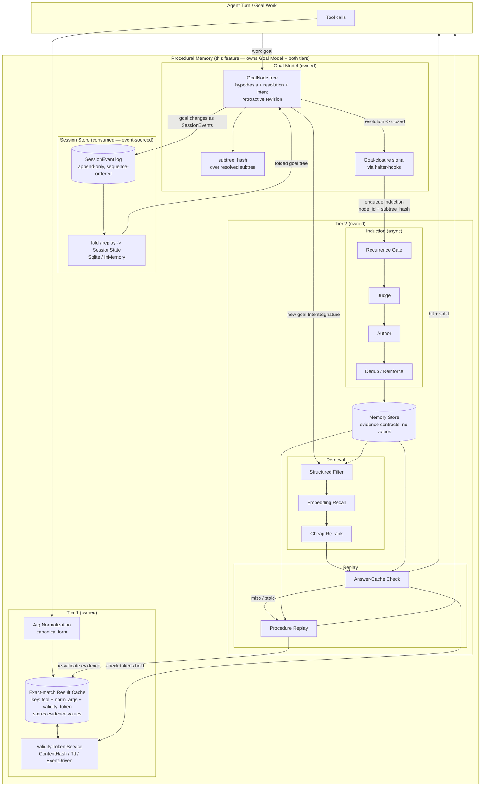
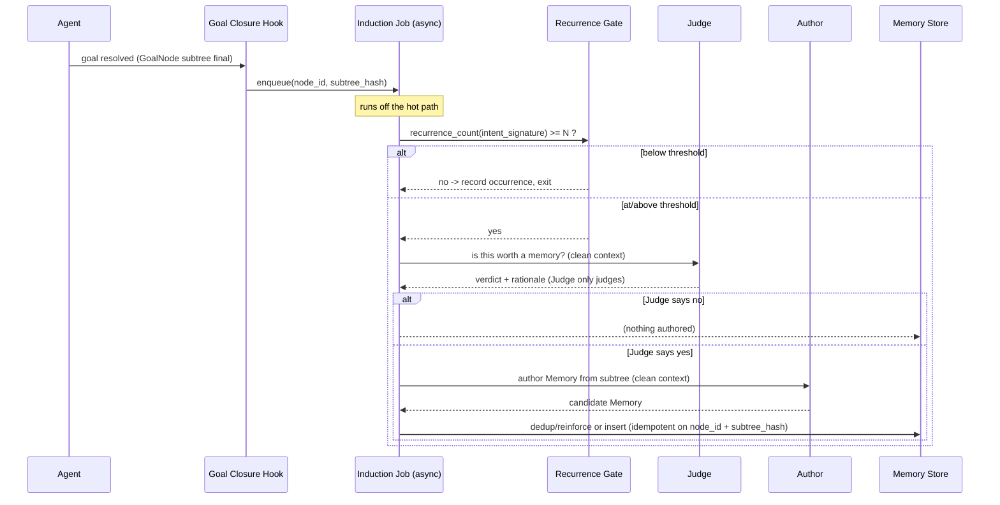
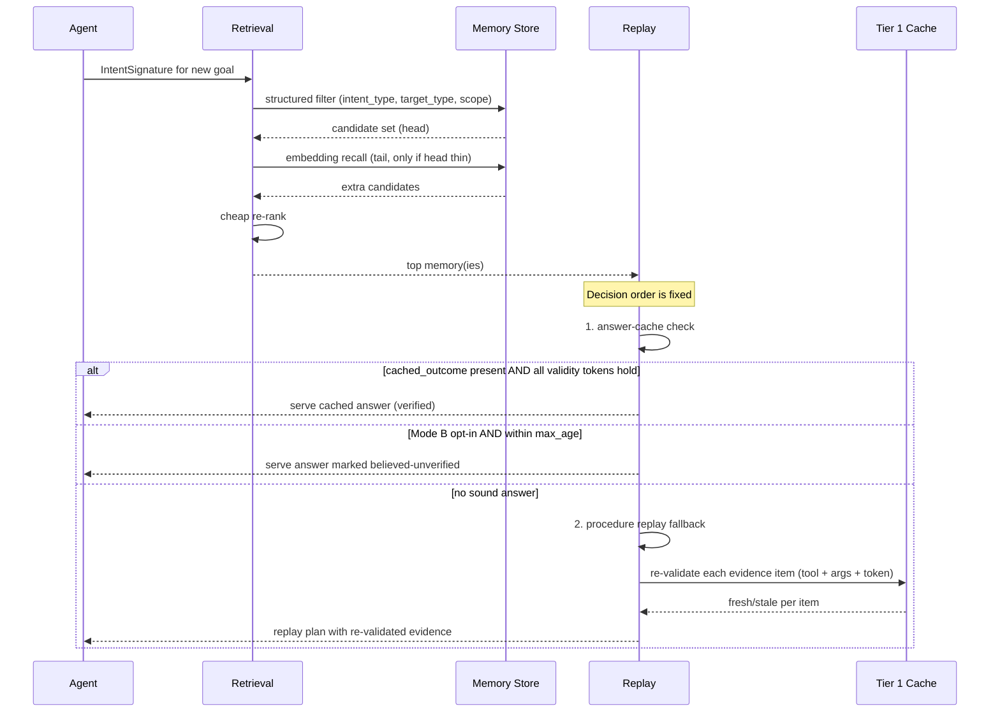
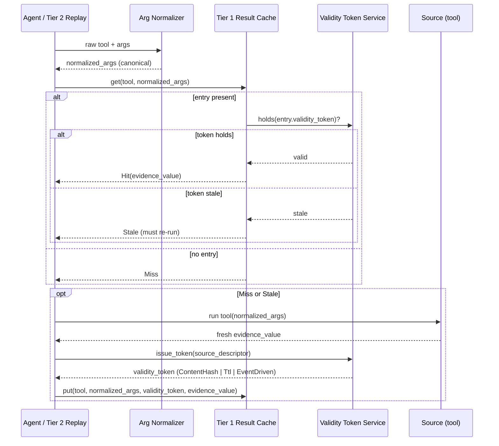

# Design Document: Goal Pace — hit your goals faster

_(Covers the **Goal Model** plus procedural memory **Tiers 1 + 2**.)_

## Overview

**Goal Pace** is a system for reaching goals faster. Its headline subsystem is the **Goal
Model** — the thing that *structures and tracks* goals — and beneath it sit two acceleration
layers (Tier 1 and Tier 2) whose whole job is to make reaching those goals faster by
skipping redundant tool calls and re-planning and serving sound cached answers. The Goal
Model and both acceleration tiers are **in scope and owned by this feature**.

The **Goal Model** is the primary subsystem: the hypothesis-shaped, hierarchical
representation of goal work that structures and tracks each goal, and the layer the two
acceleration tiers build on. It is **owned by this feature**, not an external harness
dependency: `halter` today has only a flat, user-visible task list
(`Task`/`TaskStatus`/`TaskList`) and no goal tree, no resolution semantics, and no intent
signature. This feature introduces the `GoalNode` subsystem — the goal tree, its resolution
lifecycle, `IntentSignature` derivation, and the **goal-closure** signal that triggers
induction — and **persists it on the existing event-sourced session store** (`SessionEvent`
append-only log + `fold`/replay, backed by `SqliteSessionStore` / `InMemorySessionStore`).
The Goal Model consumes existing `halter` infrastructure (the session store and the
`halter-hooks` system) but the goal semantics built on top are owned here, in the
`halter-goals` crate.

With goals structured and tracked by the Goal Model, two tiers accelerate reaching them.

**Tier 1** is the first acceleration layer: a deterministic, exact-match result cache keyed
by `tool + normalized_args + validity_token`. It owns argument normalization, the
volatility-aware **Validity Token Service**, and the storage of concrete **evidence values**
(the actual results of tool calls). Tier 1 makes goals faster by answering one question
exactly and reproducibly — "for this tool with these arguments, is a prior result still
valid, and if so, what was it?" — so the agent skips redundant tool calls.

**Tier 2** is the second acceleration layer — the procedural memory that sits above Tier 1.
When an agent finishes real work on a goal, Tier 2 induces reusable *procedural memories* —
the distilled "how" of solving a class of goal — and replays them on recurring goals so the
agent skips rediscovery and re-planning. On top of this, Tier 2 performs goal-level *answer
caching*, serving a previously computed answer directly when (and only when) it is still
provably valid. Tier 2 does **not** store evidence values; it stores evidence *contracts*
(`tool + normalized_args + validity_token`) and calls Tier 1 to fetch and re-validate the
underlying values during replay.

The two acceleration tiers compose: Tier 1 issues the volatility-aware validity tokens, Tier
2 records them in memories and cached answers, and Tier 2 calls back into Tier 1 to
re-validate evidence before trusting any replay or serving any cached answer. Tier 2 never
weakens Tier 1's guarantees; it builds on them.

The system is designed for the `halter` harness: it is context-frugal (retrieval returns
small, structured memory objects, not raw transcripts), effect-explicit (induction is an
async job outside the hot path), and correctness-first. The single non-negotiable
guarantee (§ "Key Invariants") is that an answer may be served from cache only when all of
its validity tokens still hold; anything else must be explicitly marked
`believed-unverified`, opt-in per intent type, and never the default.

### Scope

In scope (owned by this feature, living in the `halter-goals` crate):

- **Goal Model (the headline subsystem)** — the `GoalNode` subsystem that structures and
  tracks goals: the goal tree (hierarchy + retroactive revision), `subtree_hash`
  computation, the resolution lifecycle (`Open | Accepted | Rejected | Inconclusive`) and
  goal closure, `IntentSignature` derivation at the node, persistence of the goal tree as
  `SessionEvent`s folded into session state on the existing event-sourced store, and the
  goal-closure hook that enqueues induction. See § "Goal Model".
- **Tier 1 (acceleration layer)** — the exact-match result cache, argument
  normalization/canonicalization, the Validity Token Service (issuance,
  `holds()`/re-validation, invalidation), and the storage of evidence values.
- **Tier 2 (acceleration layer)** — induction, store/retrieval, replay, the procedural
  memory model, and two-mode answer caching.

All of the above ships in the `halter-goals` crate. Out of scope / external dependencies
(existing crates this feature *consumes*, not builds): the embedding/ANN backend used for
tail recall, `proptest`, the async runtime (`tokio`), and the existing event-sourced
**session store** (`halter-session` / `halter-protocol` `SessionEvent`/`fold`) and **hooks**
infrastructure (`halter-hooks`). The Goal Model is built *on* the session store and hooks but
is itself owned here in `halter-goals`, not consumed.

This document combines a high-level view (architecture, sequence flows, components, data
models) with a low-level view (Rust type sketches, function signatures with formal
specifications, and algorithmic pseudocode) so it can drive both requirements derivation
and implementation. Code sketches use Rust to match the `halter` workspace; they are
illustrative contracts, not final APIs.

## Architecture

Procedural Memory owns the **Goal Model** and both tiers. The **Goal Model** is the owned
subsystem that sits between the Agent and Tier 1/Tier 2: it maintains the `GoalNode` tree,
runs the resolution lifecycle, derives each node's `IntentSignature`, computes `subtree_hash`
over resolved subtrees, and **persists the whole tree on the existing event-sourced session
store** by appending `SessionEvent`s and folding them into state. When a goal closes, it
emits a **goal-closure signal** through the existing `halter-hooks` system that enqueues the
async induction job. **Tier 1** is organized around three responsibilities — argument
**normalization**, the **Validity Token Service**, and the **exact-match result cache** that
stores evidence values. **Tier 2** is organized around three subsystems — **Induction**,
**Store/Retrieval**, and **Replay** — that share a common vocabulary of `GoalNode`,
`IntentSignature`, and `Memory` (all defined by the owned Goal Model). Induction is
asynchronous and off the critical path; retrieval and replay are synchronous and on the hot
path of a new goal. Tier 2 consumes Tier 1's validity tokens and calls Tier 1 to re-validate
evidence during replay.



**Goal Model <-> tiers relationship.** The Goal Model is the owned subsystem between the
Agent and the tiers. It defines the vocabulary both tiers speak — `GoalNode`,
`IntentSignature`, `subtree_hash`, and the resolution lifecycle — and owns *when* work is
considered done (goal closure). The Goal Model is **persisted on the consumed event-sourced
session store**: goal changes are modeled as `SessionEvent`s appended to the log and folded
into `SessionState`, reusing `SqliteSessionStore` / `InMemorySessionStore` and
`halter_protocol::fold`. On closure it emits a hook signal (via the consumed `halter-hooks`
system) carrying `(node_id, subtree_hash)` that enqueues Tier 2 induction. See § "Goal
Model" for the full specification.

**Tier 1 <-> Tier 2 relationship.** Both tiers are owned by this feature. Tier 1 issues
volatility-aware validity tokens and stores evidence values; Tier 2 records those tokens in
memories and cached answers (never the values themselves) and calls Tier 1 to re-validate
evidence during replay and to check that an answer's tokens still hold before serving it.

## Sequence Diagrams

### Flow 1: Induction at goal closure (async, lazy, gated)



### Flow 2: Retrieval and replay on a new goal (sync, hot path)



### Flow 3: Tier 1 cache read/write with validity token (owned)



## Goal Model

The **Goal Model is an owned, first-class subsystem of this feature** — not an external
harness dependency. `halter` today has no goal tree, no resolution semantics, and no
`IntentSignature`; it has only a flat, user-visible task list (`Task { id, subject }`,
`TaskStatus { Pending, Completed }`, `TaskList`) in `halter-tools`. This feature introduces
the hypothesis-shaped `GoalNode` subsystem and builds its persistence on the **existing
event-sourced session store** (`halter-session` / `halter-protocol`), which it consumes.

### What the Goal Model owns

- The **`GoalNode`** structure and its lifecycle (sketched in § Concepts, promoted here to an
  owned subsystem): `id`, `parent`, `children`, `hypothesis`, `resolution_conditions`,
  `resolution`, `intent`, `tool_calls`, `subtree_hash`.
- The **goal tree**: parent/child hierarchy and **retroactive revision** — nodes are
  revisable as evidence changes.
- The **resolution lifecycle** (`Open | Accepted | Rejected | Inconclusive`) and the
  definition of **goal closure** (the trigger for induction).
- **`subtree_hash`** computation over a node and its resolved subtree.
- **`IntentSignature`** derivation/attachment at each node (the type itself is defined in
  § Concepts; ownership of its derivation lives here).
- **Persistence of the goal tree on the event-sourced session store** as append-only
  `SessionEvent`s folded into state.
- The **goal-closure signal** that enqueues async induction, routed through the existing
  `halter-hooks` system.

### Goal tree: hierarchy and retroactive revision

A goal tree is a set of `GoalNode`s rooted at one top-level goal, connected by
`parent`/`children`. Unlike the transcript, the *logical* tree is a **living structure**:
a node's `resolution`, `resolution_conditions`, `tool_calls`, or even its set of children may
be **revised retroactively** as later evidence arrives. Revision is expressed as *new events
appended to the log* (see persistence below) — the append-only event log is never rewritten;
instead the current tree is the fold of all events, so "revision" means "append a
`GoalNodeRevised` event that the fold applies on top of the prior state." This preserves
event-log semantics (append-only, sequence-ordered) while letting the projected tree change.

### `subtree_hash`

`subtree_hash(n)` is a stable content hash computed over node `n` together with its
**resolved subtree**: the canonicalized tuple of `n`'s intent-relevant fields (`hypothesis`,
`resolution_conditions`, `resolution`, `intent`, and the normalized `tool_calls` contracts)
combined with the `subtree_hash` of each **resolved** child, in canonical child order. It is
deterministic: two structurally-equal resolved subtrees hash equally regardless of insertion
order or incidental encoding. `subtree_hash` is the versioning + idempotency key for
induction — a revision that changes the resolved subtree changes the hash, and a revision
that does not (e.g. re-ordering already-resolved children) does not.

### Resolution lifecycle and goal closure

```rust
/// Resolution state of a goal node.
pub enum Resolution {
    Open,          // still being worked; not eligible for closure
    Accepted,      // hypothesis confirmed by its resolution conditions
    Rejected,      // hypothesis disconfirmed (a determinate dead-end)
    Inconclusive,  // conditions evaluated but neither accept nor reject
}
```

- A node is **closed** when `resolution != Open` **and** every child is closed. Closure is a
  property of the resolved subtree, not of a single node.
- **Goal closure** is the transition of a node from not-closed to closed. It is the single
  trigger for induction: on closure the Goal Model emits a closure signal carrying
  `(node_id, subtree_hash)`.
- Because nodes are revisable, a closed node can *re-open* (a revision sets a descendant back
  to `Open`) and later close again under a **new** `subtree_hash`; each distinct
  `(node_id, subtree_hash)` closure is a distinct induction trigger (see § Correctness
  Properties, closure-exactly-once).

### Persistence on the event-sourced session store

The goal tree is **not a new store**. Goal changes are modeled as **`SessionEvent`s** on the
existing append-only, sequence-ordered log and **folded** into session state, reusing
`SqliteSessionStore` / `InMemorySessionStore` and `halter_protocol::fold`. A goal tree is
scoped to a **session**: the session that did the goal work owns the events that build its
tree, and the tree is reconstructed by replaying/folding those events — exactly the mechanism
already used for messages and usage.

Concretely, the feature adds goal-shaped payloads to the session event stream (illustrative;
they extend the existing `SessionEventPayload` family or ride alongside it):

```rust
/// Goal-tree mutations recorded on the existing session event log.
/// Each is appended as a SessionEvent payload and applied by the goal fold,
/// mirroring how MessageItem / TurnCompleted mutate SessionState today.
pub enum GoalEvent {
    /// A node was created (Open) under an optional parent.
    GoalNodeCreated {
        id: GoalNodeId,
        parent: Option<GoalNodeId>,
        hypothesis: String,
        intent: IntentSignature,
    },
    /// A node was revised retroactively (fields and/or child set changed).
    /// Append-only: this event layers on top of prior state; the log is never
    /// rewritten. The projected tree is the fold of all GoalEvents.
    GoalNodeRevised {
        id: GoalNodeId,
        revision: GoalNodeRevision, // resolution_conditions / tool_calls / children delta
    },
    /// A node reached a resolution (Open -> Accepted|Rejected|Inconclusive),
    /// or was re-opened by a later revision.
    GoalNodeResolved {
        id: GoalNodeId,
        resolution: Resolution,
    },
    /// A node's subtree became fully closed under this subtree_hash.
    /// The fold recomputes subtree_hash from folded state; this event records
    /// the closure boundary that the closure signal fires on.
    GoalClosed {
        id: GoalNodeId,
        subtree_hash: SubtreeHash,
    },
}
```

The **goal fold** is the goal-tree analogue of `halter_protocol::fold::apply_event`: given
the current projected `GoalTreeState` and a `GoalEvent`, it produces the next state
(`GoalNodeCreated` inserts an `Open` node, `GoalNodeRevised` layers a delta,
`GoalNodeResolved` sets a node's resolution, `GoalClosed` marks the closure boundary and is
the fold point at which `subtree_hash` is recomputed over the resolved subtree). Replaying a
session's `GoalEvent`s in sequence order reconstructs the whole tree — the same append-only
+ fold/replay contract the session store already guarantees (gap-free monotonic sequences,
optimistic `expected_head_sequence` concurrency control on `commit`).

**Relationship between a goal tree and a session.** One session hosts one goal tree
(rooted at the session's top-level goal); subgoals are nodes within it. The tree lives in the
same event log as the session's messages and is committed through the same
`SessionStore::commit` path, so goal mutations and transcript mutations share one ordering
and one concurrency guarantee.

### Goal closure -> induction via the hooks system

Goal closure integrates with the harness through the **existing `halter-hooks` system**
rather than a bespoke callback. When the goal fold applies a `GoalClosed` event, the Goal
Model dispatches a hook signal (a `GoalClosed`-style event carrying `node_id` and
`subtree_hash`) that **enqueues the async induction job** off the hot path — the same
enqueue-not-await pattern shown in § Example Usage. Reusing `halter-hooks` means closure is
observable, configurable, and composes with the harness's existing hook lifecycle
(`PostToolUse`, `Stop`, `SessionStart`, …) without new plumbing. Induction remains gated on
recurrence and idempotent on `(node_id, subtree_hash)`, so a closure signal can fire more
than once without authoring duplicates (see Correctness Properties).

### Relationship to the existing flat `TaskList`

The goal tree is a **distinct, richer structure** from `halter`'s existing flat task list.
The flat `TaskList` (`Task { id, subject, status }`) is a user-visible, two-state
(`Pending`/`Completed`) checklist with no hierarchy, no hypotheses, no resolution conditions,
and no intent. The goal tree is **hypothesis-shaped, hierarchical, retroactively revisable,
and carries resolution semantics and `IntentSignature`s** used for retrieval/merge. They are
**not the same object and neither replaces the other**; they may **coexist** (a user may keep
a flat task list while the Goal Model tracks the hypothesis tree underneath). The Goal Model
does not read from or write to `TaskList`.

### Component: Goal Model (Goal Tree / Goal Store)

**Purpose:** Own the `GoalNode` tree, its resolution lifecycle and `subtree_hash`, derive
`IntentSignature`s, persist the tree as `SessionEvent`s on the existing session store, and
fire the goal-closure signal that enqueues induction.

**Interface:**
```rust
/// Owned goal-tree store. Backed by the existing event-sourced SessionStore:
/// every mutation appends GoalEvents through SessionStore::commit and the tree
/// is reconstructed by folding replayed events. Implementations reuse
/// SqliteSessionStore / InMemorySessionStore.
#[async_trait]
trait GoalStore {
    /// Create a new Open node (optionally under `parent`) by appending
    /// GoalNodeCreated. Returns the assigned node id.
    async fn create(
        &self,
        session: &SessionId,
        parent: Option<GoalNodeId>,
        hypothesis: String,
        intent: IntentSignature,
    ) -> Result<GoalNodeId>;

    /// Retroactively revise a node by appending GoalNodeRevised (append-only;
    /// never rewrites prior events). May re-open a previously resolved node.
    async fn revise(
        &self,
        session: &SessionId,
        id: &GoalNodeId,
        revision: GoalNodeRevision,
    ) -> Result<()>;

    /// Record a resolution for a node by appending GoalNodeResolved. When this
    /// resolution closes the node's subtree, the store also appends GoalClosed
    /// and dispatches the closure hook.
    async fn close(
        &self,
        session: &SessionId,
        id: &GoalNodeId,
        resolution: Resolution,
    ) -> Result<ClosureOutcome>; // { closed: bool, subtree_hash: Option<SubtreeHash> }

    /// Project the current tree (or one node) by folding replayed GoalEvents.
    async fn get(&self, session: &SessionId, id: &GoalNodeId) -> Result<Option<GoalNode>>;
    async fn get_tree(&self, session: &SessionId) -> Result<GoalTree>;
}
```

**Responsibilities:**
- Maintain the goal tree via append-only `GoalEvent`s folded into state; never rewrite the
  log.
- Run the resolution lifecycle and detect closure over the resolved subtree.
- Compute `subtree_hash` deterministically over a node + its resolved subtree.
- Derive/attach each node's `IntentSignature`.
- Dispatch the goal-closure hook with `(node_id, subtree_hash)` to enqueue induction.
- Reuse `SqliteSessionStore` / `InMemorySessionStore` and `halter_protocol::fold`; take no
  ownership of the flat `TaskList`.

### Goal Model Key Functions with Formal Specifications

#### `create`

```rust
async fn create(session, parent, hypothesis, intent) -> Result<GoalNodeId>;
```

**Preconditions:** `session` exists in the store; if `parent` is `Some`, the parent node
exists in the session's folded tree.

**Postconditions:**
- Exactly one `GoalNodeCreated` event is appended (through `SessionStore::commit`, receiving
  a gap-free monotonic sequence).
- After the append, folding the session's events yields a new node with the returned id,
  `resolution = Open`, the given `hypothesis`/`intent`, and (if `parent` present) the node id
  added to the parent's `children`.
- The append-only log is extended, never rewritten.

**Loop invariants:** N/A.

#### `revise`

```rust
async fn revise(session, id, revision) -> Result<()>;
```

**Preconditions:** node `id` exists in the folded tree.

**Postconditions:**
- Exactly one `GoalNodeRevised` event is appended; **no prior event is mutated or removed**
  (append-only semantics preserved).
- The folded tree reflects the revision; if the revision re-opens `id` or a descendant, the
  affected nodes' `resolution` becomes `Open` and any previously computed closure is
  superseded.
- Any subsequent closure of `id` recomputes `subtree_hash`, which differs from the prior hash
  iff the resolved subtree changed.

**Loop invariants:** when folding the log to project the tree, after processing each event the
partial tree equals the fold of all events consumed so far (event-log determinism).

#### `close`

```rust
async fn close(session, id, resolution) -> Result<ClosureOutcome>;
```

**Preconditions:** node `id` exists; `resolution != Open`.

**Postconditions:**
- A `GoalNodeResolved { id, resolution }` event is appended.
- If, after that resolution, `id`'s subtree is fully closed (`id` and all descendants have
  `resolution != Open`), a `GoalClosed { id, subtree_hash }` event is appended with
  `subtree_hash = subtree_hash(id)` over the resolved subtree, and the closure hook is
  dispatched exactly once for that `(id, subtree_hash)`; the returned `ClosureOutcome` has
  `closed = true` and the computed hash.
- If the subtree is not yet fully closed, no `GoalClosed` is appended and `closed = false`.
- All appends go through `SessionStore::commit`; the log stays append-only and
  sequence-ordered.

**Loop invariants:** while checking descendant closure, every descendant visited so far has
had its `resolution` read from the folded state; `closed` remains true iff no visited
descendant is `Open`.

#### `subtree_hash`

```rust
fn subtree_hash(node: &GoalNode, tree: &GoalTree) -> SubtreeHash;
```

**Preconditions:** `node`'s subtree is fully resolved (every node in it has
`resolution != Open`).

**Postconditions:**
- Deterministic and order-insensitive: structurally-equal resolved subtrees produce equal
  hashes; canonical child ordering and canonical `tool_calls` normalization are applied.
- Depends only on intent-relevant fields and the child `subtree_hash`es, so a revision that
  leaves the resolved subtree structurally unchanged yields the same hash.

**Loop invariants:** folding child hashes in canonical order, the accumulator after each child
equals the hash of the prefix of children processed so far.

### Goal Model Algorithmic Pseudocode

#### Closing a node and firing induction

```pascal
ALGORITHM goalClose(store, session, id, resolution, hooks)
INPUT: store (GoalStore over SessionStore), session, id, resolution (<> Open), hooks
OUTPUT: ClosureOutcome

BEGIN
  ASSERT resolution <> Open

  // Append-only: record the resolution as a SessionEvent, fold into state.
  store.appendEvent(session, GoalNodeResolved(id, resolution))   // via SessionStore.commit
  tree <- store.foldTree(session)                                // replay + fold events

  IF NOT subtreeFullyClosed(tree, id) THEN
    RETURN ClosureOutcome(closed = FALSE, subtree_hash = NULL)
  END IF

  // Closure: compute the versioning key over the resolved subtree.
  h <- subtreeHash(tree.node(id), tree)

  // Idempotent closure event: appending the same GoalClosed is a no-op fold,
  // and induction is keyed on (id, h), so re-firing authors no duplicate.
  IF NOT store.hasClosureEvent(session, id, h) THEN
    store.appendEvent(session, GoalClosed(id, h))                 // append-only
    // Fire through the existing hooks system; enqueues async induction.
    hooks.dispatch(GoalClosedSignal(node_id = id, subtree_hash = h))
  END IF

  RETURN ClosureOutcome(closed = TRUE, subtree_hash = h)
END
```

**Preconditions:** `id` exists; `resolution <> Open`; `store` is backed by the event-sourced
`SessionStore`.
**Postconditions:** the log is extended append-only; on full closure a `GoalClosed` event and
a single closure signal are produced per distinct `(id, subtree_hash)`; induction is enqueued
off the hot path.
**Loop invariants:** `subtreeFullyClosed` visits descendants folding a boolean that stays true
iff no visited node is `Open`; `subtreeHash` folds children in canonical order (see above).

## Tier 1 Design

Tier 1 is the owned foundation: a deterministic, exact-match result cache that stores the
concrete **evidence values** returned by tool calls, keyed by
`tool + normalized_args + validity_token`. It owns three things Tier 2 depends on but does
not implement: argument **normalization**, the **Validity Token Service**, and the
**cache read/write path** with volatility-aware invalidation.

### Argument normalization / canonicalization

Before a tool call becomes a cache key, its arguments are canonicalized so that
semantically equal calls key equally (and therefore hit the same cache entry). Normalization
is deterministic and total: the same logical arguments always produce the same
`CanonicalJson`, regardless of incidental encoding differences.

```rust
/// Canonical, byte-stable serialization of tool arguments.
/// Object keys sorted, whitespace removed, numbers/units normalized,
/// defaults made explicit, equivalent representations folded together.
pub struct CanonicalJson(pub Vec<u8>);

/// Deterministic argument canonicalization owned by Tier 1.
fn normalize_args(tool: &ToolName, raw: &RawArgs) -> CanonicalJson;
```

**Contract.** `normalize_args` is a pure function: for arguments `a`, `b` that are logically
equal for `tool`, `normalize_args(tool, a) == normalize_args(tool, b)`. Order of object
keys, insignificant whitespace, and equivalent scalar encodings must not affect the result.

### Validity Token Service

The Validity Token Service issues **volatility-aware** tokens that capture *how* a source's
validity can be checked. The volatility class of the source determines the token variant:

```rust
/// Volatility-aware token owned and issued by Tier 1.
pub enum ValidityToken {
    /// Pinnable / change-detectable source (files, pinned revisions, immutable
    /// blobs). Validity == content hash still matches.
    ContentHash(Sha256),
    /// Live / volatile source with no cheap change signal. Validity == the token
    /// has not yet expired: now < issued_at + ttl.
    Ttl { issued_at: Timestamp, ttl: Duration },
    /// Live source that emits an external change signal. Validity == no newer
    /// event than the one observed at issuance has been seen.
    EventDriven { subscription: EventKey, last_seen: EventSeq },
}

/// Describes a source enough to pick a volatility class and issue a token.
pub enum SourceDescriptor {
    Pinnable { content: ContentRef },              // -> ContentHash
    Volatile { ttl: Duration },                    // -> Ttl
    Signalled { subscription: EventKey },          // -> EventDriven
}
```

**Token issuance.** `issue_token(source)` inspects the source's volatility class and mints
the matching token: hashing current content for `Pinnable`, stamping `issued_at`/`ttl` for
`Volatile`, and recording the current `EventSeq` for `Signalled`.

**The `holds()` / re-validation check.** A token's validity is decided per variant:

- `ContentHash(h)` **holds iff** the source's current content hashes to `h`.
- `Ttl { issued_at, ttl }` **holds iff** `now() < issued_at + ttl`.
- `EventDriven { subscription, last_seen }` **holds iff** no event newer than `last_seen`
  has been observed on `subscription`.

**Cache invalidation semantics per volatility class.** Invalidation follows directly from
`holds()`:

- **ContentHash** — invalidated exactly when content changes; a re-hash on read detects it.
  Pinnable sources can be safely cached indefinitely until their content mutates.
- **Ttl** — invalidated by the passage of time; the entry is stale once `now >=
  issued_at + ttl`, independent of whether the source actually changed (fail-safe for
  volatile sources with no change signal).
- **EventDriven** — invalidated when a newer event arrives on the subscription; between
  events the entry stays valid, giving live sources content-hash-like precision without
  re-fetching.

### Cache read/write path and evidence storage

Tier 1 stores the actual evidence value alongside the token it was captured under. Tier 2
never duplicates these values — it holds only the contract (`tool + normalized_args +
validity_token`) and reads through Tier 1.

```rust
/// A stored Tier 1 entry: the evidence value plus the token gating its validity.
pub struct CacheEntry {
    pub tool: ToolName,
    pub normalized_args: CanonicalJson,
    pub validity_token: ValidityToken,
    pub evidence_value: EvidenceValue,   // Tier 1 owns concrete values
    pub stored_at: Timestamp,
}

/// Outcome of a cache read.
pub enum CacheLookup {
    Hit(EvidenceValue), // entry present AND its token still holds
    Stale,              // entry present but its token no longer holds
    Miss,               // no entry for this key
}
```

**Read path.** `get(tool, normalized_args)` locates the entry, calls the Validity Token
Service's `holds()` on the stored token, and returns `Hit(value)` only if it holds, `Stale`
if the entry exists but its token fails, or `Miss` if absent.

**Write path.** After a fresh tool run, `put(tool, normalized_args, token, value)` records
the evidence value under the freshly issued token, replacing any stale entry for the same
`tool + normalized_args`.

**Re-validation for Tier 2.** `revalidate(tool, normalized_args, token)` is the entry point
Tier 2's replay uses: it checks whether the specific token Tier 2 recorded still holds for
the current source, returning `Fresh` or `Stale` without necessarily returning the value.

### Component: Tier 1 Cache

**Purpose:** Deterministically cache and re-validate concrete tool-call evidence under
volatility-aware tokens.

**Interface:**
```rust
/// The owned Tier 1 result cache + validity token service.
trait Tier1Cache {
    /// Read the cached evidence value if present AND its token still holds.
    fn get(&self, tool: &ToolName, args: &CanonicalJson) -> CacheLookup;

    /// Store fresh evidence under a freshly issued token, replacing any stale entry.
    fn put(
        &self,
        tool: &ToolName,
        args: &CanonicalJson,
        token: ValidityToken,
        value: EvidenceValue,
    );

    /// Issue a volatility-aware token for a source (used before `put`).
    fn issue_token(&self, source: &SourceDescriptor) -> ValidityToken;

    /// Re-validate a specific recorded token for Tier 2 replay: is it still fresh?
    fn revalidate(
        &self,
        tool: &ToolName,
        args: &CanonicalJson,
        token: &ValidityToken,
    ) -> Freshness; // Fresh | Stale
}
```

**Responsibilities:**
- Canonicalize arguments so equal calls key equally.
- Issue and check volatility-aware tokens (`ContentHash` / `Ttl` / `EventDriven`).
- Store and serve concrete evidence values; own invalidation per volatility class.
- Provide `revalidate` as Tier 2's replay re-validation entry point.

### Tier 1 Key Functions with Formal Specifications

#### `issue_token`

```rust
fn issue_token(source: &SourceDescriptor) -> ValidityToken;
```

**Preconditions:** `source` is a well-formed descriptor; for `Pinnable`, `source.content`
is readable at issuance time.

**Postconditions:**
- Returns the token variant matching the source's volatility class
  (`Pinnable → ContentHash`, `Volatile → Ttl`, `Signalled → EventDriven`).
- A `ContentHash` token's hash equals the SHA-256 of the source content read at issuance.
- A `Ttl` token's `issued_at` equals the issuance time; `ttl` equals the descriptor's `ttl`.
- An `EventDriven` token's `last_seen` equals the current `EventSeq` on the subscription.

**Loop invariants:** N/A.

#### `holds` (re-validation)

```rust
fn holds(token: &ValidityToken) -> bool;
```

**Preconditions:** the source referenced by `token` is reachable (else treat as not-held,
fail-safe — see Error Handling).

**Postconditions:**
- `ContentHash(h)` returns `true` iff the source's current content hashes to `h`.
- `Ttl { issued_at, ttl }` returns `true` iff `now() < issued_at + ttl`.
- `EventDriven { subscription, last_seen }` returns `true` iff no event newer than
  `last_seen` has been observed on `subscription`.
- Pure with respect to the cache: `holds` never mutates stored evidence.

**Loop invariants:** N/A.

#### `get` / `put`

```rust
fn get(tool: &ToolName, args: &CanonicalJson) -> CacheLookup;
fn put(tool: &ToolName, args: &CanonicalJson, token: ValidityToken, value: EvidenceValue);
```

**`get` preconditions:** `args` is already canonicalized via `normalize_args`.
**`get` postconditions:**
- Returns `Hit(value)` iff an entry exists for `(tool, args)` **and** `holds(entry.token)`.
- Returns `Stale` iff an entry exists but `¬holds(entry.token)`.
- Returns `Miss` iff no entry exists.
- Never returns a value whose token does not currently hold.

**`put` preconditions:** `args` is canonical; `token` was issued for the source that
produced `value`.
**`put` postconditions:** after `put`, `get(tool, args)` returns `Hit(value)` while `token`
holds; any prior entry for `(tool, args)` is replaced.

### Tier 1 Algorithmic Pseudocode

```pascal
ALGORITHM tier1Get(tool, rawArgs, cache, vts)
INPUT: tool, rawArgs, cache (Tier1Cache), vts (ValidityTokenService)
OUTPUT: CacheLookup

BEGIN
  args  <- normalizeArgs(tool, rawArgs)      // canonical, deterministic
  entry <- cache.lookup(tool, args)
  IF entry = NULL THEN
    RETURN Miss
  END IF
  IF vts.holds(entry.validity_token) THEN     // per-variant check
    RETURN Hit(entry.evidence_value)
  ELSE
    RETURN Stale
  END IF
END
```

```pascal
ALGORITHM tier1RunAndCache(tool, rawArgs, source, cache, vts)
INPUT: tool, rawArgs, source (SourceDescriptor), cache, vts
OUTPUT: EvidenceValue

BEGIN
  args   <- normalizeArgs(tool, rawArgs)
  value  <- runTool(tool, args)               // fresh evidence
  token  <- vts.issueToken(source)            // volatility-aware
  cache.put(tool, args, token, value)         // stores evidence value
  ASSERT vts.holds(token)                      // freshly issued token holds
  RETURN value
END
```

**Preconditions:** `source` correctly classifies the tool's volatility.
**Postconditions:** the cache holds `value` under a token that holds at write time;
subsequent `get` returns `Hit(value)` until the token stops holding.
**Loop invariants:** N/A.

## Concepts

### GoalNode

A `GoalNode` is a hypothesis with resolution conditions, organized into a hierarchy
(parent/children forming a goal tree). Nodes are **revisable retroactively**: a node's
resolution and even its children can be revised after the fact as new evidence arrives, so
the *projected* tree is a living structure — though revisions are recorded append-only on the
event log and the tree is the fold of those events (see § "Goal Model").

**Owned here.** The `GoalNode` structure and its full lifecycle are **owned by this feature**
as a first-class subsystem — see § "Goal Model" for the goal tree, resolution lifecycle,
`subtree_hash`, persistence on the event-sourced session store, and the goal-closure hook.
The structure sketch below is promoted there to an owned subsystem.

```rust
/// A hypothesis-shaped unit of goal work. Nodes form a tree and may be revised
/// retroactively as evidence changes.
pub struct GoalNode {
    pub id: GoalNodeId,
    pub parent: Option<GoalNodeId>,
    pub children: Vec<GoalNodeId>,

    /// The hypothesis this node is trying to resolve.
    pub hypothesis: String,
    /// Conditions that, when met, resolve the hypothesis (accept/reject/inconclusive).
    pub resolution_conditions: Vec<ResolutionCondition>,
    pub resolution: Resolution, // Open | Accepted | Rejected | Inconclusive

    /// The intent this node serves, used as the retrieval/merge key.
    pub intent: IntentSignature,
    /// Tool calls performed while working this node (the raw "how").
    pub tool_calls: Vec<ToolCall>,

    /// Stable content hash over this node + its resolved subtree, used for
    /// induction idempotency and versioning.
    pub subtree_hash: SubtreeHash,
}
```

**Node granularity heuristic.** A node deserves to become (or seed) a memory when it
represents a *coherent, reusable unit of work* — roughly: it has a self-contained intent, a
plan that produced a determinate resolution, and evidence that could be re-validated
independently. Nodes that are too fine (a single incidental tool call) or too coarse (an
entire multi-intent investigation) are poor memory boundaries. The heuristic is a tunable
input to both the Judge and node segmentation (see § Open Questions).

### Tool-call contract

Every tool call captured in a node is recorded against a stable contract so it can be
matched by Tier 1 and re-validated during replay.

```rust
/// The reproducible record of one tool invocation.
pub struct ToolCall {
    pub tool: ToolName,
    /// Args normalized to a canonical form so equal calls hash equally.
    pub normalized_args: CanonicalJson,
    /// Tier 1 validity token captured at call time (volatility-aware).
    pub validity_token: ValidityToken,
    /// Shape/pointer of the result (not necessarily the full payload).
    pub outcome: OutcomeRef,
}

/// Volatility-aware token supplied by Tier 1.
pub enum ValidityToken {
    /// Pinnable / change-detectable source: validity == content hash matches.
    ContentHash(Sha256),
    /// Live / volatile source: validity == now < issued_at + ttl.
    Ttl { issued_at: Timestamp, ttl: Duration },
    /// Live source with an external change signal.
    EventDriven { subscription: EventKey, last_seen: EventSeq },
}
```

**Tier 1 linkage.** The `ToolCall` fields above (`normalized_args`, `validity_token`) are
produced and owned by Tier 1 — see § "Tier 1 Design" for the full specification of argument
normalization, token issuance, and the evidence cache. Tier 2 records these fields on nodes
and in memories but never stores the underlying evidence values; it calls Tier 1 to fetch
and re-validate them during replay.

### IntentSignature

The `IntentSignature` is the structured retrieval and merge key. Two pieces of goal work
target "the same thing" when their signatures match on the structured fields, before any
embedding similarity is considered. It is **derived/attached at the goal node and owned by
the Goal Model** (§ "Goal Model"): each `GoalNode` carries its `IntentSignature`, which
Tier 2 then consumes as the retrieval/merge key.

```rust
/// Structured retrieval/merge key. Structured match is primary; embeddings
/// are only a tail fallback.
pub struct IntentSignature {
    pub intent_type: IntentType,   // e.g. Explain | Verify | Locate | Compare | Enumerate
    pub target_type: TargetType,   // e.g. Symbol | File | Module | Concept | Dataset
    pub target_ref: TargetRef,     // canonical reference to the specific target
    pub scope: Scope,              // repo/rev/branch/dataset-version boundary
}
```

### Memory (procedural memory object)

A `Memory` is the durable, replayable distillation of how a class of goal was solved. It is
the primary Tier 2 artifact.

```rust
pub struct Memory {
    pub id: MemoryId,
    pub kind: MemoryKind,                 // Fragment | Composite | Negative
    pub intent: IntentSignature,          // structured retrieval key

    /// Parameters the memory generalizes over (so it applies beyond one target).
    pub parameter_schema: ParameterSchema,
    /// Guard describing when this memory legitimately applies.
    pub applicability: Applicability,

    /// The reusable "how": ordered steps / sub-goals to replay.
    pub plan: Plan,
    /// What evidence must be re-validated (via Tier 1) before trusting a replay.
    pub evidence_contract: EvidenceContract,
    /// The shape of what a successful application yields.
    pub outcome_shape: OutcomeShape,

    /// Optional goal-level answer cache (see Answer caching).
    pub cached_outcome: Option<CachedOutcome>,

    // Bookkeeping for dedup/reinforcement and idempotency/versioning.
    pub provenance: Provenance,           // node_id + subtree_hash origin(s)
    pub reinforcement: Reinforcement,     // hit/confirm/contradict counts, decay
    pub version: MemoryVersion,
}
```

### Memory kinds

```rust
pub enum MemoryKind {
    /// A single coherent sub-procedure (one intent, one plan).
    Fragment,
    /// A composition of fragments/sub-goals into a larger procedure.
    Composite,
    /// A learned dead-end: "this approach does not resolve this intent."
    /// Negative memories prune search on recurrence just like positive ones.
    Negative,
}
```

- **Fragment** — the atomic reusable procedure for one intent.
- **Composite** — a plan that orchestrates fragments and/or sub-goals; the granularity
  heuristic decides when to compose versus keep separate.
- **Negative** — records approaches that did *not* work, so recurring goals skip known
  dead-ends. Negative memories carry an `evidence_contract` too, since a dead-end may only
  be a dead-end while its evidence holds.

### Answer caching: two modes

A memory may carry a `cached_outcome` — the actual goal-level answer, not just the plan.
Serving it is governed by two modes:

```rust
pub struct CachedOutcome {
    pub answer: OutcomeValue,
    pub mode: AnswerMode,
    /// Every validity token the answer depends on (from its evidence).
    pub validity_tokens: Vec<ValidityToken>,
}

pub enum AnswerMode {
    /// Mode A — sound: all dependencies are pinnable/content-hashed. The answer
    /// is served verified iff every validity token still holds.
    SoundPinnable,
    /// Mode B — bounded-volatile: dependencies include volatile sources. Opt-in
    /// per intent type, served only within `max_age`, and always marked
    /// believed-unverified.
    BoundedVolatile { max_age: Duration },
}
```

- **Mode A (sound / pinnable).** All evidence is content-hashed or otherwise pinnable. The
  answer is served *verified* if and only if every validity token still holds. This is the
  default, safe path.
- **Mode B (bounded-volatile / opt-in / marked).** Some evidence is volatile. Serving is
  **opt-in per intent type**, bounded by `max_age`, and the result is **always marked
  `believed-unverified`**. Mode B never runs by default.

## Components and Interfaces

### Component 1: Induction Engine

**Purpose:** Distill reusable procedural memories from resolved goal work, asynchronously
and off the hot path.

**Interface:**
```rust
trait InductionEngine {
    /// Enqueued at goal closure; gated on recurrence, runs Judge-then-Author.
    async fn induce_memory(&self, node: &GoalNode) -> InductionResult;
}
```

**Responsibilities:**
- Enforce lazy recurrence gating (`>= N`) and clean-context authoring.
- Run the two distinct steps (Judge, then Author) — never collapsed.
- Dedup/reinforce and preserve idempotency on `(node_id, subtree_hash)`.

### Component 2: Memory Store & Retrieval

**Purpose:** Persist memories and surface applicable ones for a new goal, structured-first.

**Interface:**
```rust
trait MemoryStore {
    fn insert(&self, key: (GoalNodeId, SubtreeHash), mem: Memory) -> MemoryId;
    fn reinforce(&self, id: MemoryId, candidate: Memory) -> MemoryId;
    fn filter(&self, sig: &IntentSignature) -> Vec<Memory>;   // structured, primary
    fn ann_recall(&self, embedding: Embedding, limit: usize) -> Vec<Memory>; // tail
}

trait Retrieval {
    fn retrieve_memories(&self, sig: &IntentSignature) -> Vec<ScoredMemory>;
}
```

**Responsibilities:**
- Structured filter first; embedding recall only for a thin head; cheap re-rank.
- Return compact `Memory` objects, never raw transcripts (context frugality).

### Component 3: Replay Engine

**Purpose:** Decide, in fixed order, whether to serve a cached answer or replay a procedure.

**Interface:**
```rust
trait ReplayEngine {
    async fn decide_replay(
        &self,
        mem: &Memory,
        t1: &Tier1Cache,
        sig: &IntentSignature,
    ) -> ReplayDecision;
}
```

**Responsibilities:**
- Answer-cache check before procedure replay.
- Enforce Mode A soundness and Mode B (opt-in, bounded, marked believed-unverified).
- Re-validate every evidence item through Tier 1 before trusting a replay.

## Data Models

### Memory Store schema

```rust
/// Persistent store; structured fields are indexed for the primary filter,
/// embeddings for the tail recall.
pub struct MemoryRecord {
    pub id: MemoryId,
    pub intent_type: IntentType,     // indexed
    pub target_type: TargetType,     // indexed
    pub target_ref: TargetRef,       // indexed
    pub scope: Scope,                // indexed
    pub kind: MemoryKind,            // indexed
    pub embedding: Embedding,        // ANN index for tail recall
    pub body: Memory,                // full serialized memory
    pub node_id: GoalNodeId,         // idempotency key part
    pub subtree_hash: SubtreeHash,   // idempotency + version key part
    pub created_at: Timestamp,
    pub updated_at: Timestamp,
}
```

**Validation rules**

- `intent`, `parameter_schema`, `applicability`, `plan`, `evidence_contract`, and
  `outcome_shape` are required for every memory; `cached_outcome` is optional.
- `cached_outcome.validity_tokens` must be non-empty whenever `cached_outcome` is present.
- A `SoundPinnable` answer must contain only pinnable tokens (`ContentHash`); any volatile
  token forces `BoundedVolatile` (or no cached answer).
- `(node_id, subtree_hash)` is the idempotency key: re-inducing the same resolved subtree
  must not create a duplicate memory (see Induction § Idempotency & versioning).
- **Tier 2 stores evidence *contracts*, not values.** A memory's `evidence_contract` holds
  only `tool + normalized_args + validity_token` per item; the concrete `EvidenceValue`
  lives in the Tier 1 `CacheEntry` (see § "Tier 1 Design"). Replay reads/re-validates values
  through Tier 1.

## Key Functions with Formal Specifications

### `induce_memory`

```rust
/// Async induction job entry point, invoked at goal closure.
async fn induce_memory(node: &GoalNode, store: &MemoryStore) -> InductionResult;
```

**Preconditions:**
- `node.resolution` is not `Open` (the subtree is closed/resolved).
- `node.subtree_hash` is computed over the final, resolved subtree.
- Runs off the hot path (asynchronous; must not block a live goal).

**Postconditions:**
- If `recurrence_count(node.intent) < N`, no memory is authored; the occurrence is recorded.
- If a memory is authored, it is produced by two distinct steps (Judge then Author), never
  a collapsed single step.
- The store contains at most one memory for `(node_id, subtree_hash)` (idempotent).
- Authoring occurs in a clean context (no residual reasoning from the original goal work).

**Loop invariants:** N/A (single-shot job; any internal iteration over subtree nodes
preserves: every node inspected so far has had its recurrence recorded exactly once).

### `retrieve_memories`

```rust
/// Structured filter first, embedding recall for the tail, cheap re-rank.
fn retrieve_memories(sig: &IntentSignature, store: &MemoryStore) -> Vec<ScoredMemory>;
```

**Preconditions:**
- `sig` is fully populated (all four structured fields present).

**Postconditions:**
- Every returned memory's `applicability` guard is satisfiable by `sig`.
- Structured matches are considered before embedding matches; embedding recall only
  contributes when the structured head is thin.
- Results are ordered by the cheap re-rank score, descending.
- No raw transcripts are returned — only `Memory` objects (context-frugal).

**Loop invariants:**
- During filtering: every candidate accepted so far matches all structured predicates.
- During re-rank: the partial top-k always holds the k highest-scored candidates seen.

### `decide_replay`

```rust
/// Fixed decision order: answer-cache check first, then procedure replay.
async fn decide_replay(mem: &Memory, t1: &Tier1Cache, sig: &IntentSignature) -> ReplayDecision;
```

**Preconditions:**
- `mem` was returned by `retrieve_memories` for `sig` (applicability already holds).

**Postconditions:**
- If `mem.cached_outcome` is `SoundPinnable` and every validity token holds:
  return `ServeAnswer { verified: true }`.
- Else if `mem.cached_outcome` is `BoundedVolatile`, the intent type opted in, and the
  answer is within `max_age`: return `ServeAnswer { verified: false }` (believed-unverified).
- Else: return `ReplayProcedure` whose evidence has each item re-validated through Tier 1.
- An answer is **never** returned verified unless all its validity tokens currently hold.

**Loop invariants:**
- During evidence re-validation: for every item processed so far, its freshness has been
  resolved via Tier 1 and recorded; the decision cannot claim `verified: true` if any
  processed item is stale.

## Algorithmic Pseudocode

### Induction at goal closure

```pascal
ALGORITHM induceMemory(node, store)
INPUT: node (a resolved GoalNode), store (MemoryStore)
OUTPUT: InductionResult

BEGIN
  ASSERT node.resolution <> Open          // only closed subtrees

  // Lazy gating on recurrence
  recordOccurrence(node.intent)
  IF recurrenceCount(node.intent) < N THEN
    RETURN Skipped("below recurrence threshold")
  END IF

  // Idempotency / versioning: key on node id + subtree hash
  key <- (node.id, node.subtree_hash)
  IF store.hasMemoryFor(key) THEN
    RETURN Reinforced(store.reinforce(key))   // no duplicate authored
  END IF

  // Two-step, NEVER collapsed. Both run in a CLEAN context.
  cleanCtx <- freshContext()                  // no residual goal reasoning

  // Step 1: Judge only judges (worth a memory? which granularity?)
  verdict <- Judge.evaluate(node, cleanCtx)
  IF verdict.decision = No THEN
    RETURN Rejected(verdict.rationale)
  END IF

  // Step 2: Author only authors (produce the Memory object)
  candidate <- Author.write(node, verdict.granularity, cleanCtx)

  // Dedup & reinforcement against existing memories
  match <- store.findDuplicate(candidate.intent, candidate.plan)
  IF match <> NULL THEN
    RETURN Reinforced(store.reinforce(match.id, candidate))
  ELSE
    RETURN Inserted(store.insert(key, candidate))
  END IF
END
```

**Preconditions:** `node` is resolved; the job runs asynchronously off the hot path.
**Postconditions:** at most one memory per `(node_id, subtree_hash)`; Judge and Author are
separate steps; authoring happened in a clean context.
**Loop invariants:** N/A (no unbounded loop; `findDuplicate` iteration preserves "best
match so far is the closest examined candidate").

### Retrieval

```pascal
ALGORITHM retrieveMemories(sig, store)
INPUT: sig (IntentSignature), store (MemoryStore)
OUTPUT: ordered list of ScoredMemory

BEGIN
  ASSERT isComplete(sig)

  // 1. Structured filter first (primary)
  head <- store.filter(intent_type = sig.intent_type,
                        target_type = sig.target_type,
                        target_ref  = sig.target_ref,
                        scope       = sig.scope)

  // 2. Embedding recall only for the tail (when the head is thin)
  IF size(head) < HEAD_MIN THEN
    tail <- store.annRecall(embed(sig), limit = TAIL_LIMIT)
    candidates <- dedupe(head UNION tail)
  ELSE
    candidates <- head
  END IF

  // 3. Cheap re-rank
  scored <- EMPTY
  FOR each m IN candidates DO
    IF applicabilityHolds(m.applicability, sig) THEN
      scored.add(ScoredMemory(m, cheapScore(m, sig)))
    END IF
  END FOR

  RETURN sortDescending(scored, by = score)
END
```

**Preconditions:** `sig` fully populated.
**Postconditions:** structured match precedes embedding match; only applicable memories
returned; ordered by score.
**Loop invariants:** every memory added to `scored` has a satisfied applicability guard.

### Replay decision (fixed order)

```pascal
ALGORITHM decideReplay(mem, t1, sig)
INPUT: mem (Memory), t1 (Tier1Cache), sig (IntentSignature)
OUTPUT: ReplayDecision

BEGIN
  // ---- Step 1: answer-cache check FIRST ----
  IF mem.cached_outcome <> NULL THEN
    co <- mem.cached_outcome

    IF co.mode = SoundPinnable THEN
      IF allTokensHold(co.validity_tokens) THEN
        RETURN ServeAnswer(co.answer, verified = TRUE)
      END IF
      // stale -> fall through to replay

    ELSE IF co.mode = BoundedVolatile THEN
      IF intentOptedIn(sig.intent_type)
         AND age(co) <= co.mode.max_age THEN
        // Mode B: opt-in, bounded, ALWAYS marked believed-unverified
        RETURN ServeAnswer(co.answer, verified = FALSE)
      END IF
      // not opted in or too old -> fall through to replay
    END IF
  END IF

  // ---- Step 2: procedure replay fallback ----
  // Re-validate evidence through Tier 1 before trusting the plan.
  freshEvidence <- EMPTY
  allFresh <- TRUE
  FOR each e IN mem.evidence_contract.items DO
    status <- t1.revalidate(e.tool, e.normalized_args, e.validity_token)
    freshEvidence.add((e, status))
    IF status = Stale THEN
      allFresh <- FALSE
    END IF
    // INVARIANT: cannot claim verified=TRUE if any processed item is Stale
  END FOR

  RETURN ReplayProcedure(mem.plan, freshEvidence, evidenceFullyFresh = allFresh)
END
```

**Preconditions:** `mem` is applicable to `sig`.
**Postconditions:** answer-cache is checked before procedure replay; a verified answer is
returned only when all validity tokens hold; Mode B answers are always marked
believed-unverified; replayed evidence is re-validated via Tier 1.
**Loop invariants:** after processing each evidence item, `allFresh` is true iff every item
processed so far is fresh; the decision never reports `verified = TRUE` once any item is stale.

## Example Usage

```rust
// --- Induction: fired by the goal-closure hook, runs async, off the hot path ---
async fn on_goal_closed(node: GoalNode, store: MemoryStore) {
    // Enqueued, not awaited on the agent's critical path.
    tokio::spawn(async move {
        match induce_memory(&node, &store).await {
            InductionResult::Inserted(id)   => tracing::info!(%id, "authored memory"),
            InductionResult::Reinforced(id) => tracing::info!(%id, "reinforced memory"),
            InductionResult::Rejected(why)  => tracing::debug!(%why, "judge declined"),
            InductionResult::Skipped(why)   => tracing::trace!(%why, "gated"),
        }
    });
}

// --- Retrieval + replay: on the hot path when a new goal starts ---
async fn start_goal(sig: IntentSignature, store: &MemoryStore, t1: &Tier1Cache) -> GoalPlan {
    let candidates = retrieve_memories(&sig, store);
    let Some(top) = candidates.first() else {
        return GoalPlan::from_scratch(&sig); // cold: no memory, do real work
    };

    match decide_replay(&top.memory, t1, &sig).await {
        ReplayDecision::ServeAnswer { answer, verified: true } => {
            GoalPlan::answer(answer) // Mode A, all tokens hold
        }
        ReplayDecision::ServeAnswer { answer, verified: false } => {
            // Mode B: opt-in intent, within max_age, MUST surface the marker.
            GoalPlan::answer(answer).believed_unverified()
        }
        ReplayDecision::ReplayProcedure { plan, evidence, .. } => {
            GoalPlan::replay(plan, evidence) // skip search/planning, re-validated evidence
        }
    }
}
```

## Correctness Properties

The following are stated as universally quantified invariants; they drive the property-based
test strategy during requirements and implementation. They are grouped by subsystem — the
**Goal Model** and both **tiers** are owned by this feature.

**Goal Model properties (Properties 1–4)**

### Property 1: `subtree_hash` determinism over a resolved subtree (Goal Model)
∀ resolved subtrees `s` (every node `resolution != Open`): `subtree_hash` depends only on the
intent-relevant fields and child hashes in canonical order. Two structurally-equal resolved
subtrees hash equally, and recomputation is deterministic:
`subtree_hash(s) = subtree_hash(s')` whenever `s ≅ s'` (structural equality), independent of
child insertion order or incidental encoding.

### Property 2: Closure triggers induction exactly once per `(node_id, subtree_hash)` (Goal Model)
∀ goal closures: the closure signal enqueues induction **exactly once** for each distinct
`(node_id, subtree_hash)`. Re-firing a `GoalClosed` for the same `(node_id, subtree_hash)`
(e.g. duplicate dispatch or replay) enqueues no additional induction and, combined with
induction idempotency (Property 14), authors no duplicate memory. A revision that produces a
**new** `subtree_hash` is a distinct trigger.

### Property 3: Retroactive revision preserves append-only event-log semantics (Goal Model)
∀ revisions `r` applied to a goal tree: `r` is recorded as one or more `GoalEvent`s
**appended** to the session log; **no prior event is mutated or removed**, sequences stay
gap-free and monotonic, and the projected tree equals `fold(all events)`. The *projected*
tree may change while the *log* only grows.

### Property 4: Goal tree fold/replay determinism (Goal Model)
∀ sessions `S`: folding `S`'s `GoalEvent`s in sequence order reconstructs the same
`GoalTree` on every replay, and on both `InMemorySessionStore` and `SqliteSessionStore`
(store-agnostic determinism, mirroring the existing session fold).

**Tier 1 properties (Properties 5–10)**

### Property 5: Normalization determinism / exact-match determinism (Tier 1)
∀ tool `t`, argument sets `a`, `b` logically equal for `t`:
`normalize_args(t, a) = normalize_args(t, b)`, and therefore they key the same cache entry.
Repeated `get(t, normalize_args(t, a))` is deterministic given a fixed source state.

### Property 6: ContentHash holds iff content unchanged (Tier 1)
∀ tokens `ContentHash(h)`: `holds(ContentHash(h)) ⟺ sha256(current_content) = h`.

### Property 7: Ttl holds iff within window (Tier 1)
∀ tokens `Ttl { issued_at, ttl }`:
`holds(Ttl{issued_at, ttl}) ⟺ now() < issued_at + ttl`.

### Property 8: EventDriven holds iff no newer event (Tier 1)
∀ tokens `EventDriven { subscription, last_seen }`:
`holds(t) ⟺ no event with seq > last_seen has been observed on subscription`.

### Property 9: No stale value served (Tier 1)
∀ cache reads returning `Hit(v)`: the entry's validity token holds at read time.
`get(t, a) = Hit(v) ⟹ holds(entry.validity_token)`.

### Property 10: Write-then-read freshness (Tier 1)
∀ `put(t, a, token, v)` where `holds(token)`: an immediately following `get(t, a)` returns
`Hit(v)` while `token` continues to hold.

**Tier 2 properties (Properties 11–20)**

### Property 11: Answer soundness (Tier 2, non-negotiable, § "Key Invariants")
∀ answers `a` served with `verified = true`: every validity token in `a.validity_tokens`
holds at serve time. `serve(a, verified=true) ⟹ ∀ t ∈ a.validity_tokens: holds(t)` — the
`holds` check is Tier 1's per-variant re-validation.

### Property 12: No default unverified (Tier 2)
∀ served answers `a`: `¬verified(a) ⟹ marked_believed_unverified(a) ∧ opted_in(a.intent_type)`.
Mode B never activates by default.

### Property 13: Mode A purity (Tier 2)
∀ memories `m` with `m.cached_outcome.mode = SoundPinnable`: every token in
`m.cached_outcome.validity_tokens` is pinnable (`ContentHash`).

### Property 14: Induction idempotency (Tier 2)
∀ resolved subtrees `s`: inducing `s` any number of times yields at most one memory for
`(s.node_id, s.subtree_hash)`.

### Property 15: Two-step induction (Tier 2)
∀ authored memories `m`: `m` was produced by a Judge step *and* a separate Author step; the
two are never collapsed.

### Property 16: Clean-context authoring (Tier 2)
∀ authored memories `m`: the authoring context contained no residual reasoning state from
the original goal work.

### Property 17: Recurrence gating (Tier 2)
∀ intents `i`: no memory is authored for `i` until `recurrence_count(i) >= N`.

### Property 18: Retrieval order (Tier 2)
∀ retrievals: a memory surfaced by embedding recall appears only when the structured head is
below `HEAD_MIN`; structured matches are always considered first.

### Property 19: Replay decision order (Tier 2)
∀ replay decisions: the answer-cache check is evaluated before the procedure-replay fallback.

### Property 20: Evidence re-validation on replay (Tier 2)
∀ procedure replays: every evidence item is re-validated through Tier 1 (via
`Tier1Cache::revalidate`) before the plan is trusted; a replay reporting
`evidence_fully_fresh` implies all items validated fresh. Tier 2 stores no evidence values —
freshness always comes from Tier 1.

## Error Handling

### Scenario 1: Stale validity token at serve time
**Condition:** A `SoundPinnable` answer's token no longer holds (content hash changed).
**Response:** Do not serve the cached answer as verified; fall through to procedure replay.
**Recovery:** Replay re-validates evidence; if the goal is re-solved, induction may refresh
the `cached_outcome` on the next closure.

### Scenario 2: Judge and Author disagree / Author fails
**Condition:** Judge approves but Author cannot produce a well-formed `Memory`.
**Response:** Author failure is non-fatal; no memory is inserted, the failure is logged.
**Recovery:** The next recurrence re-triggers induction; nothing is corrupted (idempotent).

### Scenario 3: Concurrent induction on the same subtree
**Condition:** Two closures enqueue induction for the same `(node_id, subtree_hash)`.
**Response:** The idempotency key serializes them; the second becomes a reinforce, not an
insert.
**Recovery:** Store guarantees at-most-one memory per key.

### Scenario 4: Embedding index unavailable
**Condition:** ANN recall backend is down.
**Response:** Retrieval degrades to structured-filter-only (still correct, lower recall on
the tail).
**Recovery:** Tail recall resumes when the index returns; no correctness impact.

### Scenario 5: Tier 1 unavailable during replay
**Condition:** Evidence cannot be re-validated.
**Response:** Treat evidence as stale (fail safe); do not serve verified; either replay from
scratch or return believed-unverified only if Mode B opt-in applies.
**Recovery:** Normal replay resumes when Tier 1 is reachable.

## Testing Strategy

### Unit Testing Approach
Cover each component in isolation. Goal Model: `GoalStore` create/revise/close/get over an
`InMemorySessionStore`, resolution-lifecycle transitions, subtree-closure detection,
`subtree_hash` computation, `IntentSignature` derivation, and the goal-closure hook
dispatch. Tier 2: `IntentSignature` matching, applicability guards, the two-step Judge/Author
split, dedup/reinforcement, idempotency keying, and the fixed replay decision order. Include
negative-memory pruning and Mode A vs Mode B answer paths.

### Property-Based Testing Approach
Encode the Correctness Properties as executable properties. Priorities:

Goal Model:
- **`subtree_hash` determinism** (Property 1): generate resolved subtrees, permute
  already-resolved child order and re-encode fields; assert equal hashes for structurally
  equal subtrees and distinct hashes when the resolved subtree changes.
- **Closure triggers induction exactly once per `(node_id, subtree_hash)`** (Property 2):
  dispatch duplicate/replayed `GoalClosed` signals; assert exactly one induction enqueue per
  distinct key (composed with Property 14).
- **Retroactive revision preserves append-only semantics** (Property 3): apply arbitrary
  revision sequences; assert the event log only grows (no event mutated/removed), sequences
  stay gap-free/monotonic, and the projected tree equals `fold(all events)`.
- **Goal tree fold/replay determinism** (Property 4): assert identical `GoalTree` from
  replay on both `InMemorySessionStore` and `SqliteSessionStore`.

Tier 1:
- **Normalization determinism** (Property 5): generate logically-equal argument pairs;
  assert identical `CanonicalJson` and identical cache keying.
- **Token semantics** (Properties 6–8): assert `ContentHash` holds iff content unchanged,
  `Ttl` holds iff `now < issued_at + ttl`, `EventDriven` holds iff no newer event.
- **No stale value served** (Property 9) and **write-then-read freshness** (Property 10).

Tier 2:
- **Answer soundness** (Property 11): generate arbitrary token states; assert `verified=true`
  is impossible when any token is stale.
- **No default unverified** (Property 12) and **Mode A purity** (Property 13).
- **Induction idempotency** (Property 14): induce the same subtree N times, assert single
  memory.
- **Replay decision order** (Property 19) and **evidence re-validation** (Property 20):
  assert every evidence item is checked via `Tier1Cache::revalidate` and no evidence values
  are stored in Tier 2.

**Property Test Library:** `proptest` (already a workspace dependency in `Cargo.toml`).

### Integration Testing Approach
End-to-end: build a goal tree via `GoalStore` over the event-sourced session store, resolve
nodes to full closure, assert the `GoalClosed` event is appended and the closure hook fires
exactly once, and that the async induction job is enqueued off the hot path. Then start a
recurring goal and assert the answer/replay path taken. Include a retroactive-revision
scenario (re-open then re-close under a new `subtree_hash`, asserting a second distinct
induction trigger), a stale-evidence scenario that forces fallthrough from answer-cache to
procedure replay, and a Tier 1-down scenario for fail-safe behavior. Run the goal-tree
replay/fold assertions against both `SqliteSessionStore` and `InMemorySessionStore`.

## Performance Considerations

- **Induction is off the hot path** (async job) and **lazily gated** on recurrence `>= N`,
  so cold or one-off goals incur no authoring cost.
- **Retrieval is structured-filter-first**; embedding ANN recall runs only for the tail,
  bounding vector search cost. Re-rank is deliberately cheap.
- **Context frugality**: retrieval returns compact `Memory` objects, never raw transcripts,
  aligning with `halter`'s token-optimization goals.
- **Answer caching** (Mode A) is the cheapest path: a token-validity check versus full
  replay or from-scratch work.

## Security Considerations

- **Correctness as a safety property**: never serving a stale answer as verified is the core
  guarantee; `believed-unverified` marking must be preserved end-to-end to the caller.
- **Scope isolation**: `IntentSignature.scope` (repo/rev/dataset-version) prevents memories
  from leaking across boundaries they were not authored for.
- **Evidence provenance**: memories retain provenance (`node_id + subtree_hash`) so a
  poisoned or incorrect memory can be traced and invalidated.
- **No secret capture**: `OutcomeRef`/`OutcomeShape` should reference results by shape or
  pointer where payloads may contain sensitive data, rather than inlining them.

## Rollout Plan

1. **Goal Model (owned) foundation** — build the `GoalNode` subsystem: the goal tree,
   resolution lifecycle, `subtree_hash`, `IntentSignature` derivation, persistence as
   `GoalEvent`s on the existing event-sourced session store (fold/replay over
   `Sqlite`/`InMemory`), and the goal-closure hook via `halter-hooks`. Land and property-test
   fold/replay determinism, append-only revision semantics, and closure-exactly-once before
   induction depends on it.
2. **Tier 1 (owned) foundation** — build the exact-match result cache, argument
   normalization, and the Validity Token Service (`ContentHash` / `Ttl` / `EventDriven`),
   including evidence-value storage and per-variant invalidation. Land and property-test
   Tier 1 before Tier 2 depends on it.
3. **Store + retrieval (read path, no serving)** — land `Memory` schema, structured filter,
   embedding recall, re-rank. Shadow-mode: log what *would* have been retrieved.
4. **Induction (async, gated)** — enable goal-closure hook, recurrence gating, two-step
   Judge/Author, dedup, idempotency. Still no serving.
5. **Procedure replay** — enable replay with Tier 1 evidence re-validation; measure
   search/planning savings.
6. **Answer caching Mode A** — enable sound/pinnable answer serving behind a flag.
7. **Answer caching Mode B** — enable bounded-volatile, opt-in per intent type, always
   marked; roll out per intent type conservatively.

Each stage is independently reversible via feature flags; correctness invariants are gated
by the property suite before promotion.

## Open Questions / Tunables

- **Recurrence threshold `N`** — how many occurrences before authoring? Per-intent-type?
- **Node granularity heuristic** — precise boundary for Fragment vs Composite; how the Judge
  scores "coherent reusable unit."
- **`HEAD_MIN` / `TAIL_LIMIT`** — when is the structured head "thin" enough to invoke
  embedding recall, and how many tail candidates?
- **Mode B `max_age` defaults** — per intent type; which intent types are eligible to opt in
  at all.
- **Reinforcement decay** — how memory confidence decays without confirming hits, and when a
  contradicted memory is retired.
- **Versioning policy** — when a changed `subtree_hash` supersedes vs coexists with a prior
  memory version.
- **Negative-memory lifetime** — when a learned dead-end should expire as the underlying
  system changes.

## Key Invariants

- **The Goal Model is the headline subsystem, owned by this feature (in `halter-goals`).**
  It structures and tracks goals; the acceleration tiers exist to make reaching those goals
  faster. The `GoalNode` tree, resolution lifecycle
  (`Open | Accepted | Rejected | Inconclusive`), goal closure, `subtree_hash`, and
  `IntentSignature` derivation are built here, not consumed from the harness. The tree is
  **persisted on the existing event-sourced session store**: goal changes are append-only
  `GoalEvent`s folded into state (never a log rewrite), and closure fires through the
  existing `halter-hooks` system to enqueue induction. The goal tree is **distinct from**
  `halter`'s flat `TaskList`; they may coexist.
- **§1.4 (non-negotiable):** An answer may be served from cache only when *all* validity
  tokens still hold. Otherwise it must be explicitly marked **believed-unverified**,
  **opt-in per intent type**, and **never default**.
- Induction is **async, lazily gated** on recurrence `>= N`, and authored in a **clean
  context** via a **two-step Judge-then-Author** flow that is never collapsed.
- Induction is **idempotent/versioned** on `(node_id, subtree_hash)`; at most one memory per
  key.
- Retrieval considers **structured matches before embeddings**; embeddings serve only the
  tail.
- Replay follows a **fixed decision order**: answer-cache check first, then procedure replay
  with **Tier 1 evidence re-validation**.
- **Tier 1 is an acceleration layer owned by this feature (in `halter-goals`).** It provides
  deterministic exact-match caching, argument normalization, and volatility-aware validity
  tokens (`ContentHash` / `Ttl` / `EventDriven`), and it stores evidence values. Tier 2
  consumes tokens and calls Tier 1 to re-validate; Tier 2 stores no evidence values.
- **Token semantics are exact:** `ContentHash` holds iff content is unchanged, `Ttl` holds
  iff within its window, `EventDriven` holds iff no newer event has been seen.

## Dependencies

**In scope (owned by this feature in the `halter-goals` crate, not external dependencies):**

- **Goal Model (headline subsystem) — the `GoalNode` subsystem and goal-closure hook.** The
  goal tree that structures and tracks goals: resolution lifecycle, `subtree_hash`,
  `IntentSignature` derivation, persistence of the tree as `GoalEvent`s on the existing
  event-sourced session store, and the goal-closure signal that enqueues induction. Built
  here in `halter-goals` on top of the consumed session store and hooks infrastructure; the
  goal semantics are owned, the underlying crates are consumed.
- **Tier 1 acceleration layer — result cache + Validity Token Service + argument
  normalization + evidence-value storage.** Built here in `halter-goals` as the foundation
  Tier 2 composes on to make goals faster.
- **Tier 2 acceleration layer — induction, store/retrieval, replay, and two-mode answer
  caching.** Built here in `halter-goals`.

**External dependencies (existing crates/infrastructure this feature consumes, not builds):**

- **Embedding / ANN index** for tail recall (pluggable backend).
- **Event-sourced session store** — `halter-session` / `halter-protocol`
  (`SessionEvent`/`SessionState`, `halter_protocol::fold`, `SqliteSessionStore` /
  `InMemorySessionStore`). The Goal Model is *built on* this store but is itself owned (see
  in-scope list above).
- **Hooks infrastructure** — `halter-hooks` (`HookEventName`, dispatch/engine). The
  goal-closure signal *rides on* this system but the closure semantics are owned.
- **`proptest`** for property-based tests (existing workspace dependency).
- **Async runtime (`tokio`)** for the off-hot-path induction job (existing workspace
  dependency).
