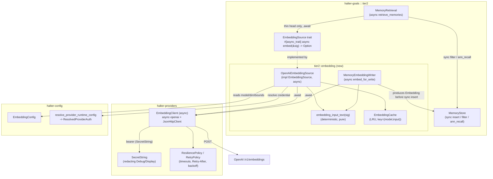

# Design Document

## Overview

This feature turns the Tier 2 embedding seam in `halter-goals` from a
test-only abstraction into a working OpenAI-backed implementation, on both the
**query path** and the **write path**, without changing the retrieval
algorithm or its head/tail bounds.

Today `crates/halter-goals/src/tier2/retrieval.rs` defines the seam as a
**synchronous** trait:

```rust
pub trait EmbeddingSource {
    fn embed(&self, sig: &IntentSignature) -> Option<Embedding>;
}
```

`MemoryRetrieval` calls `embed` **only** when the structured head is thin
(`head.len() < HEAD_MIN`, `HEAD_MIN = 3`) and, on `Some(embedding)`, requests up
to `TAIL_LIMIT = 10` neighbors via `MemoryStore::ann_recall`. A `None` return
degrades to structured-head-only retrieval with no error
(`None_Degradation_Contract`). On the write path,
`InMemoryMemoryStore::record_from` currently hardcodes `embedding:
Embedding::default()` (empty), and `cosine_distance` treats empty/zero-magnitude
vectors as maximally distant (`2.0`). So today tail recall never contributes a
real semantic match and retrieval always degrades.

### Direction: async `EmbeddingSource` over `halter-providers`

The concrete OpenAI backend is inherently async, and the workspace already
standardizes all OpenAI access on the `async-openai` crate inside the dedicated
`halter-providers` crate: every provider is `#[async_trait]`, HTTP goes through
a shared `JsonHttpClient` that already implements timeouts, cancellation
tokens, `Retry-After` parsing, error classification, and sensitive-header
redaction, secrets use `SecretString`, and retry/resilience live in
`RetryPolicy` / `ResiliencePolicy` / `ResilientProvider`. Rather than invent a
sync-over-async bridge and duplicate transport/secret/retry infrastructure on
raw `reqwest`, **this design makes `EmbeddingSource::embed` async and reuses
`halter-providers`.**

This is a low-cost, consistent change: `halter-goals` already depends on
`async-trait`, and its own Tier 2 `induction.rs` already declares
`#[async_trait]` traits (`Judge`, `Author`, `RecurrenceTracker`). Adding an
`await` point to `EmbeddingSource::embed` and `Retrieval::retrieve_memories`
does **not** change the retrieval algorithm or its head/tail bounds — it only
turns the single `embed` call site into an awaited call (Req 1.4).

This design delivers:

1. **`OpenAiEmbeddingSource`** — the concrete `EmbeddingSource` implementation
   (Req 1), backed by the OpenAI embeddings transport that lives in
   `halter-providers` (async-openai / `JsonHttpClient` / `SecretString` /
   `ResiliencePolicy`), an in-process LRU `Embedding_Cache` (Req 10), and reused
   OpenAI credential resolution (Req 5). It preserves the `Option`-returning
   contract exactly (Req 1.1, 1.4) and degrades to `None` on every failure mode
   (Req 6). The `embed` method is now `async`.
2. **`MemoryEmbeddingWriter`** — the write-time counterpart (Req 2.3, 9.2, 9.5,
   9.6) that fills `MemoryRecord.embedding` at insert time using the *same*
   transport, input-construction rule, model, and dimension as the query path.
   Its `embed_for_write` method is `async`; the store's `insert` stays
   **synchronous** by producing the embedding async up-front and passing the
   resulting `Embedding` into `insert`.
3. **`EmbeddingInputText` construction** — a single deterministic function
   shared by both paths (Req 2), so query and write embeddings are comparable.
4. **`EmbeddingConfig`** — a new configuration surface in `halter-config`
   following the existing serde + `validate(path)` conventions (Req 11).

Key design constraints established from the codebase:

- The `EmbeddingSource` trait becomes **async** (`#[async_trait]`) and returns
  `Option`. The OpenAI embeddings API is reached through the existing
  `halter-providers` async transport, so no sync-over-async bridge is needed.
- Internal fallible operations use `thiserror` enums (mirroring
  `MemoryStoreError`), but the public `embed` surface **never** returns those
  errors — it maps every failure to `None` (Req 6.1–6.3).
- Config validation uses `anyhow::Result<()>` `validate(path)` methods and the
  existing `validate_positive_u64` / `validate_positive_u32` helpers, matching
  `halter-config/src/schema.rs`.
- Functional-core / imperative-shell conventions are preserved: deterministic
  input construction, response parsing, dimension enforcement, and cache logic
  are functional-core (pure, unit/property-tested); the HTTP transport pulled
  from `halter-providers` is the imperative shell.

## Architecture

### Crate placement

The concrete OpenAI embeddings transport must live where the shared OpenAI
infrastructure already is. Two placements were considered:

| Option | Placement | Assessment |
| --- | --- | --- |
| **(a) RECOMMENDED** | Put the embeddings client in **`halter-providers`** (where `async-openai`, `JsonHttpClient`, `SecretString`, and the resilience surface already live) and expose an async embeddings function/type there. `halter-goals` depends on `halter-providers`; its `OpenAiEmbeddingSource` wraps that client. | Matches how *every* other OpenAI access is structured. Avoids duplicating transport, secret handling, `Retry-After`/error classification, and retry/resilience. Credential types (`SecretString`, `OpenAiOAuthCredentials`) are already public there. |
| (b) | Keep the concrete source in `halter-goals` but depend on `halter-providers` only for the transport primitives (`JsonHttpClient`, `SecretString`, `ResiliencePolicy`). | Viable, but `JsonHttpClient` and its helpers are `pub(crate)` in `halter-providers`; exposing them piecemeal leaks transport internals across a crate boundary. An embeddings-specific façade in `halter-providers` is cleaner. |

**Chosen: (a).** `halter-providers` exposes an async `EmbeddingClient` (name
TBD) that performs a single embeddings request and returns a parsed vector or a
classified error; `halter-goals` owns the `EmbeddingSource`/writer logic
(input construction, caching, dimension enforcement, degradation) and wraps
that client.

**Dependency-direction / cycle check.** `halter-goals` gaining a dependency on
`halter-providers` does **not** create a cycle: `halter-providers`'s
`Cargo.toml` depends on `halter-protocol` (and workspace crates), and it has
**no** dependency on `halter-goals` (verified — no `halter-goals` reference in
`crates/halter-providers/Cargo.toml`). The edge `halter-goals →
halter-providers` is therefore safe.

| Concern | Location | Rationale |
| --- | --- | --- |
| `EmbeddingClient` (async embeddings transport over async-openai / `JsonHttpClient`) + request/response DTOs | `crates/halter-providers/src/` (new module, e.g. `openai_embeddings.rs`) | Reuses the crate's `async-openai` dep, `JsonHttpClient`, `SecretString`, and `ResiliencePolicy`/`RetryPolicy`. |
| `OpenAiEmbeddingSource`, `MemoryEmbeddingWriter`, `EmbeddingCache`, `embedding_input_text` | new module `crates/halter-goals/src/tier2/embedding/` | These implement/consume the `EmbeddingSource` trait and `Embedding`/`MemoryRecord` types that live in `halter-goals`. Keeping them here lets `MemoryEmbeddingWriter` sit next to `store.rs`. `halter-goals` adds a path dependency on `halter-providers`. |
| `EmbeddingConfig` schema | `crates/halter-config/src/schema.rs` | Config lives with `HarnessConfig` so it is validated by the same `validate()` pipeline and serialized by the same JsonSchema derive. |
| Credential resolution | reuse `halter-config`'s `resolve_provider_runtime_config` + `ResolvedProviderAuth`, mapped into `SecretString` | Req 5 requires identical precedence to the `openai` provider; reusing the existing resolver guarantees it. |

`EmbeddingConfig` is added as a new optional block on `HarnessConfig`
(`[embedding]`) rather than nested under `[providers.openai]`, because:

- It configures a *consumer of goals/memory*, not the LLM chat provider; model,
  dimension, cache bounds, and enable flag are embedding-specific and would not
  make sense on `ProviderConfig` (Req 11.1–11.4).
- It still resolves credentials **through** `[providers.openai]` (Req 5.1), so
  the operator configures the OpenAI credential exactly once, in the provider
  block, and `[embedding]` only adds embedding-specific knobs.

### Component diagram



### Query path (retrieval)

1. `MemoryRetrieval::retrieve_memories(sig)` becomes `async` (under
   `#[async_trait]`) because it now awaits the embed call. The **algorithm is
   unchanged**: the structured `filter` runs first (synchronous), and only if
   `head.len() < HEAD_MIN` does it `self.embedder.embed(sig).await` (Req 1.4).
   `MemoryStore::filter` and `MemoryStore::ann_recall` remain **synchronous** —
   only the single embed call is awaited. Retrieval still mixes sync store reads
   with one awaited embed.
2. `OpenAiEmbeddingSource::embed` (async):
   - If disabled by config → `None`, no network (Req 11.5).
   - Build `input = embedding_input_text(sig)` (Req 2). If empty → `None`, no
     network (Req 3.4).
   - Cache lookup by `(model, input)`; on hit → return cached `Embedding`
     without a client call (Req 10.2).
   - Resolve credential (Req 5). If none → `None`, no network, cache untouched
     (Req 5.5).
   - Call the `halter-providers` `EmbeddingClient` with the timeout/retry
     policy from `ResiliencePolicy`/`RetryPolicy` (Req 3, 7, 8). Map the
     response to `Some(Embedding)` iff it is a non-empty, finite vector whose
     length equals the configured dimension (Req 4, 9.3, 9.4); otherwise `None`
     (Req 4.2–4.4, 6, 9.4).
   - On a usable embedding, insert into the cache (best-effort) and return it
     (Req 10.3, 10.4). On `None`, leave the cache unchanged (Req 10.5).

### Write path (induction / insert)

`MemoryEmbeddingWriter` produces the embedding stored in
`MemoryRecord.embedding` when a memory is written, replacing the current
`Embedding::default()` in `InMemoryMemoryStore::record_from`. It uses the same
`embedding_input_text` rule applied to the memory's `intent` (Req 2.3), the same
`EmbeddingClient`, and the same configured model/dimension (Req 9.1).

Because the store's `insert` returns `Result<MemoryId, MemoryStoreError>`
**synchronously** and holds an internal lock, the write path produces the
embedding **async up-front, outside the sync store lock**, then hands the
resulting `Embedding` to the still-synchronous `insert`. This keeps
`MemoryStore::insert` synchronous and avoids awaiting while a lock is held.
Behavior:

- Client yields a usable vector of the configured dimension → produce
  `Embedded(embedding)`; the caller passes it into `insert` (Req 9.2).
- Client yields `None` (unavailable) → produce `Unavailable`; the caller stores
  an `Embedding` of length zero, the write completes, and the memory remains
  retrievable via the structured filter (Req 6.4). This matches
  `cosine_distance`'s existing "empty ⇒ maximally distant" behavior, so an
  un-embedded memory simply never wins tail recall.
- Client yields a vector whose length ≠ configured dimension, or the writer's
  configured dimension ≠ the source's configured dimension → **do not store**;
  `embed_for_write` returns an error so the caller rejects the store, leaving
  any previously stored embedding unchanged (Req 9.5, 9.6). This is the one
  place a failure is *not* silently degraded, because a wrong-dimension vector
  would corrupt ANN cosine ranking.

The write-time dimension failure is surfaced by extending `MemoryStoreError`
(see [Error Handling](#error-handling)).

### Blast radius: async-ification of the retrieval seam

Making `EmbeddingSource::embed` and `Retrieval::retrieve_memories` async is a
mechanical, well-bounded change. Every affected call site and impl:

- **`crates/halter-goals/src/tier2/retrieval.rs`**
  - `EmbeddingSource` gains `#[async_trait]`; `embed` becomes `async fn embed(&self, sig: &IntentSignature) -> Option<Embedding>`.
  - `Retrieval` gains `#[async_trait]`; `retrieve_memories` becomes `async fn`.
  - `MemoryRetrieval::retrieve_memories` awaits `self.embedder.embed(sig)` at
    the single existing call site; `filter`/`ann_recall` stay sync.
  - Test embedders `SpyEmbedder` and `DownEmbedder` gain `#[async_trait]` and
    `async fn embed`; their tests become `#[tokio::test]` and `.await` the
    `retrieve_memories` call.
- **`crates/halter-goals/src/tier2/summary.rs`**
  - `SummaryProvider`'s method that calls `retrieval.retrieve_memories(sig)`
    becomes `async` and awaits it. The `SpyRetrieval` test fake gains
    `#[async_trait]` and `async fn retrieve_memories`.
- **`crates/halter-goals/src/integration.rs`**
  - `start_goal(...)` calls `retrieval.retrieve_memories(sig)` — becomes `async`
    and awaits it. The `FixedEmbedder` test fake gains `#[async_trait]` +
    `async fn embed`.
- **`crates/halter-goals/tests/sqlite_memory_store_integration.rs`**
  - The out-of-crate `FixedEmbedder` gains `#[async_trait]` + `async fn embed`;
    affected tests become `#[tokio::test]`.
- **`crates/halter-goals/src/tier2/mod.rs`** and **`src/lib.rs`**
  - Re-exports of `EmbeddingSource`, `Retrieval`, `MemoryRetrieval`, etc. are
    **unchanged in name**; only the trait method signatures change.

These are all straightforward async-ification changes; no retrieval logic,
ordering, dedup, or head/tail bounds change.

## Components and Interfaces

The `EmbeddingClient` transport lives in `halter-providers`. All other new
types live under `crates/halter-goals/src/tier2/embedding/` unless noted.
`EmbeddingConfig` lives in `halter-config`.

### The async EmbeddingSource trait (Req 1) — `tier2/retrieval.rs`

The **existing** trait is changed from sync to async. This is consistent with
`tier2/induction.rs`, which already uses `#[async_trait]` for its `Judge` /
`Author` traits, and `halter-goals` already depends on `async-trait`.

```rust
use async_trait::async_trait;

/// A source of query embeddings, abstracting the (possibly remote) embedding
/// backend so its availability can be modeled and simulated.
///
/// `embed` returns `Some(embedding)` when the backend produced an embedding,
/// and `None` when the backend is unavailable — driving graceful degradation
/// to a structured-head-only result (Requirement 18.7 / Req 6) rather than an
/// error.
#[async_trait]
pub trait EmbeddingSource: Send + Sync {
    /// Embed the query signature, or `None` if the backend is unavailable.
    async fn embed(&self, sig: &IntentSignature) -> Option<Embedding>;
}

/// Structured-first retrieval over a `MemoryStore`.
#[async_trait]
pub trait Retrieval {
    /// Retrieve the memories applicable to `sig`, ordered by score descending.
    async fn retrieve_memories(&self, sig: &IntentSignature) -> Vec<ScoredMemory>;
}
```

`MemoryRetrieval::retrieve_memories` keeps its exact algorithm; the only change
is `match self.embedder.embed(sig).await { ... }` at the single existing embed
call site (Req 1.4). The `Send + Sync` bound on `EmbeddingSource` matches the
existing bounds required for retrieval to be usable across await points.

### Deterministic input construction (Req 2) — pure, functional core

```rust
/// The fixed field separator between IntentSignature fields. A unit separator
/// (U+001F) is used so it cannot appear in ordinary field text, keeping field
/// boundaries unambiguous (Req 2.1, 2.6).
pub const FIELD_SEPARATOR: char = '\u{001F}';

/// The fixed placeholder for an absent/empty field, preserving field position
/// so boundaries stay stable for field-wise-equal inputs (Req 2.6).
pub const EMPTY_FIELD_PLACEHOLDER: &str = "";

/// Build the deterministic Embedding_Input_Text from an IntentSignature.
///
/// The text is derived *solely* from the four fields in the fixed order
/// intent_type, target_type, target_ref, scope, joined by `FIELD_SEPARATOR`
/// and encoded as UTF-8 (Req 2.1). Field-wise-equal signatures yield
/// byte-identical output (Req 2.2); signatures differing in any field yield
/// different output because the separator cannot appear inside a field, so no
/// two distinct field tuples can collide (Req 2.5).
#[must_use]
pub fn embedding_input_text(sig: &IntentSignature) -> String;
```

Both `OpenAiEmbeddingSource` (query) and `MemoryEmbeddingWriter` (write) call
this exact function — the writer passes `memory.intent` — guaranteeing
byte-identical text for field-wise-equal query/memory signatures (Req 2.3, 2.4).

### The embeddings transport (Req 3, 4, 7, 8) — `halter-providers`

Rather than a hand-rolled `reqwest` backend, `halter-providers` exposes an
async embeddings client that reuses the crate's existing infrastructure. It
either drives `async-openai`'s embeddings API (`CreateEmbeddingRequest` and the
embeddings endpoint) or routes a JSON embeddings `POST` through the existing
`JsonHttpClient::post_json`; either way the request/response DTOs and the Req
4.5 round-trip codec still apply, and credentials are held as `SecretString`.

```rust
// crates/halter-providers/src/openai_embeddings.rs (new)

/// A single embedding request: model + input text (+ optional dimension).
#[derive(Debug, Clone, PartialEq, Eq)]
pub struct EmbeddingRequest {
    pub model: String,
    pub input: String,
    pub dimensions: Option<u32>,
}

/// A parsed, usable embedding response: the first embedding object's vector.
#[derive(Debug, Clone, PartialEq)]
pub struct EmbeddingResponse {
    pub vector: Vec<f32>,
}

/// Async OpenAI embeddings transport, reusing `SecretString` for the bearer
/// credential and the shared timeout/retry infrastructure. It performs the
/// request(s) and classifies failures into a retry-relevant error surface.
///
/// Implemented for production over async-openai / `JsonHttpClient`, and by
/// fakes in tests so the source/writer logic (caching, dimension checks,
/// degradation, retry accounting) is tested without real network I/O.
#[async_trait]
pub trait EmbeddingClient: Send + Sync {
    /// Perform ONE embedding attempt. Returns the parsed response or a
    /// classified `EmbeddingClientError`. Retry is layered by the caller
    /// (the source) so it can be exercised deterministically with a fake.
    async fn embed_once(
        &self,
        request: &EmbeddingRequest,
        cancel: CancellationToken,
    ) -> Result<EmbeddingResponse, EmbeddingClientError>;
}

/// Production client: async-openai / JsonHttpClient + SecretString bearer +
/// resolved endpoint + resilience policy.
pub struct OpenAiEmbeddingClient { /* http client, endpoint, SecretString auth, timeouts */ }

#[async_trait]
impl EmbeddingClient for OpenAiEmbeddingClient {
    async fn embed_once(
        &self,
        request: &EmbeddingRequest,
        cancel: CancellationToken,
    ) -> Result<EmbeddingResponse, EmbeddingClientError>;
}
```

**Timeout and retry** reuse the existing `halter-providers` surface rather than
a hand-rolled loop where practical:

- **Timeout (Req 7)** is applied per attempt. When routed through
  `JsonHttpClient`, `post_json` already bounds the request with the configured
  `ProviderTimeouts::request` and treats a timeout as a transient failure. When
  driven through async-openai, the per-request timeout is set on the underlying
  client. The embedding timeout comes from `EmbeddingConfig` (default 30s).
- **Retry (Req 8)** is layered in `OpenAiEmbeddingSource` using a bounded
  attempt loop parameterized by `max_attempts` (1..=10, default 3). Because the
  `EmbeddingClient::embed_once` surface performs exactly one attempt and returns
  a **classified** error, the source can either drive `RetryPolicy`'s backoff
  computation or a simple bounded loop; the classification (retryable vs not)
  is the contract the requirements demand. `JsonHttpClient` already parses
  `Retry-After` and classifies HTTP status into `ProviderErrorKind`, which maps
  cleanly onto the embeddings error surface below.

**Error-surface mapping (Req 8).** The client maps its transport error surface
onto the retry classification the requirements demand:

| Underlying condition | `EmbeddingClientError` | Retryable? | Requirement |
| --- | --- | --- | --- |
| connection/transport fault | `Transport` | yes | 6.1, 8.1 |
| request timeout | `Timeout` | yes | 7.2, 8.1 |
| HTTP 429 | `RateLimited { retry_after }` | yes | 8.1 |
| HTTP 500–599 | `Server(status)` | yes | 8.1 |
| HTTP 4xx (≠ 429) | `Client(status)` | no | 6.2, 8.4 |
| unusable body (empty data / zero-len / unparseable) | `Unusable` | no | 4.2–4.4 |

When driving `JsonHttpClient`, the typed `ProviderError` recovered via
`provider_error_from_anyhow` already distinguishes `Transient` /
`RateLimited` / `Fatal` with a `backoff_hint`; the client translates that into
the table above. When driving async-openai, its error enum is matched onto the
same table.

### The embedding cache (Req 10) — `tier2/embedding/`

```rust
/// In-process LRU cache keyed by (Embedding_Model, Embedding_Input_Text).
///
/// Backed by the `lru` crate (added to halter-goals for the cache only; the
/// HTTP client comes from halter-providers). Access order is updated on read so
/// eviction is least-recently-*accessed* (Req 10.7).
pub struct EmbeddingCache {
    inner: lru::LruCache<EmbeddingCacheKey, Embedding>, // cap = configured max (Req 10.6)
}

#[derive(Debug, Clone, PartialEq, Eq, Hash)]
pub struct EmbeddingCacheKey {
    pub model: String,
    pub input: String,
}

impl EmbeddingCache {
    #[must_use]
    pub fn new(capacity: usize) -> Self; // capacity defaults to 1024 via config (Req 10.6)
    /// Look up, updating recency on hit (Req 10.2).
    pub fn get(&mut self, key: &EmbeddingCacheKey) -> Option<Embedding>;
    /// Insert, evicting the least-recently-accessed entry if at capacity
    /// (Req 10.7). Returns whether the entry is now present (Req 10.4).
    pub fn put(&mut self, key: EmbeddingCacheKey, value: Embedding) -> bool;
}
```

The cache lives behind a `Mutex` inside `OpenAiEmbeddingSource` because `embed`
takes `&self` (interior mutability, mirroring `InMemoryMemoryStore`'s `RwLock`).
The cache lock is only held for the synchronous get/put; it is **not** held
across the `.await` on the client.

### The concrete EmbeddingSource (Req 1, 5, 6, 9, 10, 11) — `tier2/embedding/`

```rust
/// Concrete OpenAI-backed EmbeddingSource for the query path.
pub struct OpenAiEmbeddingSource<C: EmbeddingClient> {
    client: C,                          // from halter-providers
    cache: std::sync::Mutex<EmbeddingCache>,
    model: String,          // Req 9.1, 11.1
    dimension: u32,         // Req 9.1, 9.3, 9.4
    max_attempts: u32,      // 1..=10, default 3 (Req 8.2, 8.3)
    timeout: Duration,      // Req 7
    enabled: bool,          // Req 11.4, 11.5
    // credential/endpoint captured when constructing the client
}

impl<C: EmbeddingClient> OpenAiEmbeddingSource<C> {
    /// Build from resolved config + a client. Config values are already
    /// clamped/validated (attempts to 1..=10, dimension >= 1, etc.).
    pub fn new(client: C, settings: ResolvedEmbeddingSettings) -> Self;
}

#[async_trait]
impl<C: EmbeddingClient> EmbeddingSource for OpenAiEmbeddingSource<C> {
    async fn embed(&self, sig: &IntentSignature) -> Option<Embedding> {
        // 1. disabled -> None (Req 11.5)
        // 2. input = embedding_input_text(sig); if empty -> None (Req 3.4)
        // 3. cache hit -> Some(cached) (Req 10.2)  [lock not held across await]
        // 4. attempt loop with retry classification (Req 8) + per-attempt
        //    timeout (Req 7); each attempt: client.embed_once(..).await
        // 5. validate finite + dimension (Req 4, 9.3, 9.4)
        // 6. put in cache best-effort, return Some (Req 10.3, 10.4)
        // any failure -> None, cache unchanged (Req 6, 10.5)
    }
}
```

Credential resolution (Req 5) happens when constructing the client, not on the
hot path: a helper resolves `ResolvedProviderAuth` for
`ConfiguredProvider::OpenAi` via `resolve_provider_runtime_config`, yielding
either an API-key or OAuth access-token bearer, wrapped in `SecretString`. If
resolution finds no credential, the source is built in a "no credential" state
whose `embed` returns `None` without a network call (Req 5.5). Because the
bearer is a `SecretString`, its `Debug`/`Display` already redact the value (Req
5.6) — no new wrapper type is needed.

### The memory embedding writer (Req 2.3, 6.4, 9) — `tier2/embedding/`

```rust
/// Write-time embedding producer for MemoryRecord.embedding.
pub struct MemoryEmbeddingWriter<C: EmbeddingClient> {
    client: C,          // same halter-providers client type as the source
    model: String,      // MUST equal the source's model (Req 9.1)
    dimension: u32,     // MUST equal the source's dimension (Req 9.1, 9.6)
    max_attempts: u32,
    timeout: Duration,
    enabled: bool,
}

/// Outcome of producing a write-time embedding.
pub enum WriteEmbedding {
    /// A usable vector of the configured dimension (Req 9.2).
    Embedded(Embedding),
    /// Backend unavailable -> store empty, write still succeeds (Req 6.4).
    Unavailable,
}

impl<C: EmbeddingClient> MemoryEmbeddingWriter<C> {
    /// Produce the embedding for `memory.intent`, **async**, up-front and
    /// outside any store lock. The caller then hands the resulting `Embedding`
    /// (or empty on `Unavailable`) to the synchronous `MemoryStore::insert`.
    ///
    /// # Errors
    /// Returns `EmbeddingWriteError::DimensionMismatch` when the produced
    /// vector length != configured dimension (Req 9.5), and
    /// `EmbeddingWriteError::DimensionMisconfigured` when the writer's
    /// dimension != the source's dimension (Req 9.6), so the caller rejects
    /// the store and leaves any prior embedding unchanged.
    pub async fn embed_for_write(
        &self,
        intent: &IntentSignature,
    ) -> Result<WriteEmbedding, EmbeddingWriteError>;
}
```

The insert flow keeps `MemoryStore::insert` synchronous: the caller
`embed_for_write(&memory.intent).await` first, then maps `Embedded(e)` into the
record, `Unavailable` into `Embedding::default()` (empty), and a
`DimensionMismatch` / `DimensionMisconfigured` error into a rejected store —
surfaced through a new `MemoryStoreError` variant when the store performs the
final validation (Req 9.5, 9.6).

### Configuration (Req 11) — `halter-config/src/schema.rs`

```rust
/// Default embedding model when none is configured (Req 11.1).
pub const DEFAULT_EMBEDDING_MODEL: &str = "text-embedding-3-small";
/// Default per-request timeout in seconds (Req 7.1, 11.3).
pub const DEFAULT_EMBEDDING_TIMEOUT_SECS: u64 = 30;
/// Default total attempts (Req 8.2, 11.3).
pub const DEFAULT_EMBEDDING_MAX_ATTEMPTS: u32 = 3;
/// Default cache capacity (Req 10.6, 11.3).
pub const DEFAULT_EMBEDDING_CACHE_MAX_ENTRIES: usize = 1024;

fn default_embedding_model() -> String { DEFAULT_EMBEDDING_MODEL.to_owned() }
const fn default_embedding_enabled() -> bool { true }

#[derive(Debug, Clone, Serialize, Deserialize, JsonSchema, PartialEq)]
#[serde(deny_unknown_fields)]
/// Configuration for the OpenAI embedding source (Req 11).
pub struct EmbeddingConfig {
    /// Enable flag; defaults to enabled (Req 11.4).
    #[serde(default = "default_embedding_enabled")]
    pub enabled: bool,
    /// Embeddings model id; defaults to text-embedding-3-small (Req 11.1).
    #[serde(default = "default_embedding_model")]
    pub model: String,
    /// Optional dimension override; when set must be >= 1 (Req 11.2, 11.6).
    #[serde(default)]
    pub dimension: Option<u32>,
    /// Optional base URL override; defaults to the openai provider base URL
    /// (https://api.openai.com) when unset (Req 3.3, 11.3).
    #[serde(default)]
    pub base_url: Option<String>,
    /// Per-request timeout seconds; default 30, must be >= 1 (Req 7, 11.3, 11.7).
    #[serde(default)]
    pub timeout_secs: Option<u64>,
    /// Max total attempts; default 3, clamped to 1..=10 (Req 8, 11.3, 11.7).
    #[serde(default)]
    pub max_attempts: Option<u32>,
    /// Max cache entries; default 1024, must be >= 1 (Req 10.6, 11.3, 11.7).
    #[serde(default)]
    pub cache_max_entries: Option<u64>,
}

impl Default for EmbeddingConfig { /* enabled=true, model=default, rest None */ }

impl EmbeddingConfig {
    /// Validate the embedding config (Req 11.6, 11.7). Mirrors the existing
    /// validate_positive_* helpers and "invalid configuration: {path} ..."
    /// message shape.
    pub fn validate(&self, path: &str) -> anyhow::Result<()> {
        validate_optional_positive_u32(&format!("{path}.dimension"), self.dimension)?;    // Req 11.6
        validate_optional_positive_u64(&format!("{path}.timeout_secs"), self.timeout_secs)?; // Req 11.7
        validate_optional_positive_u32(&format!("{path}.max_attempts"), self.max_attempts)?; // Req 11.7
        validate_optional_positive_u64(&format!("{path}.cache_max_entries"), self.cache_max_entries)?; // Req 11.7
        Ok(())
    }
}
```

`HarnessConfig` gains `#[serde(default)] pub embedding: EmbeddingConfig` and
calls `self.embedding.validate("embedding")?` inside `HarnessConfig::validate`.

A resolution helper turns `EmbeddingConfig` + resolved OpenAI provider auth into
a runtime-ready `ResolvedEmbeddingSettings` (applying defaults and the
`max_attempts` 1..=10 clamp from Req 8.3, and the timeout ">= 1 else 30" rule
from Req 7.3), which both the source and writer read (Req 9.1 — single source of
truth for model + dimension), and which carries the `SecretString` bearer.

> Note on Req 8.3 / 7.3 vs 11.6/11.7: config *validation* rejects
> zero/negative-shaped values with an error (Req 11.6, 11.7). The runtime
> `max_attempts` clamp to 1..=10 (Req 8.3) and timeout fallback to 30s (Req 7.3)
> apply to values that pass schema validation but fall outside the runtime
> range — e.g. `max_attempts = 50` is a positive integer (valid schema) that the
> runtime clamps to 10.

## Data Models

### OpenAI embeddings request/response DTOs (Req 3, 4)

These serde types are the wire representation used by the `halter-providers`
`EmbeddingClient` (whether it drives async-openai's `CreateEmbeddingRequest`
directly or posts JSON through `JsonHttpClient`). They are internal to the
embeddings module.

```rust
/// Wire request body for POST {base_url}/v1/embeddings (Req 3.1, 3.2).
#[derive(Debug, Clone, PartialEq, Serialize, Deserialize)]
struct OpenAiEmbeddingRequestBody {
    model: String,
    input: String,
    /// Omitted entirely when no dimension override is configured so the
    /// model default applies (Req 3.2).
    #[serde(skip_serializing_if = "Option::is_none")]
    dimensions: Option<u32>,
}

/// Wire success response (Req 4.1).
#[derive(Debug, Clone, PartialEq, Serialize, Deserialize)]
struct OpenAiEmbeddingResponseBody {
    /// Zero or more embedding objects; we take the first (Req 4.1, 4.3).
    data: Vec<OpenAiEmbeddingObject>,
    #[serde(default)]
    model: String,
}

#[derive(Debug, Clone, PartialEq, Serialize, Deserialize)]
struct OpenAiEmbeddingObject {
    embedding: Vec<f32>,
    #[serde(default)]
    index: u32,
}
```

Response → domain mapping (`OpenAiEmbeddingResponseBody` →
`Option<EmbeddingResponse>`):

| Condition | Result | Requirement |
| --- | --- | --- |
| `data` empty | `None` | 4.3 |
| body unparseable into ≥1 object with numeric vector | `None` | 4.2 |
| first object's `embedding` length 0 | `None` | 4.4 |
| any element NaN/infinite | `None` | 1.3 |
| length ≠ configured dimension | `None` | 9.4 |
| otherwise | `Some(EmbeddingResponse { vector })`, order preserved | 4.1 |

### Round-trip codec (Req 4.5)

The "request/response representation" that must round-trip is the pair
`(EmbeddingRequest, OpenAiEmbeddingResponseBody)` and the domain `Embedding` it
parses to. The property: for any success payload that parses into a non-empty
`Embedding`, `parse → serialize → parse` yields an element-wise-equal
`Embedding`. Because `Vec<f32>` serializes losslessly through `serde_json` for
finite values (and the parse step rejects non-finite values before this point),
the codec is a faithful round trip. This property is unchanged by the async /
`halter-providers` transport choice: it is a property of the pure DTO codec,
not of the network path.

```rust
/// Parse a wire body into the domain Embedding (first object), applying all
/// the None rules above.
fn parse_embedding(body: &OpenAiEmbeddingResponseBody, dimension: u32) -> Option<Embedding>;

/// Serialize a domain Embedding back into a wire body (single data object).
fn to_wire(embedding: &Embedding, model: &str) -> OpenAiEmbeddingResponseBody;
```

### Domain and config models (already grounded)

- `Embedding(pub Vec<f32>)` — unchanged (`tier2/memory.rs`).
- `MemoryRecord.embedding: Embedding` — now populated at write time instead of
  `Embedding::default()`, from the async-produced write embedding.
- `IntentSignature { intent_type, target_type, target_ref, scope }` — the four
  fields feeding `embedding_input_text`.
- `ResolvedProviderAuth::{ApiKey(String), OpenAiOAuth(OpenAiOAuthConfig)}` —
  the resolved credential; the OAuth `access_token` is the bearer (Req 5.3).
- `SecretString` (from `halter-providers`) — the redacting wrapper holding the
  resolved bearer credential. Its `Debug` prints `SecretString(<redacted>)` and
  `Display` prints `<redacted>`; `expose_secret()` yields the raw value only at
  the point the `Authorization` header is built (Req 5.6). No new credential
  wrapper is introduced.

## Correctness Properties

*A property is a characteristic or behavior that should hold true across all
valid executions of a system — essentially, a formal statement about what the
system should do. Properties serve as the bridge between human-readable
specifications and machine-verifiable correctness guarantees.*

The properties below are the consolidated result of analyzing every acceptance
criterion (see the Testing Strategy for which criteria are covered by
example/edge tests instead). The async change does not alter which criteria are
testable or how they consolidate — property tests simply become `#[tokio::test]`
and `.await` the async `embed`, and the fakes implement the async
`EmbeddingClient` trait. Redundant criteria were folded together: the four
input-construction determinism criteria (2.1–2.4, 2.6) became one property; the
three no-network preconditions (3.4, 5.5, 11.5) became one; the response-mapping
and dimension-enforcement criteria (1.2, 1.3, 9.3, 9.4) became one; and the
degradation criteria (6.1–6.3, 7.2, 8.5, 10.5) became one.

### Property 1: Input construction is deterministic and path-agnostic

*For any* two `IntentSignature` values that are field-wise equal across all four
fields — whether used as a query signature or as a memory's `intent` — the
`embedding_input_text` produced for both is byte-identical, including when one
or more fields are empty.

**Validates: Requirements 2.1, 2.2, 2.3, 2.4, 2.6**

### Property 2: Input construction is injective over field tuples

*For any* two `IntentSignature` values that differ in at least one of the four
fields, the `embedding_input_text` values produced for them are not
byte-identical.

**Validates: Requirements 2.5**

### Property 3: The client request carries model, input, and conditional dimension

*For any* `IntentSignature` with non-empty constructed input and *any* configured
dimension option, the `EmbeddingRequest` handed to the `EmbeddingClient` has
`model` equal to the configured model, `input` equal to
`embedding_input_text(sig)`, and `dimensions == Some(d)` when a dimension
override `d` is configured and `None` (omitted from the serialized body) when no
override is configured.

**Validates: Requirements 3.1, 3.2**

### Property 4: No-network preconditions yield None without side effects

*For any* `IntentSignature`, when the source is disabled, or no credential is
resolvable, or the constructed input is empty, awaiting `embed` returns `None`,
makes zero `EmbeddingClient` calls, and leaves the cache unchanged.

**Validates: Requirements 3.4, 5.5, 11.5**

### Property 5: Response mapping enforces finiteness and dimension

*For any* client response vector, `embed` returns `Some(Embedding(v))` — where
`v` equals the response vector element-wise and in order — if and only if the
vector is non-empty, contains no NaN or infinite value, and has length equal to
the configured dimension; in every other case `embed` returns `None` and leaves
the input signature unchanged.

**Validates: Requirements 1.2, 1.3, 4.1, 9.3, 9.4**

### Property 6: Request/response codec round-trips

*For any* success payload that parses into a non-empty `Embedding`, parsing the
payload, then serializing the resulting request-and-response representation, then
parsing it again yields an `Embedding` whose `Vec<f32>` is element-wise equal in
value and order to the `Embedding` produced by the first parse.

**Validates: Requirements 4.5**

### Property 7: Degradation always yields an Option, never an error or panic

*For any* client outcome (arbitrary transport error, non-2xx status, timeout, or
degenerate response) and *any* `IntentSignature`, awaiting `embed` returns a value
of type `Option<Embedding>` without panicking and without propagating an error to
the caller; whenever it returns `None`, the cache is unchanged for that input's
key.

**Validates: Requirements 6.1, 6.2, 6.3, 7.2, 8.5, 10.5**

### Property 8: Retry attempts are bounded and classified

*For any* configured maximum attempts `max` in `1..=10` and *any* scripted client
failure sequence, the number of `EmbeddingClient` calls a single `embed` makes
equals `min(k, max)` where `k` is the 1-based position of the first success; a
non-retryable failure (HTTP 4xx other than 429) stops after exactly one attempt;
and when every attempt is a retryable failure (transport, timeout, 429, or
5xx), `embed` makes exactly `max` attempts and then returns `None`.

**Validates: Requirements 8.1, 8.2, 8.4, 8.5, 7.2**

### Property 9: Caching memoizes identical inputs

*For any* `IntentSignature` embedded twice with a cache capacity of at least one
and no intervening eviction of its key, the source makes at most one
`EmbeddingClient` call across both embeds, both embeds return equal `Embedding`
values, and after a successful embed the `(model, input)` key is present in the
cache.

**Validates: Requirements 10.1, 10.2, 10.3, 10.8**

### Property 10: Cache is bounded and evicts least-recently-accessed

*For any* configured capacity `c` and *any* sequence of distinct-key insertions and
lookups, the cache never holds more than `c` entries, and whenever a new distinct
key is inserted while the cache is full, the entry evicted is the one that was
least recently accessed.

**Validates: Requirements 10.6, 10.7**

### Property 11: Write-time client unavailability degrades to an empty embedding

*For any* valid memory, when the write-time `EmbeddingClient` is unavailable, the
insert completes successfully, the stored `MemoryRecord.embedding` has length
zero, and the memory is retrievable via the structured filter.

**Validates: Requirements 6.4**

### Property 12: Write-time dimension mismatch rejects the store

*For any* non-empty produced vector whose length does not equal the configured
dimension, `embed_for_write` surfaces a failure, the store rejects the insert
without persisting a mismatched embedding, and any previously stored embedding
for that memory is left unchanged.

**Validates: Requirements 9.2, 9.5**

### Property 13: Credentials never appear in logs or errors

*For any* credential string, formatting the `SecretString` bearer (via `Debug` or
`Display`) and any produced `EmbeddingClientError` value never contains the raw
credential value.

**Validates: Requirements 5.6**

## Error Handling

Internal fallible operations use a `thiserror` enum, mirroring
`MemoryStoreError`. The **public** `embed` surface never exposes these; every
variant maps to `None` (Req 6). Write-time dimension mismatch is the sole case
that surfaces a failure to the caller.

```rust
/// Classified client failure from a single embed attempt. Lives in
/// halter-providers alongside the EmbeddingClient trait. Carries no
/// credential, URL query, or response body text, so its Debug/Display cannot
/// leak secrets (Req 5.6, Property 13).
#[derive(Debug, thiserror::Error)]
pub enum EmbeddingClientError {
    #[error("embedding client transport error")]        // Req 6.1, 8.1 (retryable)
    Transport,
    #[error("embedding client request timed out")]      // Req 7.2, 8.1 (retryable)
    Timeout,
    #[error("embedding client rate limited (429)")]     // Req 8.1 (retryable)
    RateLimited { retry_after: Option<std::time::Duration> },
    #[error("embedding client server error ({0})")]     // 500-599, Req 8.1 (retryable)
    Server(u16),
    #[error("embedding client error ({0})")]            // 4xx != 429, Req 8.4 (non-retryable)
    Client(u16),
    #[error("embedding client returned an unusable body")] // Req 4.2-4.4 (non-retryable)
    Unusable,
}

impl EmbeddingClientError {
    /// Retryable iff Transport | Timeout | RateLimited | Server (Req 8.1, 8.4).
    fn is_retryable(&self) -> bool;
}
```

The `OpenAiEmbeddingClient` builds these variants from the `halter-providers`
transport it drives. When routing through `JsonHttpClient`, the typed
`ProviderError` recovered via `provider_error_from_anyhow` maps as follows:
`ProviderErrorKind::RateLimited` → `RateLimited { retry_after: backoff_hint }`;
`Transient` (transport/timeout) → `Transport`/`Timeout`; non-2xx `Fatal` with a
4xx status → `Client`; 5xx → `Server`; undecodable/empty body → `Unusable`.
When driving `async-openai`, its error enum is matched onto the same variants.
The `RateLimited.retry_after` carries the parsed `Retry-After` so the retry
loop can honor it (reusing `JsonHttpClient`'s existing `Retry-After` parsing).

### Failure-to-outcome mapping

| Source of failure | `embed` (query) | Requirement |
| --- | --- | --- |
| Disabled / no credential / empty input | `None`, no network | 11.5, 5.5, 3.4 |
| `Transport` / `Timeout` / `RateLimited` / `Server` | retry up to `max`, then `None` | 6.1, 7.2, 8.1, 8.2 |
| `Client(4xx != 429)` | `None`, no further attempts | 6.2, 8.4 |
| `Unusable` body (empty data / zero-len / NaN / inf / unparseable) | `None` | 4.2–4.4, 1.3 |
| Vector length ≠ dimension | `None` | 9.4 |
| Cache put fails | still return `Some`, key absent | 10.4 |

### Write-time error path

```rust
#[derive(Debug, thiserror::Error)]
pub enum EmbeddingWriteError {
    #[error("embedding dimension mismatch: produced {actual}, configured {configured}")]
    DimensionMismatch { actual: usize, configured: u32 }, // Req 9.5
    #[error("embedding dimension misconfiguration: writer {writer} != source {source}")]
    DimensionMisconfigured { writer: u32, source: u32 },   // Req 9.6
}
```

`MemoryStore::insert` gains a new failure surface for these. Because
`embed_for_write` is awaited **before** the synchronous `insert`, the store
itself stays synchronous: the caller resolves the write embedding async, and a
dimension failure is surfaced through `insert` rejecting the store. Options
considered:

1. Add variants to `MemoryStoreError` (`EmbeddingDimensionMismatch`,
   `EmbeddingDimensionMisconfigured`). **Chosen** — keeps the store's single
   synchronous `Result<MemoryId, MemoryStoreError>` signature (no breaking
   change to callers) while letting a dimension failure reject the write with
   the store left unchanged, exactly like the existing validation failures.
2. A separate error type on a new insert method. Rejected — fragments the write
   API and duplicates the "store unchanged on error" guarantee.

Unavailability at write time is **not** an error: it maps to
`WriteEmbedding::Unavailable` → `Embedding::default()` and a successful insert
(Req 6.4), because `cosine_distance` already treats empty vectors as maximally
distant, so an un-embedded memory is simply never a tail-recall winner.

## Testing Strategy

### Dual approach

- **Property-based tests** verify the 13 universal properties above across many
  generated inputs.
- **Unit / example tests** verify specific behaviors, config defaults,
  credential precedence, URL construction, and validation messages that are not
  universal.
- **Edge-case tests** cover degenerate responses and best-effort cache failure.

Because the seam is now async, property and behavior tests that exercise `embed`
/ `retrieve_memories` / `embed_for_write` run under `#[tokio::test]` and `.await`
the calls. Pure-function tests (input construction, codec, cache invariants,
config validation) stay synchronous.

### Property-based testing applies here

The core of this feature is pure logic over a large input space: deterministic
string construction, a JSON request/response codec, dimension enforcement,
retry/caching state machines driven by scripted clients, and a degradation
invariant. These are ideal for PBT. Network I/O itself is **not**
property-tested; it is isolated behind the `halter-providers` `EmbeddingClient`
trait and exercised by fakes/spies, with 1–2 integration examples for the real
HTTP path.

- Library: **`proptest`** (already a `dev-dependency` of `halter-goals`). Do not
  hand-roll generators or a PBT harness.
- Minimum **100 iterations** per property test (proptest default `cases` ≥ 100).
- Each property test is tagged with a comment referencing its design property:
  `// Feature: openai-embedding-source, Property {n}: {property text}`.
- Each of the 13 properties is implemented by a **single** property test.

Generators:
- `IntentSignature` — random UTF-8 (incl. empty strings and the unit separator
  as content to stress injectivity/boundaries) for the four fields.
- Vectors — `Vec<f32>` with a mix of finite values, plus injected NaN/±inf and
  empty vectors; length drawn around the configured dimension to exercise
  match/mismatch.
- Scripted async clients — a fake `EmbeddingClient` whose `embed_once` returns a
  caller-supplied sequence of `Result<EmbeddingResponse, EmbeddingClientError>`,
  and a spy that counts attempts, to drive the retry (Property 8), caching
  (Property 9), and degradation (Property 7) properties deterministically. These
  are async trait impls, so they need no real network and run under
  `#[tokio::test]`.
- Cache capacities and access sequences for Property 10.

### Unit / example tests (non-property criteria)

- Trait conformance and substitutability into `MemoryRetrieval` — the concrete
  async source is used where `EmbeddingSource` is accepted, under
  `#[tokio::test]`, and the head/tail bounds are unchanged (Req 1.1, 1.4).
- Endpoint/base-URL resolution incl. the `https://api.openai.com` default and
  `/v1/embeddings` suffix (Req 3.3).
- Credential precedence via `resolve_provider_runtime_config`: api_key wins,
  oauth wins, env fallback, api_key+oauth rejected (Req 5.1–5.4).
- Bearer selection from `ApiKey` vs OAuth `access_token`, wrapped in
  `SecretString` (Req 5.2, 5.3).
- Timeout resolution: configured vs 30s default, invalid → 30s (Req 7.1, 7.3).
- `max_attempts` runtime clamp of out-of-range values to 3 (Req 8.3).
- Single-source-of-truth model/dimension for source + writer from one
  `ResolvedEmbeddingSettings` (Req 9.1) and writer≠source dimension rejection
  (Req 9.6).
- Config defaults: model, enabled, timeout, attempts, cache size (Req 11.1–11.4).
- Config validation rejects zero-valued `dimension`, `timeout_secs`,
  `max_attempts`, `cache_max_entries` with field-naming messages matching the
  existing `invalid configuration: {path} must be greater than zero` shape
  (Req 11.6, 11.7).

### Edge-case tests

- Empty-string signature fields fold into Property 1/2 generators (Req 2.6).
- Unparseable / zero-object / zero-length response bodies (Req 4.2–4.4) — folded
  into Property 5/7 generators plus a couple of explicit cases.
- Best-effort cache failure via a zero-capacity cache: `embed` still returns
  `Some`, no entry retained (Req 10.4).

### Integration tests (real HTTP, not PBT)

1–2 tests exercising the `halter-providers` `OpenAiEmbeddingClient` against a
mocked HTTP server (or a recorded fixture) verifying it issues a well-formed
`POST /v1/embeddings` with the bearer header (marked sensitive by
`JsonHttpClient`) and parses a representative real response — validating the
wiring the fakes stub out, without repeated live calls. Reusing `JsonHttpClient`
means the timeout, cancellation, and `Retry-After` behavior are already covered
by that module's existing tests and are not re-verified here.

### Cargo dependency notes

- `crates/halter-goals/Cargo.toml`: add a path dependency
  `halter-providers = { path = "../halter-providers", version = "0.5.0" }`.
  `async-trait` is **already** present and is used for the async
  `EmbeddingSource`/`Retrieval` traits. Add `lru` (workspace dep) **only** for
  the in-process `EmbeddingCache`; the HTTP client, secrets, and resilience all
  come from `halter-providers`, so **no** `reqwest` is added to `halter-goals`.
- `crates/halter-providers/Cargo.toml`: no new deps required — `async-openai`,
  `reqwest`, `tokio`, `async-trait`, `thiserror`, and `tokio-util` are already
  present; the new `EmbeddingClient` module reuses them.
- `crates/halter-config/Cargo.toml`: `EmbeddingConfig` reuses the existing
  serde + `JsonSchema` derives; keep `#[serde(deny_unknown_fields)]`, the
  `JsonSchema` derive, and the `validate(path)` method consistent with the rest
  of `schema.rs`.
