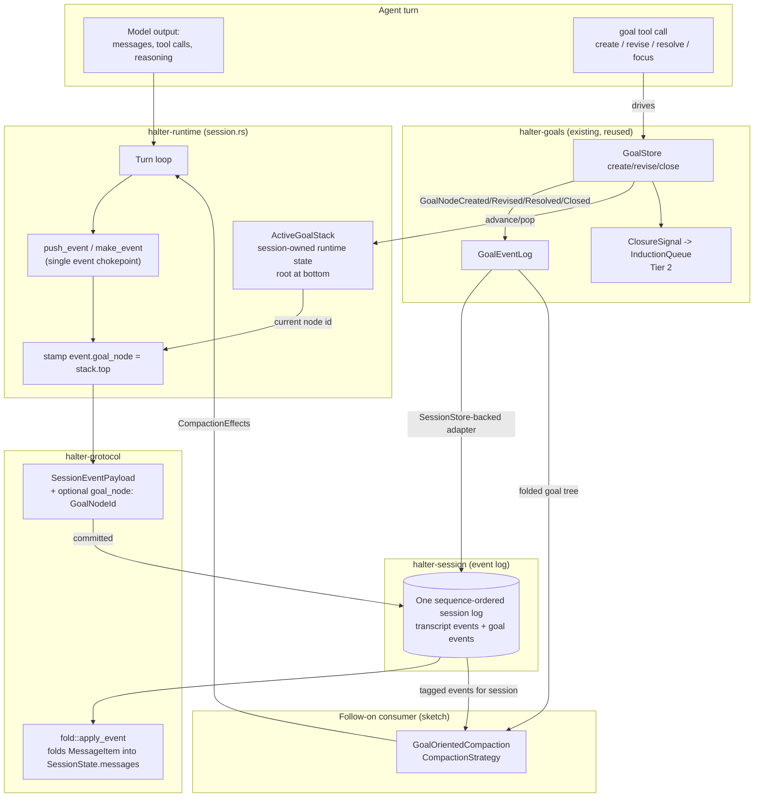
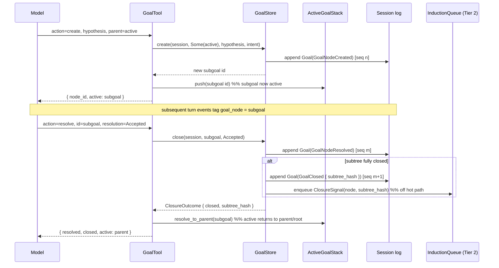
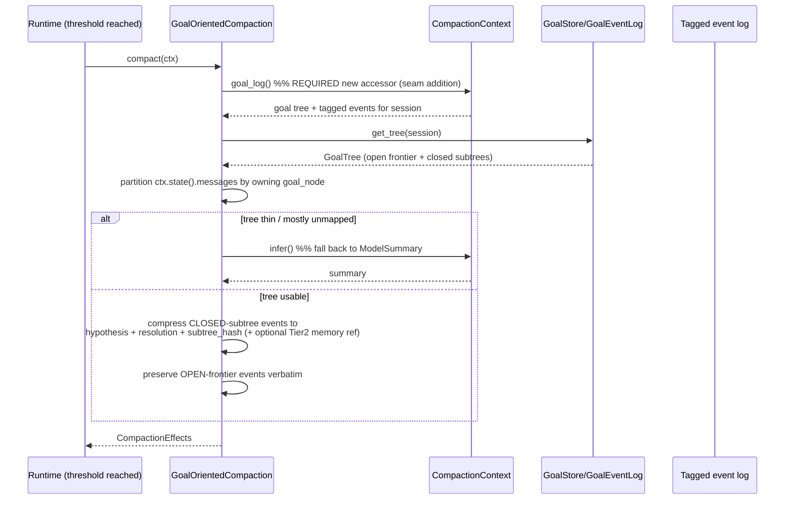

# Design Document: Runtime Goal Tracking

## Overview

**Runtime Goal Tracking** wires the already-built **Goal Model** (`halter-goals`) into the
`halter-runtime` turn loop so that, when enabled, the runtime automatically maintains goal
state as turns execute and **tags every turn-attributable session event with the goal node
that owns it**. It does two things and defers a third:

1. **Automatic attribution (runtime-driven).** At the single event chokepoint
   (`SessionHandle::push_event` / `make_event` in `crates/halter-runtime/src/session.rs`),
   the runtime stamps each emitted `SessionEventPayload` with the **active goal node id**.
   This is the *first* mechanism in the workspace that maps runtime artifacts (messages, tool
   calls, reasoning, usage) to goals — nothing does this today.
2. **Agent-driven goal advancement.** A new agent-facing **goal tool** (mirroring the shape
   of the built-in `TaskTool`) drives the `GoalStore` create/revise/close operations. The
   agent decides *when* a subgoal starts, is resolved, or is closed; the runtime only decides
   *what node owns an event*.
3. **A follow-on consumer (sketched, not fully specified):** a `GoalOrientedCompaction`
   `CompactionStrategy` that reads the goal tree plus the goal-tagged events to compress the
   transcript along goal boundaries. This design enables and sketches it; a later spec
   details it.

A per-session **root goal** (lazily created on first use) is the always-present fallback, so
attribution is **total**: every turn event maps to *some* node even when the agent never
touches the goal tool. Totality plus partitionability of the event stream by goal node is a
hard requirement — the compaction consumer depends on it.

The feature is **off by default**. A new config toggle `[context].goal_tracking = auto | off`
(mirroring `CompactionStrategyKind`) gates all of it; `off` reproduces today's behavior
exactly, leaves the Goal Model dormant, and adds zero per-turn overhead.

This document combines a high-level view (architecture, components, data models, sequence
flows) with a low-level view (Rust type sketches, function signatures with formal
specifications, and algorithmic pseudocode). Code sketches use Rust to match the workspace;
they are illustrative contracts, not final APIs. It follows the `halter-goals` design doc
style for consistency.

### Scope

In scope (this feature):

- An **active-goal pointer**: session-owned runtime state tracking the current
  `GoalNodeId`, with defined advancement semantics (a stack with a single always-present
  root at the bottom).
- An **optional attribution tag** on turn-attributable `SessionEventPayload` variants
  (additive, backward-compatible), and the tagging logic at `push_event`.
- The **goal tool** (`GoalTool`) driving `GoalStore`, persisting on the shared event log.
- A **`SessionStore`-backed `GoalEventLog` adapter** so goal events ride the same
  sequence-ordered log as the tagged transcript events (the adapter `halter-goals`
  explicitly deferred).
- The **`[context].goal_tracking`** config surface and its wiring through
  `HalterBuilder`/`RuntimeServices`.
- A **required compaction seam addition** (a goal-log accessor) plus a **sketch** of
  `GoalOrientedCompaction`.

Out of scope / non-goals:

- **No redesign of Tier 1 or Tier 2 internals** (induction, memory, retrieval, replay). This
  feature only *triggers* them through the existing `GoalStore`/`ClosureSignal` path already
  built in `halter-goals`.
- **No provider/server-side auto-compaction** — the existing prohibition in
  `CompactionStrategy` docs stands.
- **No break to existing serialized session logs** — only additive optional fields.
- The full `GoalOrientedCompaction` strategy body is sketched only.

The feature makes exactly two small, justified revisions to existing crates:

- **`halter-protocol`:** an additive optional `GoalNodeId` tag on turn-attributable
  `SessionEventPayload` variants (`#[serde(default, skip_serializing_if = ...)]`).
- **`halter-goals`:** a `SessionStore`-backed `GoalEventLog` adapter (already anticipated in
  `store.rs` module docs) and a documented status change to `GoalNode.tool_calls` (see
  § "Goal Model reconciliation").

## Architecture

The runtime owns *attribution* and *the active-goal pointer*; the agent owns *advancement*
through the goal tool; the Goal Model (`halter-goals`) owns *goal semantics and persistence*;
and the compaction consumer *reads* both the tagged event log and the goal tree.



**Two clocks, one log.** Transcript events and goal events are committed through the same
`halter-session` `SessionStore` and share one gap-free, sequence-ordered log. This is what
makes "the events between sequence *a* and *b* belong to node *n*" a coherent statement, and
what the compaction consumer relies on.

**Separation of concerns (the central decision).**

| Concern | Owner | Trigger | Rationale |
| --- | --- | --- | --- |
| Tag an event with the owning goal node | Runtime (`push_event`) | Automatic, every event | Attribution is a total, mechanical, session-log concern; the chokepoint already sees every artifact |
| Advance the active goal (subgoal, resolve, close) | Agent, via goal tool | Explicit tool call | Which hypothesis is "active" is a judgment the runtime cannot soundly infer |
| Goal semantics, `subtree_hash`, closure→induction | `halter-goals` `GoalStore` | Called by the goal tool | Already built and verified; reused unchanged |
| Compress transcript along goal boundaries | `GoalOrientedCompaction` | Runtime compaction trigger | A pure reader of the tagged log + tree; follow-on |

## Data Models

### The attribution tag (`halter-protocol` revision)

The recommended design tags the **event**, not the provider-visible `Message`. The
turn-attributable payloads gain an additive, optional `goal_node` field. Only the payloads a
turn emits inside `push_event` are tagged; lifecycle/aggregate markers
(`SessionStarted`, `Lagged`, `SessionShutdownComplete`, …) are not attributable and are left
untouched.

```rust
// crates/halter-protocol/src/lib.rs — additive changes to existing variants.
// #[serde(tag = "kind", rename_all = "snake_case")]
pub enum SessionEventPayload {
    MessageItem {
        message: Message,
        /// The goal node that owned the turn when this item was emitted.
        /// `None` on legacy logs and when goal tracking is off, so existing
        /// serialized logs deserialize unchanged.
        #[serde(default, skip_serializing_if = "Option::is_none")]
        goal_node: Option<GoalNodeId>,
    },
    ToolExecutionStarted {
        call: ToolCall,
        #[serde(default, skip_serializing_if = "Option::is_none")]
        goal_node: Option<GoalNodeId>,
    },
    ToolExecutionCompleted {
        outcome: ToolExecutionOutcome,
        #[serde(default, skip_serializing_if = "Option::is_none")]
        goal_node: Option<GoalNodeId>,
    },
    ToolOutput { call_id: ToolCallId, tool_name: ToolName, chunk: SharedStr,
        #[serde(default, skip_serializing_if = "Option::is_none")]
        goal_node: Option<GoalNodeId>,
    },
    TurnCompleted { turn_id: TurnId, usage: Usage,
        #[serde(default, skip_serializing_if = "Option::is_none")]
        goal_node: Option<GoalNodeId>,
    },
    // ... other turn-attributable variants (Warning, DeltaItem,
    //     ContextProjectionUpdated) gain the same optional field WLOG.

    /// New payload: a goal-tree mutation, so goal events ride the SAME log as
    /// transcript events (see § Persistence). Folded by the goal fold, a no-op
    /// for halter_protocol::fold::apply_event (does not touch SessionState.messages).
    Goal { event: halter_goals::GoalEvent },
}
```

`GoalNodeId` moves to (or is re-exported from) `halter-protocol` so the protocol crate need
not depend on `halter-goals` for the id type; the richer `GoalEvent` in the new `Goal`
payload does introduce a `halter-protocol` → `halter-goals` type dependency for that one
variant (acceptable, and the direction `halter-goals` already anticipates).

**Why tag the event, not the `Message`.** (§ "Key design decisions", decision 2.)

- Attribution is a **session-log/replay concern**, not something a provider should ever see.
  `Message` is the provider-visible transcript item; adding a goal id to it would leak
  internal bookkeeping into provider requests and risk codecs forwarding or choking on it.
- The event payloads are the natural attribution unit and the fold **already special-cases**
  `MessageItem` and the tool payloads, so adding a sibling field is local and cheap.
- The field is **additive and optional** with `#[serde(default, skip_serializing_if)]`, so
  every existing serialized session log deserializes unchanged (`goal_node = None`), and logs
  written with tracking off are byte-compatible with today's.
- **Alternative considered — tag the `Message` struct:** rejected. It would either (a) reach
  the provider (unwanted, and each `Message` variant is `#[serde(tag="role")]` with
  `id`/`created_at` — a provider-facing shape) or (b) require the runtime to strip the field
  before every request, an easy-to-miss invariant. Tool outcomes and usage are also *not*
  `Message`s, so message-level tagging could not achieve **total** attribution anyway.

### The active-goal pointer

```rust
// crates/halter-runtime — session-owned runtime state (NOT on the fold-covered
// SessionState domain fields; it is runtime bookkeeping carried by the checkpoint,
// like pending_tool_calls / fired_hook_ids).
pub struct ActiveGoalStack {
    /// Root is always index 0 once initialized; the top is the active node.
    stack: Vec<GoalNodeId>,
    /// Lazily created per-session root; None until first attribution or first
    /// goal-tool use, at which point the root GoalNode is created and pushed.
    root: Option<GoalNodeId>,
}

impl ActiveGoalStack {
    /// The active node id — the node any event pushed right now is attributed to.
    /// `None` only before the root exists (before the first tagged event).
    pub fn active(&self) -> Option<&GoalNodeId>;
    /// Ensure the root exists, creating it via GoalStore if needed; returns it.
    pub async fn ensure_root(&mut self, store: &dyn GoalStore, session: &SessionId)
        -> Result<GoalNodeId, GoalStoreError>;
    /// Push a freshly created subgoal, making it active.
    pub fn push(&mut self, node: GoalNodeId);
    /// Pop to the parent when the active node (or an ancestor) is resolved.
    /// Never pops the root (index 0); popping the root is a no-op.
    pub fn resolve_to_parent(&mut self, resolved: &GoalNodeId);
    /// Explicitly refocus onto an existing node (must be on the stack or root).
    pub fn focus(&mut self, node: &GoalNodeId) -> Result<(), FocusError>;
}
```

### Config surface

```rust
// crates/halter-config/src/schema.rs
#[derive(Debug, Clone, Copy, Serialize, Deserialize, JsonSchema, PartialEq, Eq, Default)]
#[serde(rename_all = "snake_case")]
pub enum GoalTrackingMode {
    /// Goal Model dormant; today's behavior; zero per-turn overhead. Default.
    #[default]
    Off,
    /// Runtime maintains the active-goal pointer, tags turn events, and
    /// installs the goal tool.
    Auto,
}

// added to ContextConfig (mirrors `compaction: CompactionStrategyKind`)
pub struct ContextConfig {
    // ... existing fields ...
    #[serde(default)]
    pub goal_tracking: GoalTrackingMode,
}
```

## Sequence Diagrams

### Flow 1: A turn with goal tracking on (automatic attribution)

```mermaid
sequenceDiagram
    participant Model
    participant Loop as Turn loop
    participant Stack as ActiveGoalStack
    participant Chk as push_event
    participant Log as Session log

    Loop->>Stack: ensure_root(store, session)
    Stack-->>Loop: root id (created lazily if absent)
    Model-->>Loop: assistant message + tool calls
    Loop->>Chk: push_event(MessageItem { message })
    Chk->>Stack: active()
    Stack-->>Chk: node_id (root, since agent hasn't focused a subgoal)
    Chk->>Chk: stamp goal_node = node_id
    Chk->>Log: pending MessageItem { message, goal_node }
    Loop->>Chk: push_event(ToolExecutionStarted { call })
    Chk->>Log: pending ToolExecutionStarted { call, goal_node }
    Loop->>Chk: push_event(TurnCompleted { usage })
    Chk->>Log: pending TurnCompleted { usage, goal_node }
    Note over Log: every turn-attributable event carries an owning node
```

### Flow 2: The agent creates and resolves a subgoal



### Flow 3: Goal-oriented compaction (follow-on sketch)



## Components and Interfaces

### Component 1: Active-goal pointer (runtime)

**Purpose:** Track the current `GoalNodeId` per session and provide the value the chokepoint
stamps onto events.

**Semantics (§ "Open questions", advancement).**

- **Structure: a stack, not a single pointer.** The bottom is the always-present root; the
  top is the active node. A stack models nested subgoal work directly: `create` pushes, a
  resolve that closes a node pops back to its parent. A single pointer cannot express "return
  to the parent after finishing a subgoal" without the agent restating the parent id.
- **Root is lazy and total.** `ensure_root` creates the root `GoalNode` (via `GoalStore`) on
  the first tagged event or first goal-tool call, whichever comes first. After that `active()`
  is always `Some`. Before it (a session that emits no events), there is nothing to attribute.
- **Turn boundaries: the stack persists across turns.** The active node does **not** reset at
  turn start; a subgoal opened in one turn keeps owning events in the next until the agent
  resolves or refocuses. The stack is runtime bookkeeping persisted on the session checkpoint
  (rehydrated on resume by folding the goal events; see § Persistence), so it survives
  resume.
- **Resolve → parent.** When the goal tool resolves node *x*, the runtime calls
  `resolve_to_parent(x)`, which pops *x* (and any of its still-active descendants left on the
  stack) so the active node becomes *x*'s parent, or the root if *x* was a direct child of
  root. Resolving the root never empties the stack (root stays; a resolved root is a valid
  terminal state whose events still attribute to root).
- **Focus.** `action=focus` lets the agent move the active pointer to an existing node
  without creating one (e.g., re-entering a sibling). This is the one place the agent may set
  the active node to a node not on the current stack path; the stack is rebuilt as the
  root→node path.

### Component 2: Attribution at the chokepoint (runtime)

**Purpose:** Stamp `goal_node = active()` onto every turn-attributable payload as it is
created, with zero behavior change when tracking is off.

**Interface:** the existing `push_event`/`make_event` gain access to the session's
`ActiveGoalStack`. When `goal_tracking = Off`, the stamp is skipped and payloads are emitted
exactly as today (`goal_node = None`).

### Component 3: `GoalTool` (agent-facing)

**Purpose:** Let the agent advance the goal tree. Mirrors `TaskTool`'s action-based shape but
persists on the event log through `GoalStore` (not a `TaskStore`), and updates the
`ActiveGoalStack`.

**Interface (JSON tool actions):**

- `create` — `{ hypothesis, resolution_conditions?, parent? }` → creates a subgoal under
  `parent` (default: the active node), pushes it active, returns its id.
- `revise` — `{ id, resolution_conditions?, tool_calls?, children? }` → appends
  `GoalNodeRevised`.
- `resolve` — `{ id, resolution }` → calls `GoalStore::close`; on closure returns the
  `subtree_hash`; pops the stack to the parent.
- `focus` — `{ id }` → refocus the active node onto an existing node.
- `tree` — `{}` → project and return the current tree (read-only, like `TaskTool::list`).

**Responsibilities:** validate input (mirroring `TaskTool` — non-empty hypothesis, known id),
call `GoalStore`, update `ActiveGoalStack`, never touch the flat `TaskList`.

**Coexistence with `TaskList` (§ "Open questions").** Confirmed: the goal tree and the flat
`TaskList` **coexist** (as the `halter-goals` design states). `TaskList` remains the
user-visible, two-state checklist; the goal tree is the hypothesis-shaped attribution/memory
structure. They are distinct surfaces with distinct tools; neither reads or writes the other.
For a user: use `task` for a simple visible to-do list; the `goal` tool (and the automatic
attribution behind it) exists to structure hypothesis work and to make the transcript
relatable to goals for compaction and Tier 2. When goal tracking is `off`, only `task` is
present, exactly as today.

### Component 4: `SessionStore`-backed `GoalEventLog` adapter (`halter-goals`)

**Purpose:** Realize the persistence the `halter-goals` `store.rs` module docs deferred: map
`GoalEventLog::append`/`replay`/`head_sequence` onto the session store's
`commit`/`replay` so goal events land on the **same** log as tagged transcript events.

**Interface:**

```rust
// crates/halter-goals — the deferred adapter (store.rs module docs anticipate it).
pub struct SessionStoreGoalEventLog {
    sessions: Arc<dyn SessionStore>, // halter-session
}

#[async_trait]
impl GoalEventLog for SessionStoreGoalEventLog {
    async fn append(&self, session: &SessionId, events: Vec<GoalEvent>,
        expected_head_sequence: Option<u64>)
        -> Result<Vec<SequencedGoalEvent>, GoalStoreError> {
        // Wrap each GoalEvent as SessionEventPayload::Goal { event } and commit
        // through SessionStore::commit with expected_head for OCC. The commit
        // assigns gap-free monotonic sequences shared with transcript events.
    }
    async fn replay(&self, session: &SessionId)
        -> Result<Vec<SequencedGoalEvent>, GoalStoreError> {
        // Replay the session log, keep only SessionEventPayload::Goal, preserving
        // ascending sequence order.
    }
    async fn head_sequence(&self, session: &SessionId) -> Result<u64, GoalStoreError> {
        // The session log's head sequence (goal + transcript events share it).
    }
}
```

The `GoalEventLog` **contract is identical** to what the in-memory implementation already
guarantees (gap-free monotonic sequences from `head + 1`, in-order replay, OCC conflict on
`expected_head_sequence` mismatch), so `EventLogGoalStore` and every Tier that folds goal
events is unchanged — only the backing log swaps, exactly as `store.rs` anticipated.

**Note on shared sequence:** because goal and transcript events share one log, "the tagged
events between goal sequence *a* and *b*" is well-defined, which is what makes sequence-range
reasoning coherent for the compaction consumer.

### Component 5: `GoalOrientedCompaction` (follow-on sketch)

**Purpose:** A `CompactionStrategy` that compresses the transcript along goal boundaries.

**Required seam addition (§ "Open questions").** The strategy needs to reach the session's
goal tree and tagged events. `CompactionContext` today exposes `state()` (folded messages),
`blueprint()`, `model()`, `provider()`, `trigger()`, `append`/`record`/`infer`, but **not**
the goal log. Recommended: add a `goal_log()` accessor to `CompactionContext` that returns a
handle over the session's `GoalStore` + `GoalEventLog`. Rationale: a `CompactionStrategy` is
shared by every session and holds configuration, not per-session state, so per-session goal
data must arrive through the per-session `CompactionContext` (the same reason `state()` lives
there, not on the strategy). The strategy holding a `GoalStore` handle directly is the
alternative, but it re-introduces per-session lookup keyed by `ctx.state()`'s session id and
duplicates what the context already scopes.

**Interface sketch:**

```rust
pub struct GoalOrientedCompaction { fallback: ModelSummary }

#[async_trait]
impl CompactionStrategy for GoalOrientedCompaction {
    fn tools(&self) -> Vec<Arc<dyn Tool>> { self.fallback.tools() }
    async fn compact(&self, mut ctx: CompactionContext<'_>)
        -> anyhow::Result<Option<CompactionEffects>> {
        let tree = ctx.goal_log().get_tree().await?;        // seam addition
        if thin_or_unmapped(&tree, ctx.state()) {
            return self.fallback.compact(ctx).await;         // ModelSummary fallback
        }
        // partition ctx.state().messages by owning goal_node (from the tagged log),
        // compress CLOSED-subtree events to distilled form, keep OPEN frontier verbatim.
        // ...
    }
}
```

## Goal Model reconciliation (§ "Key design decisions", decision 4)

**Attribution source of truth = event tags.** The new "a node owns its whole event span
(messages, tool calls, reasoning, usage)" relationship is expressed **entirely by the
`goal_node` tags on the shared log**. The event log is the source of truth for which artifacts
belong to which node.

**`GoalNode.tool_calls` becomes a convenience projection, not the attribution mechanism.**
Today `tool_calls` is populated only via `GoalNodeRevised` in tests and is *not* the runtime
attribution path (there was none). Under this feature it is **superseded as the source of
truth** by the event tags, and is retained as an **optional, agent-curated convenience
projection** (the reproducible `ToolCall` *contracts* the agent chooses to record on a node
via the goal tool's `revise` action — the same contracts Tier 2 already consumes). We do
**not** auto-populate `tool_calls` from every tagged tool event: that would conflate the
semantic contract Tier 2 needs with the raw incidental transcript. No change to the
`GoalNode` struct is required; only its documented role changes.

**`subtree_hash` input model does NOT change (critical).** `subtree_hash` stays keyed on the
**semantic contract** — `hypothesis`, `resolution_conditions`, `resolution`, `intent`, and the
normalized `tool_calls` contracts, combined with resolved children in canonical order —
**not** on the raw tagged transcript. Justification: induction idempotency is keyed on
`(node_id, subtree_hash)`; if the hash depended on incidental message ordering or the exact
byte content of tagged events, then re-running the same goal work (different phrasing, different
interleaving) would change the hash and defeat dedup/reinforce. Keeping the hash on the
semantic contract means **attribution is orthogonal to versioning**: tagging events with a node
never perturbs that node's `subtree_hash`. This is captured as a correctness property (P8).

## Persistence (§ "Key design decisions", decision 5)

Goal state persists so attribution and replay work across resume:

- Goal mutations are `SessionEventPayload::Goal { event }` committed through the **same**
  `SessionStore::commit` path as transcript events, via `SessionStoreGoalEventLog`. One
  gap-free, sequence-ordered log; shared OCC via `expected_head_sequence`.
- The **active-goal stack is rehydrated on resume** by folding the session's `Goal` events
  into a `GoalTree` and reconstructing the root→active path. Because the stack is derivable
  from the log (root = tree root; active path = the open frontier the agent last focused,
  persisted as a lightweight checkpoint field), a resumed session resumes attribution at the
  right node.
- `halter_protocol::fold::apply_event` treats `Goal` as a **no-op for `SessionState.messages`**
  (goal events do not change the transcript window); the goal fold in `halter-goals` consumes
  them. Tagged `MessageItem`s fold exactly as today — the added `goal_node` field does not
  change `state.messages` content (the fold reads `message`, not `goal_node`), so the existing
  log/checkpoint conformance invariant is preserved.

## Error Handling

- **Goal store unavailable / OCC conflict during a goal-tool call:** surfaced to the agent as
  a tool error (like `TaskTool`'s rejections); the turn continues, attribution stays on the
  current active node. Retryable conflicts follow the existing `GoalStoreError::Conflict`
  path.
- **`ensure_root` fails:** attribution degrades gracefully to `goal_node = None` for that
  event (never blocks the turn); a `Warning` event is emitted. Totality is a target under
  normal operation; a store outage must not break turns.
- **Focus onto an unknown node:** `FocusError`; tool returns an error, active node unchanged.
- **Compaction consumer, thin/unmapped tree:** falls back to `ModelSummary` (never fails the
  turn for `Automatic`; propagates for `Manual`, per existing `CompactionStrategy` contract).
- **Legacy logs (no `goal_node`, no `Goal` events):** deserialize with `goal_node = None`;
  the tree is empty; every strategy still works.

## Testing Strategy

### Unit testing

- `ActiveGoalStack` push/resolve_to_parent/focus semantics, including root-never-popped and
  cross-turn persistence.
- `GoalTool` action validation mirroring `TaskTool`'s tests (missing/blank hypothesis, unknown
  id, idempotent resolve).
- `SessionStoreGoalEventLog` conformance to the `GoalEventLog` contract (reuse the existing
  in-memory conformance suite against the new adapter).
- Config: `goal_tracking` defaults to `Off`, round-trips, and `Off` installs no goal tool.

### Property-based testing

**Library:** `proptest` (the workspace standard, as used in `halter-protocol::fold` and
`halter-goals`).

Properties in § "Correctness Properties" below are the PBT targets. Key generators: random
turn-event sequences interleaved with random goal-tool actions (create/resolve/focus), then
assert totality, partitionability, replay stability, frontier preservation, and
`subtree_hash` invariance.

### Integration testing

- End-to-end turn with `goal_tracking = auto`: assert every committed turn-attributable event
  carries a `goal_node`, and that resume re-establishes the active node.
- `off` mode: byte-compatible event logs with today's output (golden test).

## Performance Considerations

- `goal_tracking = off`: the chokepoint checks a mode flag and skips stamping — effectively
  zero overhead; no goal tool registered; Goal Model dormant.
- `auto`: attribution is a pointer read + `Option<GoalNodeId>` clone per event. Goal events add
  commits only when the agent uses the goal tool (bounded by tool calls, not turn events).
  Induction remains async/off the hot path (unchanged `halter-goals` behavior).

## Security Considerations

- The `goal_node` tag is internal bookkeeping and is **never** sent to providers (that is the
  core reason it lives on the event, not the `Message`). No new external surface.
- Goal hypotheses/conditions are agent-authored text already flowing through the transcript;
  no new sensitive-data path.

## Dependencies

- **`halter-goals`** (existing): `GoalStore`, `EventLogGoalStore`, `GoalEventLog`, `GoalEvent`,
  `GoalNode`, `Resolution`, `ClosureSignal`, `subtree_hash` — reused; adds the
  `SessionStoreGoalEventLog` adapter.
- **`halter-protocol`** (revised): additive optional `goal_node` on turn-attributable payloads;
  new `Goal` payload variant; `GoalNodeId` available to the protocol crate.
- **`halter-session`** (existing): `SessionStore::commit`/`replay` back the goal event log.
- **`halter-runtime`** (revised): `ActiveGoalStack`, chokepoint stamping, `CompactionContext`
  goal-log accessor, `GoalOrientedCompaction` sketch, wiring `goal_tracking`.
- **`halter-tools`** (revised): the new `GoalTool` (mirrors `TaskTool`).
- **`halter-config`** (revised): `GoalTrackingMode` + `ContextConfig.goal_tracking`.
- **`halter`** (revised): `HalterBuilder` wires the mode into `RuntimeServices`, registering
  the goal tool and the `SessionStore`-backed goal store when `auto`.
- **`proptest`, `tokio`, `async-trait`, `serde`** (existing).

## Correctness Properties

Properties suitable for later property-based testing. Universally quantified over random
interleavings of turn events and goal-tool actions with `goal_tracking = auto` (unless
stated).

### Property 1: Total attribution

After the root exists, for every committed
turn-attributable event *e*, `e.goal_node` is `Some(n)` for some node *n* present in the
session's folded goal tree. (∀ turn-attributable *e* after first `ensure_root`:
`e.goal_node = Some(n) ∧ tree.contains(n)`.)

### Property 2: Root is total fallback

In a session where the agent never calls the goal
tool, every turn-attributable event is attributed to the root node. (∀ *e*:
`e.goal_node = Some(root)`.)

### Property 3: Attribution stability under replay

Folding a session's committed log twice
(or resuming from any checkpoint and re-folding) yields identical `goal_node` on every event;
attribution is a pure function of the committed log. (`fold(log) == fold(fold-prefix ++
fold-suffix)` on the `goal_node` fields.)

### Property 4: Partitionability

The set of turn-attributable events partitions cleanly by
`goal_node`: every such event belongs to exactly one node, and grouping by `goal_node`
reconstructs the full turn-event stream with no loss and no duplication.

### Property 5: Off ≡ today

With `goal_tracking = off`, every emitted payload has
`goal_node = None`, no `Goal` events are produced, and the committed log is byte-identical to
the log the same turns produce on the current code path.

### Property 6: Advancement discipline (resolve → parent)

After the goal tool resolves node
*x*, the active node becomes *x*'s parent (or the root if *x* was a direct child of root), and
the root is never popped: `active()` is always `Some` once `ensure_root` has run.

### Property 7: Backward-compatible deserialization

Any session log serialized before this
feature (no `goal_node`, no `Goal` payloads) deserializes successfully with `goal_node = None`
on every event and an empty goal tree.

### Property 8: `subtree_hash` invariance under incidental transcript changes

For a fixed
resolved subtree (same `hypothesis`/`resolution_conditions`/`resolution`/`intent`/`tool_calls`
contracts and same resolved children), `subtree_hash(n)` is identical regardless of how many
turn events were tagged to *n*, their content, or their ordering. (Tagging never changes a
node's `subtree_hash`.)

### Property 9: Closure-exactly-once is preserved

Runtime-driven advancement does not change
`halter-goals`' guarantee: each distinct `(node_id, subtree_hash)` closure enqueues exactly
one induction job, even if the goal tool resolves the same node repeatedly.

### Property 10: Shared-log ordering

Goal events and transcript events drawn from one session
occupy one gap-free, strictly increasing sequence; for any node *n*, the events attributed to
*n* form a well-defined, sequence-ordered set (basis for sequence-range reasoning in
compaction).

### Property 11: Compaction preserves the open frontier (consumer)

`GoalOrientedCompaction`
retains verbatim every event attributed to an **open** node (a node not in a fully-closed
subtree); only events attributed to fully-closed subtrees may be compressed. (∀ *e* with
`e.goal_node = n`, *n* open ⟹ *e* present unchanged in the compacted window.)

### Property 12: Compaction totality/fallback (consumer)

When the goal tree is thin or the
transcript is largely unmapped, `GoalOrientedCompaction` produces the same result as
`ModelSummary` (no worse than the default strategy), and never drops an open-frontier event.
