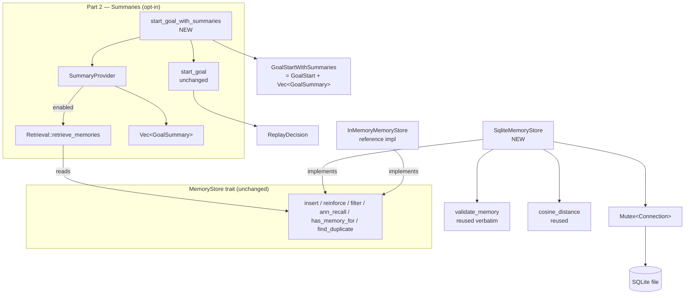

# Design Document

## Overview

This design adds two capabilities to the `halter-goals` crate's Tier 2 procedural-memory subsystem, both constrained to fit the existing seams without altering any established contract.

**Part 1 — `SqliteMemoryStore`.** A durable, SQLite-backed implementation of the existing `MemoryStore` trait (`crates/halter-goals/src/tier2/store.rs`). It is a drop-in alternative to `InMemoryMemoryStore`: same trait, same `&self` interior-mutability contract, same write-time validation (`validate_memory`), and the same observable read semantics for `filter`, `ann_recall`, `has_memory_for`, and `find_duplicate`. It persists each `MemoryRecord` to SQLite so learned memory survives process restarts, indexes the structured signature fields for the applicability filter, serializes the `Memory` body to a JSON column for lossless round-trip, and stores the embedding for cosine tail-recall.

**Part 2 — `SummaryProvider`.** A wireable, opt-in capability that, when the agent triggers the goal tool (`start_goal` in `integration.rs`), searches memory for similar past goals using the existing structured-first `Retrieval` and returns compact, natural-language-style `GoalSummary` values describing what each similar goal did and what it concluded. Summaries are surfaced **alongside** (not in place of) the existing `ReplayDecision`. The feature is **off by default**, configurable, and **non-fatal**: any summarization failure degrades to returning the existing replay decision with no summaries, and an unavailable embedding backend falls back to the structured head.

### Design Principles

1. **Behavioral parity, not implementation parity.** `SqliteMemoryStore` must produce the *same observable results* as `InMemoryMemoryStore` for the same inputs (Requirement 3.3). This is the north star for the correctness properties: the in-memory store is the executable reference model.
2. **Validation before mutation.** `validate_memory` is reused verbatim and always runs before any SQL write, so no invalid memory is ever persisted and a rejected write leaves the database byte-for-byte unchanged (Requirement 2).
3. **Contracts unchanged.** The `MemoryStore` trait, the `Memory`/`MemoryRecord` model, and the structured-first retrieval semantics are not modified. Part 1 adds a new impl; Part 2 adds a new component and an additive return shape.
4. **Additive and resilient hot path.** Part 2 never disturbs the replay decision the hot path already returns; it only *adds* summaries when enabled and successful.

### Research Notes

- **rusqlite 0.32.1 (`bundled`)** is already a workspace dependency. The `bundled` feature compiles SQLite in-tree, so there is no system dependency and the schema/PRAGMA behavior is stable across platforms. `rusqlite::Connection` is `Send` but **not** `Sync` and is not internally synchronized, so shared `&self` access requires an external `Mutex<Connection>` (see Concurrency). This is the standard rusqlite sharing pattern and matches the trait's interior-mutability requirement.
- **serde is already derived** on `Memory` and `MemoryRecord` (verified in `memory.rs`), and `serde_json` is a dependency. The body column can therefore store `serde_json::to_string(&memory)` and round-trip losslessly — `memory.rs` already has a passing `memory_roundtrips_through_serde` test that guarantees this at the type level.
- **`InMemoryMemoryStore` semantics** (verified in `store.rs`) define the exact behavior to mirror: `insert` stores keyed by `MemoryId`; `filter` returns every record whose `applicability.applies_to(sig)`; `ann_recall` sorts by `cosine_distance` ascending with `total_cmp`, treating zero-magnitude vectors as maximally distant (`2.0`) and returning empty on `limit == 0`; `has_memory_for` matches `(node_id, subtree_hash)`; `find_duplicate` matches `intent == && plan ==`; `reinforce` bumps `hits`/`confirms` and advances `updated_at`/`last_updated`, or inserts when the id is unknown. `SqliteMemoryStore` reuses `validate_memory` and the same `cosine_distance` function so ranking math is identical.
- **Retrieval seam** (verified in `retrieval.rs`): `Retrieval::retrieve_memories(sig) -> Vec<ScoredMemory>` already returns candidates ordered by `cheap_score` descending, structured-head-first, with embedding tail recall only when the head is thin and graceful degradation (`EmbeddingSource::embed -> Option<Embedding>`) when the backend is down. Part 2's `SummaryProvider` consumes this output directly, so summary ordering (Requirement 11.2) and structured-head fallback (Requirement 15.2) come for free.
- **Hot-path seam** (verified in `integration.rs`): `start_goal(...) -> GoalStart` runs retrieval, takes the top candidate, and calls `decide_replay`. Part 2 introduces a new entry point (`start_goal_with_summaries`) that returns an additive shape wrapping the same `GoalStart` plus the summaries, leaving `start_goal` and `GoalStart` unchanged.

## Architecture



### Part 1 layering

`SqliteMemoryStore` lives in a new module `crates/halter-goals/src/tier2/sqlite_store.rs`, exported from `tier2/mod.rs` alongside `InMemoryMemoryStore`. It depends only on:

- `rusqlite` for the connection, prepared statements, and transactions;
- the existing `validate_memory` and `cosine_distance` from `store.rs` (the latter is currently private; this design promotes it to `pub(crate)` so both stores share identical ranking math — a non-breaking, internal change);
- `serde_json` for the body column.

The store keeps a single `Mutex<rusqlite::Connection>`. All methods take `&self`; each acquires the mutex for the duration of its SQL work. Ranking (`ann_recall`) is done in Rust after loading candidate rows, exactly mirroring the in-memory path, because SQLite has no native vector distance.

### Part 2 layering

`SummaryProvider` lives in a new module `crates/halter-goals/src/tier2/summary.rs`, exported from `tier2/mod.rs`. The additive hot-path function `start_goal_with_summaries` lives in `integration.rs` next to `start_goal`. The provider is generic over `Retrieval` (so it works with any store behind retrieval) and holds a `SummaryConfig` carrying the `enabled` flag and `max_summaries`.

## Components and Interfaces

### Part 1: `SqliteMemoryStore`

```rust
/// A durable, SQLite-backed `MemoryStore`. Drop-in for `InMemoryMemoryStore`.
pub struct SqliteMemoryStore {
    conn: std::sync::Mutex<rusqlite::Connection>,
}

impl SqliteMemoryStore {
    /// Open (or create) a store at `path`, running idempotent migration.
    ///
    /// # Errors
    /// Returns `SqliteStoreError::Open` if the file cannot be opened/created,
    /// or `SqliteStoreError::Schema` if migration or a schema-version check fails.
    pub fn open(path: impl AsRef<std::path::Path>) -> Result<Self, SqliteStoreError>;

    /// Open an in-memory SQLite database (for tests / ephemeral use).
    pub fn open_in_memory() -> Result<Self, SqliteStoreError>;

    /// Apply the schema migration idempotently (CREATE TABLE/INDEX IF NOT EXISTS,
    /// user_version check). Safe to call repeatedly.
    fn migrate(conn: &rusqlite::Connection) -> Result<(), SqliteStoreError>;
}

impl MemoryStore for SqliteMemoryStore {
    fn insert(&self, key: (GoalNodeId, SubtreeHash), mem: Memory) -> Result<MemoryId, MemoryStoreError>;
    fn reinforce(&self, id: &MemoryId, candidate: Memory) -> Result<MemoryId, MemoryStoreError>;
    fn filter(&self, sig: &IntentSignature) -> Vec<Memory>;
    fn ann_recall(&self, embedding: &Embedding, limit: usize) -> Vec<Memory>;
    fn has_memory_for(&self, key: &(GoalNodeId, SubtreeHash)) -> Option<MemoryId>;
    fn find_duplicate(&self, intent: &IntentSignature, plan: &Plan) -> Option<MemoryId>;
}
```

**Method behavior (mirroring `InMemoryMemoryStore`):**

- `insert`: call `validate_memory(&mem)?` first (Requirement 2.3). On success, serialize the body to JSON, extract indexed columns from `mem.intent`/`mem.kind`, and `INSERT OR REPLACE` a row keyed by `MemoryId`, with `created_at == updated_at == Timestamp::default()`. Return `mem.id`. A validation error returns before any SQL runs, leaving the DB unchanged (Requirement 2.1).
- `reinforce`: `validate_memory(&candidate)?` first (Requirement 2.2, 2.3). Inside a single transaction: if a row with `id` exists, bump `hits`/`confirms` in the stored body, advance `updated_at`/`last_updated` (mirroring in-memory: `updated_at + 1`), and `UPDATE`; otherwise `INSERT` the candidate as a new record keyed by `id` with `node_id` from the first provenance origin and `subtree_hash` from `candidate.version.0` (Requirement 6). Return `id`.
- `filter`: `SELECT` candidate rows, deserialize each body, keep those where `body.applicability.applies_to(sig)`. Indexed columns are used as an optional pre-filter *only when they cannot change the result*; the authoritative check is always `applies_to` on the deserialized guard, guaranteeing set-equality with the in-memory store even for guards that constrain fields not covered by a chosen index (Requirement 3.4). The safe default is a full scan + `applies_to`, identical to the in-memory `values().filter(...)`.
- `ann_recall`: return empty if `limit == 0` (Requirement 4.2). Otherwise load all `(embedding, body)` rows, compute `cosine_distance(stored, query)` with the shared function, sort ascending via `total_cmp`, take `limit`. Zero-magnitude vectors sort last at distance `2.0` (Requirements 4.3, 4.4).
- `has_memory_for`: `SELECT id WHERE node_id = ?1 AND subtree_hash = ?2` (Requirement 5.1, 5.2).
- `find_duplicate`: load candidate rows and return the first whose deserialized `body.intent == intent && body.plan == plan` (Requirement 5.3, 5.4). `Plan` equality is over the full serialized structure, so this matches the in-memory `find(...)`.

### Part 2: `SummaryProvider`

```rust
/// Opt-in configuration for similar-goal summaries. Default: disabled.
#[derive(Debug, Clone)]
pub struct SummaryConfig {
    /// Whether the provider runs retrieval-driven summarization. Default: false.
    pub enabled: bool,
    /// Maximum number of GoalSummary values returned. `None` = unbounded.
    pub max_summaries: Option<usize>,
}

impl Default for SummaryConfig {
    fn default() -> Self { Self { enabled: false, max_summaries: None } }
}

/// A compact, natural-language-style summary of one past similar goal.
#[derive(Debug, Clone, PartialEq, Eq)]
pub struct GoalSummary {
    /// What the goal did, distilled from its IntentSignature + Plan.
    pub did: String,
    /// The conclusion/outcome reached, from MemoryKind + outcome info.
    pub concluded: String,
    /// True when the summarized memory is a learned dead-end (Negative).
    pub dead_end: bool,
}

/// Turns retrieved memories into compact GoalSummary values.
pub struct SummaryProvider {
    config: SummaryConfig,
}

impl SummaryProvider {
    #[must_use] pub fn new(config: SummaryConfig) -> Self;

    /// Produce summaries for `sig` using `retrieval`, honoring the config.
    ///
    /// - When `config.enabled` is false, returns an empty Vec WITHOUT invoking
    ///   `retrieval` (Requirement 13.2).
    /// - When enabled, calls `retrieval.retrieve_memories(sig)` (already ordered
    ///   by score, structured-head-first) and maps up to `max_summaries` of them
    ///   to GoalSummary, preserving order (Requirements 11.1, 11.2, 11.3).
    /// - Never mutates any persisted record (Requirement 14.3): it reads the
    ///   compact `Memory` values retrieval already returned.
    pub fn summaries_for(&self, sig: &IntentSignature, retrieval: &impl Retrieval) -> Vec<GoalSummary>;
}

/// Build one summary from a retrieved memory (pure, total function).
fn summarize(mem: &Memory) -> GoalSummary;
```

`summarize` builds `did` from `mem.intent` (the intent/target/scope) and `mem.plan` (the step descriptions, joined compactly), and `concluded` from `mem.kind` plus `mem.outcome_shape.schema` and, if present, the *shape* of `mem.cached_outcome` (never the raw answer value). For `MemoryKind::Negative` it sets `dead_end = true` and phrases `concluded` as a learned dead-end (Requirement 12.3). It deliberately excludes `evidence_contract` values and any raw transcript (Requirement 12.4) — the `Memory` model already carries only contracts, so this is naturally satisfied.

### Additive hot-path wiring

```rust
/// The hot-path outcome plus any similar-goal summaries. Additive over GoalStart.
#[derive(Debug, Clone, PartialEq, Eq)]
pub struct GoalStartWithSummaries {
    /// The existing replay decision (unchanged shape).
    pub start: GoalStart,
    /// Similar-goal summaries; empty when disabled, no candidates, or on failure.
    pub summaries: Vec<GoalSummary>,
}

/// Like `start_goal`, but also attaches similar-goal summaries when enabled.
///
/// Always computes `start` via the existing `start_goal` path first, so the
/// replay decision is identical to the summaries-absent path (Requirements 13.3,
/// 14.1, 15.1). Summarization is best-effort: any failure yields empty summaries.
pub fn start_goal_with_summaries(
    sig: &IntentSignature,
    retrieval: &impl Retrieval,
    validator: &impl EvidenceValidator,
    mode_b_policy: &impl ModeBPolicy,
    now: Timestamp,
    summary_provider: &SummaryProvider,
) -> GoalStartWithSummaries;
```

`start_goal` and `GoalStart` are left untouched; `start_goal_with_summaries` delegates to `start_goal` for the decision and to `summary_provider.summaries_for` for the summaries, then combines them. Because `summaries_for` never errors (structured-head fallback always succeeds; retrieval degrades gracefully), Requirement 15 is satisfied structurally; any future fallible summary source is wrapped so a failure maps to an empty summary set rather than propagating.

## Data Models

### SQLite schema

A single table holds one row per `MemoryRecord`. Indexed columns mirror the `MemoryRecord` indexed fields; the full memory is JSON in `body`.

```sql
-- schema version pinned via PRAGMA user_version (checked on open)
CREATE TABLE IF NOT EXISTS memories (
    id           TEXT PRIMARY KEY NOT NULL,   -- MemoryId
    intent_type  TEXT NOT NULL,               -- indexed structured field
    target_type  TEXT NOT NULL,
    target_ref   TEXT NOT NULL,
    scope        TEXT NOT NULL,
    kind         TEXT NOT NULL,               -- Fragment | Composite | Negative
    embedding    BLOB NOT NULL,               -- JSON-encoded Vec<f32>
    body         TEXT NOT NULL,               -- serde_json of Memory (round-trip)
    node_id      TEXT NOT NULL,               -- idempotency key part
    subtree_hash TEXT NOT NULL,               -- idempotency + version key part
    created_at   INTEGER NOT NULL,            -- Timestamp (u64 ms)
    updated_at   INTEGER NOT NULL
);

CREATE INDEX IF NOT EXISTS idx_memories_signature
    ON memories (intent_type, target_type, target_ref, scope);
CREATE INDEX IF NOT EXISTS idx_memories_kind ON memories (kind);
CREATE INDEX IF NOT EXISTS idx_memories_idempotency
    ON memories (node_id, subtree_hash);
```

**Column mapping.** String newtypes (`IntentType`, `TargetType`, `TargetRef`, `Scope`, `GoalNodeId`, `MemoryId`) wrap `String`, so they map to `TEXT`. `SubtreeHash(Sha256(String))` maps to `TEXT` via its inner string. `MemoryKind` serializes to a stable `TEXT` tag. `Embedding(Vec<f32>)` is stored as JSON in a `BLOB` for exact `f32` round-trip (avoids float text-formatting loss). `Timestamp`/`Duration` wrap `u64`, mapping to `INTEGER`. `body` is `serde_json::to_string(&Memory)` and is the authoritative source for all reads that reconstruct a `Memory` — the indexed columns are derived duplicates used only for filtering and lookup.

**Round-trip invariant.** `body` fully determines the returned `Memory`. On read, a row's `Memory` is `serde_json::from_str(&body)`; a deserialize failure surfaces `SqliteStoreError::Corruption`/`MalformedRecord` rather than a silently wrong value (Requirement 10.2).

### Migration

`migrate` runs the `CREATE ... IF NOT EXISTS` statements (idempotent, Requirement 8.1–8.3) and checks `PRAGMA user_version`: `0` (fresh) is set to the current version; a matching version is left intact; a higher/unknown version is rejected with `SqliteStoreError::Schema` (Requirement 1.5). Because every DDL statement is `IF NOT EXISTS` and the version write is conditional, applying migration N times yields the same schema as applying it once.

### Error type

A new `SqliteStoreError` covers open/schema/corruption/IO, and it *composes with* — does not replace — `MemoryStoreError`. Write methods keep returning `MemoryStoreError` (validation is the only failure the trait exposes on writes); the `SqliteStoreError` surfaces at `open` and, for the fail-safe corruption cases on read, is folded per the strategy in Error Handling.

```rust
#[derive(Debug, thiserror::Error)]
pub enum SqliteStoreError {
    #[error("failed to open sqlite store at {path}: {source}")]
    Open { path: String, #[source] source: rusqlite::Error },

    #[error("sqlite schema is incompatible or migration failed: {0}")]
    Schema(String),

    #[error("persisted memory record is corrupted or malformed: {0}")]
    Corruption(String),

    #[error("sqlite I/O error: {0}")]
    Io(#[from] rusqlite::Error),

    /// A write-time validation failure, preserved unchanged from the trait.
    #[error(transparent)]
    Validation(#[from] MemoryStoreError),
}
```

`MemoryStoreError` is unchanged. `SqliteStoreError::Validation` wraps it so `open`-time and read-time failures and write-time validation can all be expressed through one store-level error where a caller wants the union, while the `MemoryStore` trait methods keep their exact existing signatures (Requirement 7.1).

## Correctness Properties

*A property is a characteristic or behavior that should hold true across all valid executions of a system — essentially, a formal statement about what the system should do. Properties serve as the bridge between human-readable specifications and machine-verifiable correctness guarantees.*

The reference model for every parity property is `InMemoryMemoryStore`: its behavior is the specification `SqliteMemoryStore` must match (Requirement 3.3). These are model-based properties.

### Property 1: Filter set-equality with the reference store

*For any* set of valid memories inserted under keys and *any* `IntentSignature`, the set of memory ids returned by `SqliteMemoryStore::filter` equals the set returned by `InMemoryMemoryStore::filter` for the same inserts and query.

**Validates: Requirements 3.1, 3.2, 3.3, 3.4**

### Property 2: Persisted memory round-trip equality

*For any* valid `Memory` inserted into `SqliteMemoryStore`, retrieving that memory (via `filter` with a matching signature) yields a `Memory` equal to the one inserted.

**Validates: Requirements 1.1, 1.3, 1.4**

### Property 3: Durability across reopen

*For any* set of valid memories inserted into a `SqliteMemoryStore` opened on a file path, closing and reopening the store at the same path yields, for every `filter`, `ann_recall`, `has_memory_for`, and `find_duplicate` query, results equal to those of the original store before close.

**Validates: Requirements 1.2, 8.2**

### Property 4: `ann_recall` ordering and limit match the reference store

*For any* set of valid memories, *any* query `Embedding`, and *any* `limit`, `SqliteMemoryStore::ann_recall` returns at most `limit` memories, ordered by ascending cosine distance, and its result equals `InMemoryMemoryStore::ann_recall` for the same inputs (including the empty result when `limit == 0` and the maximal-distance treatment of zero-magnitude vectors).

**Validates: Requirements 4.1, 4.2, 4.3, 4.4**

### Property 5: Validation preserved on write, database unchanged on rejection

*For any* `Memory` that fails `validate_memory`, `SqliteMemoryStore::insert` (and `reinforce`) returns the same `MemoryStoreError` variant as `validate_memory`/`InMemoryMemoryStore`, and the set of persisted records is unchanged from before the call.

**Validates: Requirements 2.1, 2.2, 2.3**

### Property 6: Idempotency and dedup lookups match the reference store

*For any* set of valid memories inserted under keys, *any* `Idempotency_Key`, and *any* `(IntentSignature, Plan)` pair, `SqliteMemoryStore::has_memory_for` and `find_duplicate` return the same `Option<MemoryId>` as `InMemoryMemoryStore` for the same inputs.

**Validates: Requirements 5.1, 5.2, 5.3, 5.4**

### Property 7: Reinforcement advances bookkeeping and is idempotent in shape

*For any* valid memory inserted and then reinforced against its own id, the stored record's `hits` and `confirms` counters strictly increase and its `updated_at`/`last_updated` advance, matching the reference store's post-reinforce record; reinforcing an unknown id persists the validated candidate as a new record.

**Validates: Requirements 6.1, 6.2**

### Property 8: Migration idempotence

*For any* database, applying `migrate` one or more times produces the same schema (same tables and indexes) and leaves any pre-existing data intact.

**Validates: Requirements 8.1, 8.2, 8.3**

### Property 9: Summaries preserve retrieval order and count bound

*For any* set of memories and *any* `IntentSignature`, when `Summary_Enabled` is true the `GoalSummary` values returned by `SummaryProvider::summaries_for` appear in the same order as the underlying `Retrieval` candidates and number at most `max_summaries` (when set).

**Validates: Requirements 11.2, 11.3**

### Property 10: Disabled provider retrieves nothing and yields no summaries

*For any* `IntentSignature`, when `Summary_Enabled` is false, `SummaryProvider::summaries_for` returns an empty set of summaries without invoking `Retrieval`.

**Validates: Requirements 13.1, 13.2**

### Property 11: Summaries are additive and never alter the replay decision

*For any* `IntentSignature` and store state, the `GoalStart` returned by `start_goal_with_summaries` equals the `GoalStart` returned by `start_goal` for the same inputs, regardless of whether summaries are enabled or produced.

**Validates: Requirements 13.3, 14.1, 14.2**

### Property 12: Negative memories are summarized as dead-ends, excluding evidence values

*For any* retrieved `Memory` of kind `Negative`, its `GoalSummary` has `dead_end == true` and indicates a learned dead-end; and *for any* retrieved `Memory`, its `GoalSummary` text contains no raw evidence values or transcript content (only distilled plan and outcome description).

**Validates: Requirements 12.1, 12.2, 12.3, 12.4**

## Error Handling

- **Open / initialization failures (Requirements 10.1, 1.5).** `SqliteMemoryStore::open` returns `SqliteStoreError::Open` when the file cannot be opened or created, and `SqliteStoreError::Schema` when migration fails or `PRAGMA user_version` indicates an incompatible schema. The store is only constructed after migration succeeds, so a returned store never serves reads/writes against an unusable database.
- **Corruption / malformed records (Requirements 10.2, 1.5).** Reads deserialize `body` with `serde_json`. Because the trait's read methods (`filter`, `ann_recall`, `has_memory_for`, `find_duplicate`) return non-`Result` values (matching `InMemoryMemoryStore`), a malformed row is handled fail-safe: the store logs the corruption and skips the row for collection-returning reads, while `open` performs an integrity pass that fails with `SqliteStoreError::Corruption` if any persisted `body` cannot be deserialized — so corruption is caught at open time (the diagnosable path) rather than silently returning a wrong `Memory`. This preserves the trait signatures (Requirement 7.1) while satisfying "surface an error rather than a silently corrupted `Memory`."
- **Write-time validation (Requirement 2).** `validate_memory` runs before any SQL mutation; the trait methods return the existing `MemoryStoreError` unchanged. On rejection nothing is written (enforced by validating before opening any transaction).
- **Concurrency (Requirement 9).** All access is serialized through `Mutex<Connection>`; writes run inside a single rusqlite transaction so a reader observes either the pre- or post-write state, never a partial `MemoryRecord`. A poisoned mutex is recovered via `into_inner`, mirroring the in-memory store's `PoisonError` handling.
- **Summary resilience (Requirement 15).** `summaries_for` is total: retrieval degrades to the structured head when the embedding backend is down (Requirement 15.2), and `summarize` is a pure total function over the compact `Memory`. `start_goal_with_summaries` computes the replay decision independently, so even a (future) fallible summary source maps to an empty summary set without affecting `start` (Requirement 15.1).

## Testing Strategy

Property-based testing **applies** to this feature: `SqliteMemoryStore` is a data-transformation/storage component with a clear executable reference model (`InMemoryMemoryStore`) and a large input space (arbitrary memories, signatures, embeddings, limits). The summary logic is a pure transformation over retrieved memories. Both admit universal "for all inputs" statements.

**Property-based tests.**
- Library: `proptest` (already a `dev-dependency`, workspace version `1.11.0`). Do not hand-roll generators frameworks.
- Each of Properties 1–12 is implemented by a **single** property test running a **minimum of 100 iterations**.
- Generators: build arbitrary *valid* `Memory` values (passing `validate_memory`) plus a separate generator for *invalid* memories (e.g. `Negative` with empty contract, cached outcome with empty tokens, `SoundPinnable` with a volatile token) for Property 5. Generate arbitrary `IntentSignature`, `Embedding` (including empty/zero vectors and varying lengths), and `limit` values (including `0`).
- Parity tests drive the same operation sequence against a fresh `SqliteMemoryStore::open_in_memory()` and a fresh `InMemoryMemoryStore`, then compare results as sets (order-insensitive for `filter`; order-sensitive for `ann_recall`). Durability (Property 3) uses a temp file path, closes, and reopens.
- Each test carries a tag comment: **Feature: sqlite-memory-store, Property {n}: {property text}**.

**Unit / example tests.**
- Migration idempotence on a fresh file, an already-migrated file, and a double-applied migration (Property 8 has a PBT form; also add one concrete example).
- Open errors: a path that cannot be created returns `SqliteStoreError::Open`; a database stamped with an incompatible `user_version` returns `SqliteStoreError::Schema` (Requirements 10.1, 1.5).
- Corruption: a row whose `body` is deliberately garbled causes `open`'s integrity pass to return `SqliteStoreError::Corruption` (Requirement 10.2).
- Drop-in compatibility: a small example wiring `SqliteMemoryStore` through `MemoryRetrieval` and `start_goal` unchanged, proving it substitutes for `InMemoryMemoryStore` (Requirement 7).
- Summary content examples: a `Negative` memory produces a dead-end summary; an enabled provider with `max_summaries = 2` over three candidates returns two summaries in retrieval order; a disabled provider returns none (Requirements 12, 11.3, 13).

**Integration tests.**
- End-to-end: insert memories via `SqliteMemoryStore`, reopen, retrieve through `MemoryRetrieval`, and run `start_goal_with_summaries` with summaries enabled to confirm the replay decision is unchanged and summaries are attached (Requirements 14.1, 14.2).
