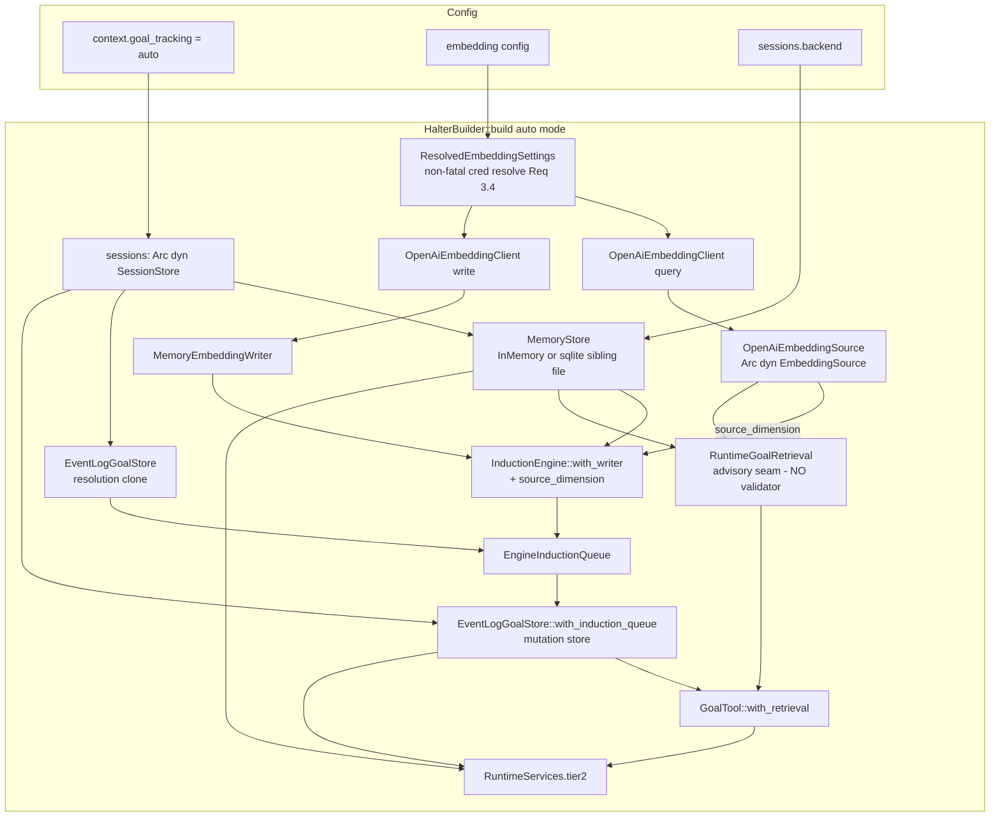
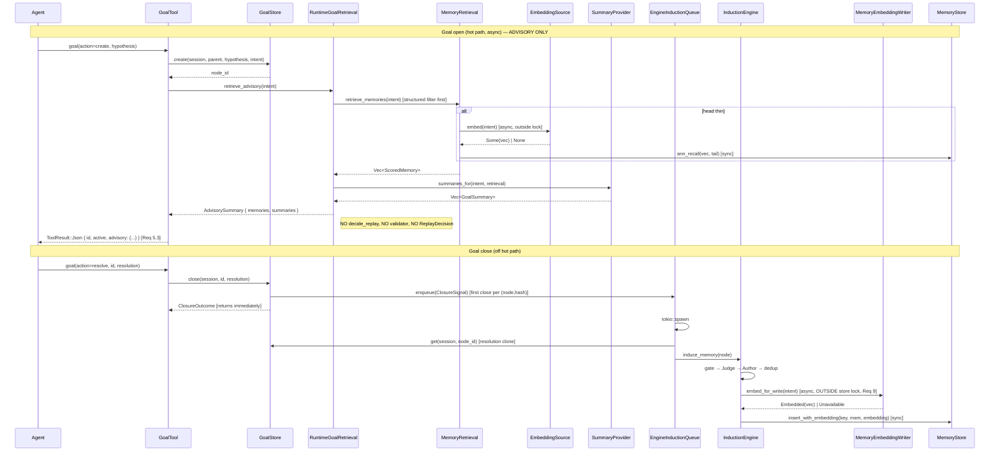
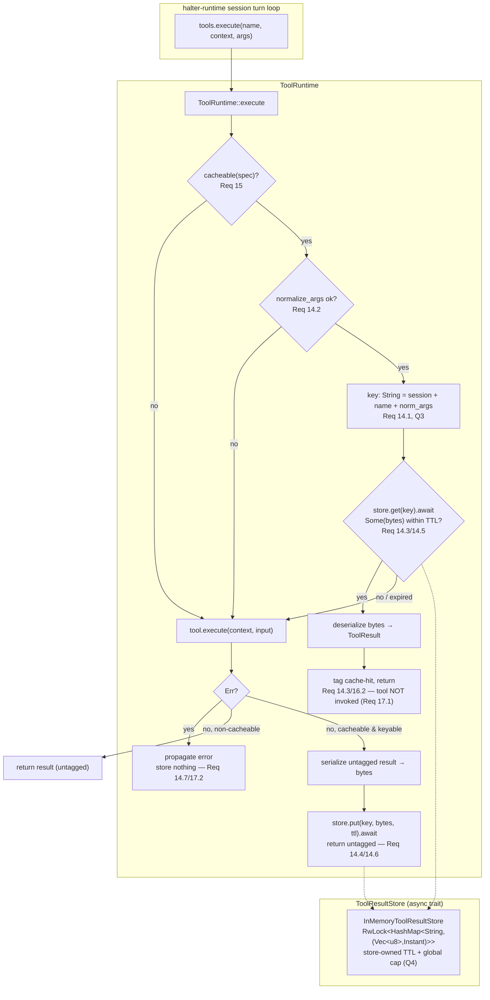

# Design Document

## Overview

This feature delivers **two independent runtime capabilities** and **removes the
orphaned verification-tier plumbing** that a rejected earlier scope left behind.
Neither capability reintroduces the removed replay/verify model: there is no
evidence validator on the hot path, no source resolution, no content-hashing,
no "verified vs believed-unverified" answer serving.

**Capability A — Tier 2 retrieval → advisory context injection (Req 1–12).**
Wire the already-built-but-unwired Tier 2 components
(`OpenAiEmbeddingClient`, `OpenAiEmbeddingSource`, `MemoryEmbeddingWriter`,
`ResolvedEmbeddingSettings`, `InMemoryMemoryStore`, `SqliteMemoryStore`,
`MemoryRetrieval`, `InductionEngine`, `EngineInductionQueue`,
`insert_memory_with_writer`) into `HalterBuilder::build`, gated on
`goal_tracking = auto` + `[embedding].enabled` + the session backend. When a
goal opens, the runtime runs structured-first retrieval and folds a short
**advisory** summary of applicable memories and their summaries into the
`goal(action=create)` tool result the agent reads next turn. **The advisory path
bypasses the replay/verification code entirely** (Req 5.3, 5.4): it does not call
`decide_replay`, constructs no `EvidenceValidator`, produces no `ReplayDecision`,
and serves no cached answer. Closed goals feed induction off the hot path, and
induction now stores real embeddings through the writer.

**Capability B — TTL tool-result cache (Req 13–17).** A time-window cache of tool
*results*, keyed by tool name + `Normalized_Args` (reusing `normalize_args`),
with a single global default TTL from a new `[tools]` config
(`tool_cache_ttl_secs` + an enable flag, **default disabled**). The cache is
abstracted behind an async **`ToolResultStore` backend trait** so the in-memory
implementation is just the first backend and durable/remote backends (Redis,
sqlite) can be added later as config-only changes; a `tool_cache_backend`
selector (default `Memory`) chooses the backend, and `Redis`/`Sqlite` selection
fails `build` fast with a "not yet supported" error until those backends land.
The store is interposed inside `ToolRuntime::execute`: a hit within the TTL
returns the stored (deserialized) `ToolResult` without invoking the tool, tagged
with a cache-hit indicator; a miss/expiry invokes the tool, stores the fresh
result as bytes, and returns it untagged. Only side-effect-free tools (as declared
on `ToolSpec`) are cacheable; an errored invocation caches nothing.

**Code removal (verification tier).** The runtime validator/resolver plumbing
that only existed to serve the now-cut verification model is removed:
`Tier1EvidenceValidator`, the `SourceResolver` trait, and the `SourceResolution`
enum (in `crates/halter-goals/src/integration.rs`) plus their `lib.rs`
re-exports. Model-level and public-API types that remain ground truth
(`decide_replay`, `ReplayDecision`, the `replay` module, `EvidenceValidator`,
the entire `tier1` module, `CachedOutcome`/`AnswerMode`, `start_goal`/
`start_goal_with_summaries`) are explicitly **kept** — the advisory bypass simply
never calls them. See the [Code Removal](#code-removal) section.

Capability A preserves three invariants from the prior specs, treated as ground
truth here: the **synchronous `MemoryStore` / asynchronous embedding split**
(embeddings produced async up-front, outside any store lock, then handed to the
synchronous insert); **backward compatibility** (defaults ⇒ byte-identical
behavior, no new network calls); and **end-to-end graceful degradation**
(disabled embedding, missing credential, or unavailable backend never break
build or goal execution). This spec changes neither the retrieval algorithm, the
`MemoryStore` trait contract, the `Memory`/`MemoryRecord` model, `validate_memory`,
the embedding codec, the credential-resolution precedence, nor `normalize_args`.

### Resolved open questions

The requirements' Open Questions are resolved by this design and are updated in
`requirements.md`:

- **Q1 — Cacheable-tool policy.** Derive cacheability from the existing
  `ToolSpec` fields **plus** an explicit opt-in flag. A tool is cacheable iff
  `capabilities.mutating == false` **and** `concurrency ∈ {ReadOnly, ParallelSafe}`
  **and** a new `capabilities.cacheable == true` opt-in is set. See
  [Cacheability policy](#6-cacheability-policy-req-15-q1). Rationale inline.
- **Q2 — Cache location.** The cache lives **inside `ToolRuntime`**, interposed in
  `ToolRuntime::execute`, so every dispatch path benefits. The concrete storage is
  abstracted behind the async `ToolResultStore` trait; the runtime holds an
  `Option<Arc<dyn ToolResultStore>>` and owns only the keying/serialization/tagging
  logic. **The backend is a deliberate extension point** — in-memory now, with
  Redis/sqlite as future backends selected by config with no schema change. See
  [Tool-result store + interposition](#7-toolresultstore--inmemorytoolresultstore--interposition-req-13-14-16-17-q2-q3-q4).
- **Q3 — Cache scope.** **Per-session** (the `SessionId` is embedded in the string
  key), to prevent cross-session result bleed. Rationale inline. The scope survives
  the abstraction because the session id is part of the flat string key every
  backend uses.
- **Q4 — Eviction/size bound.** **TTL-only for v1**, with a **global entry cap and
  lazy expiry sweep** to bound memory. Because keys are now flat strings that
  already embed the session id, the in-memory backend's bound is a global entry cap
  (with lazy expiry on `get`), not a per-session map; the store owns this bound.
  Rationale inline.
- **Q5 — Tool_Result wire compat.** The `ToolResult` change is an **additive,
  defaulted, `#[serde(skip_serializing_if)]` field on the `Json` payload via a
  new wrapper**, requiring **no migration or version bump**; absent-on-deserialize
  ⇒ not-from-cache. See [ToolResult envelope extension](#7-toolresult-envelope-extension-req-16-q5).
- **Q6 — Memory store DB location.** When `Session_Backend` is `sqlite`, open a
  **distinct sibling file** `memory.sqlite3` in the session database's directory,
  never the session DB. Confirmed.

## Architecture

### Capability A — builder-time construction graph

The central construction challenge is the dependency knot among the goal store,
the induction queue, the induction engine, and the memory store, verified in the
code:

- `EngineInductionQueue::new(store: Arc<G>, engine: Arc<InductionEngine<M>>)`
  needs a `GoalStore` handle **and** the engine
  (`integration.rs`, `EngineInductionQueue`).
- `EventLogGoalStore::with_induction_queue(log, queue)` needs the queue
  (`goal_model/store.rs`, confirmed present).
- `InductionEngine` needs the `MemoryStore`.

This is **not** a true cycle: `EngineInductionQueue` uses its `GoalStore` handle
only to *resolve closed nodes* (`store.get(session, node_id)` inside `run`),
which the `EventLogGoalStore` does independently of which queue it holds. The
resolution is to build in dependency order and break the knot by constructing a
**second `EventLogGoalStore` over a clone of the same `SessionStoreGoalEventLog`**
(itself an `Arc<dyn SessionStore>` wrapper — cheap to clone, reads the same
shared log) and handing *that* to the queue as its resolution handle. The queue's
resolution store and the runtime's mutation store observe the same session log,
so a node closed on the mutation store is visible to the queue (Req 7).

```
Construction order (auto mode):

1. sessions        = build_session_store(&config.sessions)          (already built)
2. HarnessConfig::validate() already ran (Req 12.1/12.2 — fail-fast)
3. settings        = resolve_embedding_settings(&config)            (NON-FATAL creds, Req 3.4/10.2)
4. source_dimension = settings.dimension
5. source          = Arc::new(OpenAiEmbeddingSource::new(client_q, settings.clone()))
6. writer          = MemoryEmbeddingWriter::new(client_w, settings.clone())   (same settings ⇒ same dim, Req 8.1)
7. mem_store       = build_memory_store(&config.sessions)?          (InMem | sqlite sibling file, Req 4)
8. engine          = Arc::new(InductionEngine::with_writer(
                        mem_store.clone(), tracker, judge, author, N,
                        writer, source_dimension))                   (Req 6, 8)
9. resolution_store = Arc::new(EventLogGoalStore::new(
                        SessionStoreGoalEventLog::new(sessions.clone())))   (knot-break clone)
10. queue          = Arc::new(EngineInductionQueue::new(resolution_store, engine))   (Req 7)
11. goal_store     = Arc::new(EventLogGoalStore::with_induction_queue(
                        SessionStoreGoalEventLog::new(sessions.clone()), queue))
12. advisory       = Arc::new(RuntimeGoalRetrieval { store: mem_store, source, summary, clock })
13. tools.register(GoalTool::with_retrieval(goal_store.clone(), advisory))   (Req 5)
14. RuntimeServices { .. tier2: Some(Tier2Services { .. }) }         (Req 11.3 non-secret)
```



### Capability A — runtime data flow (advisory, no verification)



### Capability B — tool-result cache interposition



## Components and Interfaces

### 1. Advisory entry point + `AdvisorySummary` (Req 5) — the verification bypass

The old design threaded retrieval through `start_goal`/`start_goal_with_summaries`,
which return `GoalStart::Replay(ReplayDecision)` and call `decide_replay`. That
whole path is verification and is **out of scope**. This design adds a **new thin
advisory entry point** in `halter-goals::integration` that runs retrieval and
summaries only — it never touches `decide_replay`, `EvidenceValidator`, or
`ReplayDecision` (Req 5.3, 5.4).

```rust
// crates/halter-goals/src/integration.rs  (NEW)

use crate::tier2::{GoalSummary, Memory, Retrieval, ScoredMemory, SummaryProvider};
use crate::types::IntentSignature;

/// The advisory payload for a newly-opened goal (Req 5.3). It carries ONLY the
/// applicable memories and their summaries — no replay decision, no validation
/// result, no served answer (Req 5.4). Empty when retrieval finds nothing
/// (Req 5.5).
#[derive(Debug, Clone, PartialEq)]
pub struct AdvisorySummary {
    /// Applicable memories in retrieval order (score-descending, structured-head
    /// first). Compact `Memory` values, never raw transcripts.
    pub memories: Vec<ScoredMemory>,
    /// Similar-goal summaries (empty when the provider is disabled / no
    /// candidates / on failure). Additive over `memories`.
    pub summaries: Vec<GoalSummary>,
}

impl AdvisorySummary {
    /// The empty advisory (no applicable memory). `goal` proceeds as if no
    /// memory existed (Req 5.5).
    #[must_use]
    pub fn empty() -> Self {
        Self { memories: Vec::new(), summaries: Vec::new() }
    }

    /// True when there is nothing to inject.
    #[must_use]
    pub fn is_empty(&self) -> bool {
        self.memories.is_empty() && self.summaries.is_empty()
    }
}

/// Run advisory retrieval for a newly-opened goal.
///
/// Runs the UNCHANGED structured-first `Retrieval::retrieve_memories` (structured
/// filter first; embed only when the head is thin — Req 5.2, 5.6) and the opt-in
/// `SummaryProvider::summaries_for`, and returns the applicable memories +
/// summaries ONLY. It calls neither `decide_replay` nor any `EvidenceValidator`
/// and constructs no `ReplayDecision` (Req 5.3, 5.4). Never errors: a degraded
/// embedding backend yields a structured-head-only advisory (Req 10.3).
pub async fn retrieve_advisory(
    sig: &IntentSignature,
    retrieval: &impl Retrieval,
    summary_provider: &SummaryProvider,
) -> AdvisorySummary {
    let memories = retrieval.retrieve_memories(sig).await;
    let summaries = summary_provider.summaries_for(sig, retrieval).await;
    AdvisorySummary { memories, summaries }
}
```

Note `summaries_for` already re-runs `retrieve_memories` internally when enabled
(verified in `summary.rs`), and returns empty without consulting retrieval when
disabled — so a disabled provider adds no work and no summaries. The
double-retrieve when summaries are enabled is acceptable (both reads are cheap
structured-first passes) and matches the existing `start_goal_with_summaries`
shape; we keep it to avoid changing the `SummaryProvider` contract (ground truth).

### 2. The `GoalRetrieval` seam on `GoalTool` (Req 1.3, 5.3, 5.5)

Reuse the trait-object seam pattern the old design established, but its method now
returns the **advisory summary**, not a replay decision. `GoalTool` gains an
`Option<Arc<dyn GoalRetrieval>>`; `None` ⇒ byte-identical to today (Req 1.3).

```rust
// crates/halter-tools/src/builtin/goal.rs

use async_trait::async_trait;
use halter_goals::{AdvisorySummary, IntentSignature};

/// The hot-path advisory capability GoalTool consults on goal open.
///
/// Erases the concrete MemoryStore/EmbeddingSource generics behind one async
/// method so GoalTool needs no Tier 2 type parameters. `None` on GoalTool (off
/// mode / no Tier 2) preserves today's behavior EXACTLY (Req 1.3). This method
/// NEVER runs verification — it returns an advisory only (Req 5.4).
#[async_trait]
pub trait GoalRetrieval: Send + Sync {
    /// Retrieve the advisory for a newly-opened goal's intent. Never errors:
    /// degradation yields an empty or head-only advisory (Req 5.5, 10.3).
    async fn retrieve_advisory(&self, intent: &IntentSignature) -> AdvisorySummary;
}

pub struct GoalTool {
    store: Arc<dyn GoalStore>,
    retrieval: Option<Arc<dyn GoalRetrieval>>, // None ⇒ byte-identical to today
}

impl GoalTool {
    /// Today's constructor — no advisory (Req 1.3). Unchanged signature.
    #[must_use]
    pub fn new(store: Arc<dyn GoalStore>) -> Self {
        Self { store, retrieval: None }
    }

    /// Auto-mode constructor wiring the advisory seam (Req 5).
    #[must_use]
    pub fn with_retrieval(store: Arc<dyn GoalStore>, retrieval: Arc<dyn GoalRetrieval>) -> Self {
        Self { store, retrieval: Some(retrieval) }
    }
}
```

Injection in `create_action` (Req 5.3): fold the advisory into the existing
`ToolResult::Json`. Off mode emits exactly today's `{ id, active }` (Req 1.3):

```rust
// GoalTool::create_action tail, after the successful create + stack push:
let active = stack.lock().active().cloned();
let mut response = json!({ "id": id, "active": active });

if let Some(retrieval) = &self.retrieval {
    // Req 5.1: run advisory retrieval with the freshly-derived intent.
    let advisory = retrieval.retrieve_advisory(&intent).await;
    // Req 5.3/5.5: fold the advisory in; empty advisory ⇒ empty object, goal
    // proceeds. NO action is taken on it (Req 5.4).
    response["advisory"] = render_advisory(&advisory);
}
Ok(response) // execute() wraps this in ToolResult::Json
```

`render_advisory` maps `AdvisorySummary` into an agent-facing shape: an
`applicable_memories` array (each memory's intent, plan step descriptions, kind,
score — never the raw cached answer value) and a `similar_goals` array of
`{ did, concluded, dead_end }` from `GoalSummary`. An empty advisory renders
`{ "applicable_memories": [], "similar_goals": [] }` (Req 5.5). Because injection
is additive JSON and only occurs when `retrieval.is_some()`, the off path is
byte-identical (Req 1.1, 1.3).

The concrete seam implementation lives in the `halter` crate (it owns the
concrete store/source):

```rust
// crates/halter/src/builder.rs  (adapter)

struct RuntimeGoalRetrieval {
    store: Arc<dyn MemoryStore>,       // shared with induction
    source: Arc<dyn EmbeddingSource>,  // query path (enabled flag inside)
    summary: SummaryProvider,
}

#[async_trait]
impl GoalRetrieval for RuntimeGoalRetrieval {
    async fn retrieve_advisory(&self, intent: &IntentSignature) -> AdvisorySummary {
        let retrieval = MemoryRetrieval::new(self.store.as_ref(), self.source.as_ref());
        retrieve_advisory(intent, &retrieval, &self.summary).await // Req 5.1/5.2/5.3
    }
}
```

`MemoryRetrieval::new` uses the default `HEAD_MIN`/`TAIL_LIMIT` bounds, so the
algorithm, ordering, dedup, and head/tail bounds are unchanged (Req 5.6). The
`create_action` handler is already `async` on an async hot path, so awaiting here
introduces no sync-over-async bridge (Req 9).

### 3. Embedding source, client, and writer construction (Req 3, 8, 11)

All three derive from a single `ResolvedEmbeddingSettings` so the write and query
paths agree on model and dimension (Req 8.1). The builder resolves the OpenAI
credential **non-fatally** (Req 3.4, 10.2): an enabled embedding path with no
credential must not fail `build`. On `Err` from `resolve_provider_runtime_config`
(the no-credential case), synthesize an empty bearer, which both
`OpenAiEmbeddingSource::new` and `MemoryEmbeddingWriter::new` read as
`has_credential = false` (verified: both compute `has_credential =
!settings.bearer.expose_secret().is_empty()`), degrading `embed`/`embed_for_write`
to `None`/`Unavailable` with no network call.

```rust
// crates/halter/src/builder.rs

use halter_config::{resolve_provider_runtime_config, ConfiguredProvider, ResolvedProviderAuth};
use halter_goals::ResolvedEmbeddingSettings;
use halter_providers::{EmbeddingClient, OpenAiEmbeddingClient};
use halter_goals::{EmbeddingSource, MemoryEmbeddingWriter, OpenAiEmbeddingSource};

/// Resolve embedding settings from `[embedding]` + OpenAI provider auth,
/// treating a MISSING credential as non-fatal (Req 3.3, 3.4, 10.2, 11.1).
fn resolve_embedding_settings(config: &HarnessConfig) -> ResolvedEmbeddingSettings {
    // Reuse the SAME OpenAI resolution/precedence the model registry uses
    // (ground truth). For the EMBEDDING path only, catch the no-credential Err
    // and synthesize an empty bearer so build() still succeeds (Req 3.4).
    let auth = match resolve_provider_runtime_config(config, ConfiguredProvider::OpenAi) {
        Ok(resolved) => resolved.auth,
        Err(_) => ResolvedProviderAuth::ApiKey(String::new()), // empty ⇒ no credential
    };
    ResolvedEmbeddingSettings::resolve(&config.embedding, &auth)
}

// Construction (only under `auto`):
let settings = resolve_embedding_settings(&config);
let source_dimension = settings.dimension; // Option<u32>, shared by both paths (Req 8.1/8.2)

let client_q = OpenAiEmbeddingClient::new(settings.bearer.clone(), settings.base_url.clone());
let source: Arc<dyn EmbeddingSource> =
    Arc::new(OpenAiEmbeddingSource::new(client_q, settings.clone())); // Req 3.2

let client_w = OpenAiEmbeddingClient::new(settings.bearer.clone(), settings.base_url.clone());
let writer = MemoryEmbeddingWriter::new(client_w, settings.clone()); // same settings ⇒ same dim (Req 8.1)
```

`ResolvedEmbeddingSettings::resolve` wraps the bearer in a redacting
`SecretString` (Req 11.1, verified). When `[embedding].enabled == false`, the same
construction runs but `embed`/`embed_for_write` short-circuit to
`None`/`Unavailable` with no network call — the `enabled` flag lives inside
`ResolvedEmbeddingSettings` and is honored by the existing source/writer. So
Req 2.3/2.4 ("real source when enabled, None-returning when disabled") is
satisfied by a *single* `OpenAiEmbeddingSource` whose flags drive behavior, not by
two types. The builder logs only `enabled` and the store backend, never the
credential (Req 11.2, 11.3).

### 4. Memory store construction (Req 4, Q6)

Mirror the session backend selection, feature-gated exactly as
`build_session_store` (verified `#[cfg(feature = "sqlite")]` split in
`builder.rs`).

```rust
// crates/halter/src/builder.rs

use halter_goals::{InMemoryMemoryStore, MemoryStore};
#[cfg(feature = "sqlite")]
use halter_goals::SqliteMemoryStore;

#[cfg(feature = "sqlite")]
fn build_memory_store(config: &SessionsConfig) -> anyhow::Result<Arc<dyn MemoryStore>> {
    match config.backend {
        SessionBackend::Memory => Ok(Arc::new(InMemoryMemoryStore::new())),   // Req 4.1
        SessionBackend::Sqlite => {
            let path = memory_store_path(config); // Q6: sibling of session sqlite_path
            let store = SqliteMemoryStore::open(&path).with_context(|| {
                format!("failed to initialize sqlite memory store at {}", path.display())
            })?; // Req 4.2, 4.4 — fail build identifying the memory-store failure
            Ok(Arc::new(store))
        }
    }
}

#[cfg(not(feature = "sqlite"))]
fn build_memory_store(config: &SessionsConfig) -> anyhow::Result<Arc<dyn MemoryStore>> {
    match config.backend {
        SessionBackend::Memory => Ok(Arc::new(InMemoryMemoryStore::new())),
        // No Sqlite variant without the feature — the session store already
        // forecloses `backend = sqlite` (schema validate), so this is total.
    }
}

/// Q6: distinct sibling file `memory.sqlite3` in the session DB's directory,
/// never the session DB. Falls back to the default halter dir when no session
/// path is set.
#[cfg(feature = "sqlite")]
fn memory_store_path(config: &SessionsConfig) -> PathBuf {
    match config.sqlite_path.as_ref() {
        Some(session_path) => {
            let expanded = expand_path(session_path);
            let dir = expanded.parent().map(Path::to_path_buf).unwrap_or_else(|| PathBuf::from("."));
            dir.join("memory.sqlite3")
        }
        None => default_halter_dir().join("memory.sqlite3"),
    }
}
```

`MemoryStore` is a `&self` interior-mutability trait (verified), so both stores are
shared as `Arc<dyn MemoryStore>` by retrieval and induction without changing the
trait (Req 4.3). `SqliteMemoryStore::open` failure maps to a build failure
identifying the memory store (Req 4.4).

### 5. Induction wiring: engine → writer, closure → induction (Req 6, 7, 8, 9)

Today `InductionEngine<S: MemoryStore>` calls `self.store.insert(key, candidate)`
directly, storing an empty embedding (verified in `induction.rs`, single insert
call site at the end of `induce_memory`). To store real embeddings (Req 6.1, 6.2)
the engine gains an embedding-client generic and routes that single insert through
`insert_memory_with_writer`.

```rust
// crates/halter-goals/src/tier2/induction.rs

use crate::tier2::embedding::{insert_memory_with_writer, MemoryEmbeddingWriter};
use halter_providers::EmbeddingClient;

pub struct InductionEngine<S: MemoryStore, C: EmbeddingClient> {
    store: Arc<S>,
    tracker: Arc<dyn RecurrenceTracker>,
    judge: Arc<dyn Judge>,
    author: Arc<dyn Author>,
    threshold: u64,
    log: InductionLog,
    key_locks: Arc<KeyLocks>,
    // NEW: write-path embedding producer + the query-path source dimension so
    // the engine inserts real embeddings through the sync/async-split seam.
    writer: MemoryEmbeddingWriter<C>,
    source_dimension: Option<u32>,
}

impl<S: MemoryStore, C: EmbeddingClient> InductionEngine<S, C> {
    /// Build an engine that inserts through `insert_memory_with_writer` (Req 6, 8).
    #[must_use]
    pub fn with_writer(
        store: Arc<S>,
        tracker: Arc<dyn RecurrenceTracker>,
        judge: Arc<dyn Judge>,
        author: Arc<dyn Author>,
        threshold: u64,
        writer: MemoryEmbeddingWriter<C>,
        source_dimension: Option<u32>,
    ) -> Self { /* ... */ }
}
```

The single changed call site inside `induce_memory` (the non-dedup insert only):

```rust
// BEFORE:  match self.store.insert(key, candidate) { .. }
// AFTER (Req 6.1, 6.2, 8.2, 9.1):
match insert_memory_with_writer(
    &self.writer,
    self.source_dimension,     // Req 8.2 — passed for the consistency check
    self.store.as_ref(),
    key,
    candidate,
).await {
    Ok(id) => InductionOutcome::Inserted(id),
    Err(err) => InductionOutcome::AuthorFailed(err.to_string()),
}
```

`insert_memory_with_writer` (verified signature) already: (1) calls
`check_source_dimension` (Req 8.3 — reject on writer/source mismatch, leaving any
prior embedding unchanged); (2) awaits `embed_for_write` **outside** the store lock
then calls the synchronous `insert_with_embedding` (Req 9.1, 9.2); (3) on
`Embedded` stores the real vector, on `Unavailable` stores an empty embedding and
still succeeds (Req 6.3, 10.4). Disabled embedding ⇒ writer short-circuits to
`Unavailable` with no network call ⇒ empty embedding stored (Req 6.4). The
dedup/reinforce path is unchanged (reinforcement does not re-embed).

**Backward-compat for `InductionEngine::new`.** `new` is retained as the
**disabled-writer path**: it constructs a `MemoryEmbeddingWriter` over a
zero-sized `NoEmbeddingClient` with a disabled/empty-credential
`ResolvedEmbeddingSettings`, so its insert path degrades to an empty embedding
exactly as today. This keeps existing callers/tests compiling. `with_writer` is
the new runtime path.

```rust
/// A zero-sized `EmbeddingClient` whose `embed_once` is never reached (the
/// disabled writer short-circuits before any client call). Backs
/// `InductionEngine::new`'s disabled-writer path.
pub struct NoEmbeddingClient;

#[async_trait]
impl EmbeddingClient for NoEmbeddingClient { /* embed_once: unreachable / Unavailable */ }

impl<S: MemoryStore> InductionEngine<S, NoEmbeddingClient> {
    #[must_use]
    pub fn new(/* unchanged params */) -> Self {
        // writer = disabled MemoryEmbeddingWriter<NoEmbeddingClient>; source_dimension = None
    }
}
```

**Closure → induction (Req 7).** The builder installs the queue on the mutation
store via `EventLogGoalStore::with_induction_queue` and breaks the construction
knot with the resolution-clone store (see Architecture):

```rust
let engine = Arc::new(InductionEngine::with_writer(
    mem_store.clone(), tracker, judge, author, N, writer, source_dimension,
));
let resolution_store = Arc::new(EventLogGoalStore::new(
    SessionStoreGoalEventLog::new(sessions.clone()),   // same shared session log
));
let queue: SharedInductionQueue =
    Arc::new(EngineInductionQueue::new(resolution_store, engine));
let goal_store: Arc<dyn GoalStore> = Arc::new(EventLogGoalStore::with_induction_queue(
    SessionStoreGoalEventLog::new(sessions.clone()),
    queue,
));
```

`EngineInductionQueue::enqueue` runs `induce_memory` on a `tokio::spawn`ed task, so
`close` returns before induction runs (Req 7.2, verified existing behavior). Under
`off`, none of this is constructed and the goal store keeps its default
`NoopInductionQueue` (Req 7.3, 1.1).

### 6. Cacheability policy (Req 15, Q1)

Side-effect-free is **necessary but not sufficient** (Req 15.1). Investigating
`ToolSpec` (verified): it carries `concurrency: ToolConcurrency`
(`Exclusive`/`ReadOnly`/`ParallelSafe`) and `capabilities: ToolCapabilities`
(`mutating`, `requires_approval`, `cancellable`, `long_running`). The mutating
tools (`goal` shown as `mutating: true`, `Exclusive`; write/edit/shell/process/
pty/subagent) are excluded by the mutating/concurrency test alone. But read-only
concurrency does **not** guarantee cache-safety (e.g. a read tool whose result
legitimately varies moment-to-moment, or one with hidden context dependence).

**Decision (Q1): derive from existing fields AND require an explicit opt-in.** Add
a `cacheable: bool` field to `ToolCapabilities`, **defaulting `false`**. A tool is
a `Cacheable_Tool` iff:

```
capabilities.cacheable == true
  && capabilities.mutating == false
  && matches!(concurrency, ToolConcurrency::ReadOnly | ToolConcurrency::ParallelSafe)
```

```rust
// crates/halter-protocol/src/lib.rs
pub struct ToolCapabilities {
    pub mutating: bool,
    pub requires_approval: bool,
    pub cancellable: bool,
    pub long_running: bool,
    /// Opt-in: the tool's result is safe to serve from the TTL cache within the
    /// window (Req 15). Defaults false; ignored unless the tool is also
    /// non-mutating and read-only/parallel-safe.
    #[serde(default)]
    pub cacheable: bool,
}

// crates/halter-tools/src/runtime.rs — pure policy over the registered spec.
fn is_cacheable(spec: &ToolSpec) -> bool {
    spec.capabilities.cacheable
        && !spec.capabilities.mutating
        && matches!(spec.concurrency, ToolConcurrency::ReadOnly | ToolConcurrency::ParallelSafe)
}
```

**Rationale / tradeoff.** Relying purely on `mutating`/`concurrency` would
auto-cache every read tool, which over-reaches: `ToolConcurrency` is a *scheduler*
hint about parallel safety, not a statement about temporal result stability, and a
read tool's output can still change between identical calls (a file re-read after
an external edit). The explicit `cacheable` opt-in (defaulting false) makes
caching a deliberate per-tool decision that a tool author asserts, while the
`mutating`/concurrency conjunction is a hard safety floor that can never be
overridden — so `write/edit/shell/process/pty/subagent` are never cached even if
mis-flagged (Req 15.3). The cost is that read tools must opt in to benefit; that
is the safe default and satisfies "MAY classify a side-effect-free tool as not
cacheable" (Req 15.1). `ToolCapabilities` already derives `Default`, so adding a
`#[serde(default)]` bool is additive and leaves every existing construction site
valid (they use `..Default::default()` or field lists; the new field defaults
false).

### 7. `ToolResultStore` + `InMemoryToolResultStore` + interposition (Req 13, 14, 16, 17, Q2, Q3, Q4)

**Location (Q2).** The cache lives **inside `ToolRuntime`** and is interposed in
`ToolRuntime::execute`, so **every** caller of `execute` (the turn loop, subagents,
tests) benefits uniformly and the hit short-circuits before `tool.execute`
(Req 17.1). Rationale: `execute` is the single dispatch chokepoint (verified —
`halter-runtime` calls `tools.execute(&name, context, args)`), and `ToolContext`
already carries `session_id`, giving the cache everything it needs without new
plumbing.

**Scope (Q3): per-session.** The lookup key embeds the `SessionId`. Rationale: a
tool's result can depend on session-scoped context (working dir, tool-session
state, subagent parent); a global cache risks serving one session's result into
another (cross-session bleed). Per-session isolation is the safe choice; the reuse
we give up (identical calls across sessions) is low-value and unsafe. The tradeoff
is noted: global would maximize reuse but is unsound for context-dependent reads.

#### The `ToolResultStore` backend trait (store-owned TTL, bytes boundary)

The concrete cache is abstracted behind an **async backend trait** so the
in-memory implementation is only the first backend. The trait is `#[async_trait]`
and **owns expiry**, and its value boundary is **bytes (`Vec<u8>`), not
`ToolResult`**:

```rust
// crates/halter-tools/src/cache.rs  (NEW)

use std::time::Duration;
use async_trait::async_trait;

/// A pluggable backend for the TTL tool-result cache. The value boundary is raw
/// bytes so durable/remote backends (Redis, sqlite) need not depend on
/// `halter-protocol` types; `ToolRuntime` owns (de)serialization of `ToolResult`.
/// The store enforces its OWN expiry (Req 14.3/14.5): the in-memory backend
/// compares a stored deadline `Instant`, a Redis backend uses native key
/// TTL/`EXPIRE`, and a sqlite backend stores an `expires_at` column.
#[async_trait]
pub trait ToolResultStore: Send + Sync {
    /// Return the stored bytes for `key` iff present AND not expired. The store
    /// enforces its own expiry, so a `Some` return is always a live, servable
    /// entry (Req 14.3); an absent or expired entry ⇒ `None` (Req 14.5).
    async fn get(&self, key: &str) -> Option<Vec<u8>>;

    /// Store `value` bytes under `key` with a time-to-live. The store is
    /// responsible for expiring the entry after `ttl` (Req 14.4). Backends bound
    /// their own memory/size.
    async fn put(&self, key: String, value: Vec<u8>, ttl: Duration);
}
```

**Why async.** Redis is inherently async and sqlite is blocking I/O that a durable
backend would run on a blocking pool; the trait must be async to accommodate
remote/durable backends, and the in-memory backend pays only a trivial async
wrapper cost (it does no real I/O). `ToolRuntime::execute` is already `async`, so
awaiting `get`/`put` introduces **no** sync-over-async bridge on the dispatch path
— consistent with Req 9's spirit (Req 9 is about the memory store, but the tool
cache is likewise await-friendly here). **Why store-owned TTL.** Expiry lives in
the store so Redis can use native `EXPIRE` and sqlite an `expires_at` column,
rather than `ToolRuntime` re-implementing expiry per backend; the runtime just
passes the resolved `ttl` to `put`.

**Why a `String` key.** The key stays a flat `String` — the serialized
`session + tool + normalized_args` composite — so it is backend-neutral: it works
directly as a `HashMap` key, a Redis key, and a sqlite primary key with no
per-backend key type. The composite renders to a **stable** string (see
`CacheKey` below).

#### `CacheKey` → stable `String` (Req 14.1, Q3)

`ToolRuntime` computes the composite key and renders it to the flat string every
backend uses. Because `normalize_args` already produces a canonical string, the
rendering is deterministic and collision-safe (the session id and tool name are
length-prefixed so no separator can be forged across fields):

```rust
use halter_goals::normalize_args;               // ground-truth canonicalization
use halter_protocol::{SessionId, ToolName};
use serde_json::Value;

/// The composite per-session key (session + tool name + canonical args, Req 14.1,
/// Q3). Rendered to a single stable `String` for the backend-neutral store key.
struct CacheKey {
    session: SessionId,
    tool: String,
    normalized_args: String,   // the CanonicalJson string from normalize_args
}

impl CacheKey {
    /// Compute the key, or `None` when the args are non-canonicalizable
    /// (Req 14.2) — the caller then bypasses the cache entirely.
    fn compute(session: &SessionId, tool: &str, input: &Value) -> Option<Self> {
        let canon = normalize_args(&ToolName::from(tool), input).ok()?; // Req 14.2 (Err ⇒ None)
        Some(Self { session: session.clone(), tool: tool.to_owned(), normalized_args: canon.0 })
    }

    /// Render to a stable, backend-neutral string key (Req 14.1). Length-prefixed
    /// fields make the encoding injective: identical rendered strings imply equal
    /// (session, tool, normalized_args) triples, and vice versa.
    fn to_key_string(&self) -> String {
        let s = self.session.as_str();
        format!("{}:{}\u{1f}{}:{}\u{1f}{}", s.len(), s, self.tool.len(), self.tool, self.normalized_args)
    }
}
```

#### `InMemoryToolResultStore` — the only backend now (Req 14.3/14.5, Q4)

The in-memory backend implements the trait over a
`RwLock<HashMap<String, (Vec<u8>, Instant)>>`, storing a **deadline `Instant`**
per entry (`stored_at + ttl`). It enforces TTL by comparing `Instant::now()` on
`get` (monotonic, immune to wall-clock jumps), and bounds memory with a **global
entry cap** plus a **lazy expiry sweep** on `put` (Q4). Because keys are now flat
strings that already embed the session id, the size bound is a global entry cap
rather than a per-session map; the store owns and enforces it. It is
`#[async_trait]` but does no real I/O:

```rust
use std::collections::HashMap;
use std::sync::RwLock;
use std::time::Instant;

/// In-memory `ToolResultStore`. Stores `(bytes, deadline)` where
/// `deadline = stored_at + ttl`; `get` returns the bytes iff `Instant::now() <=
/// deadline` (Req 14.3/14.5). Bounds memory with a global entry cap and a lazy
/// expiry sweep on `put` (Q4). No real I/O — the async wrapper is trivial.
pub struct InMemoryToolResultStore {
    max_entries: usize,   // global cap (Q4)
    entries: RwLock<HashMap<String, (Vec<u8>, Instant)>>,
}

impl InMemoryToolResultStore {
    #[must_use]
    pub fn new(max_entries: usize) -> Self {
        Self { max_entries, entries: RwLock::new(HashMap::new()) }
    }
}

#[async_trait]
impl ToolResultStore for InMemoryToolResultStore {
    async fn get(&self, key: &str) -> Option<Vec<u8>> {
        let map = self.entries.read().unwrap_or_else(PoisonError::into_inner);
        map.get(key).and_then(|(bytes, deadline)| {
            (Instant::now() <= *deadline).then(|| bytes.clone()) // expired ⇒ None (Req 14.5)
        })
    }

    async fn put(&self, key: String, value: Vec<u8>, ttl: Duration) {
        let now = Instant::now();
        let mut map = self.entries.write().unwrap_or_else(PoisonError::into_inner);
        map.retain(|_, (_, deadline)| now <= *deadline);          // lazy expiry sweep (Q4)
        if map.len() >= self.max_entries && !map.contains_key(&key) {
            // evict the nearest-deadline entry to stay under the global cap (Q4)
            if let Some(oldest) = map.iter().min_by_key(|(_, (_, d))| *d).map(|(k, _)| k.clone()) {
                map.remove(&oldest);
            }
        }
        map.insert(key, (value, now + ttl));                      // store-owned deadline (Req 14.4)
    }
}
```

#### `ToolRuntime`: optional store + resolved TTL + enabled flag (Req 13.2)

`ToolRuntime` holds an **`Option<Arc<dyn ToolResultStore>>`** plus the resolved
TTL and enabled flag; `None` (the default) ⇒ byte-identical to today
(`ToolRuntime::new()` / `Default`, Req 13.2). `clone_filtered` carries the same
config and the same `Arc` store handle unless a filtered runtime is meant to be
isolated; a fresh store handle avoids surprise reuse across differently-scoped
runtimes (either choice is sound under the flat per-session key — state that the
runtime installs a fresh `InMemoryToolResultStore` on clone to match today's
non-sharing filtered semantics):

```rust
// crates/halter-tools/src/runtime.rs
pub struct ToolRuntime {
    tools: RwLock<HashMap<String, Arc<dyn Tool>>>,
    cache_enabled: bool,                       // disabled by default (Req 13.2)
    cache_ttl: Duration,                       // resolved TTL (Req 13.3/13.5)
    store: Option<Arc<dyn ToolResultStore>>,   // None ⇒ no caching
}

impl ToolRuntime {
    /// Install the configured store + TTL (builder-only). Absent call ⇒ disabled.
    pub fn with_cache(&mut self, store: Arc<dyn ToolResultStore>, ttl: Duration) {
        self.cache_enabled = true;
        self.cache_ttl = ttl;
        self.store = Some(store);
    }
}
```

Interposed `execute` (Req 14, 17). The runtime owns keying, (de)serialization, and
cache-hit tagging; the store owns storage + expiry:

```rust
pub async fn execute(
    &self,
    name: &str,
    context: ToolContext,
    input: Value,
) -> anyhow::Result<ToolResult> {
    let tool = /* existing lookup; unknown-tool error unchanged */;
    let spec = tool.spec();

    // Non-cacheable OR cache disabled/absent ⇒ today's dispatch exactly (Req 13.4, 15.3, 17.3).
    let Some(store) = self.store.as_ref().filter(|_| self.cache_enabled && is_cacheable(&spec)) else {
        return tool.execute(context, input).await;
    };

    // Cacheable: compute the key; non-canonicalizable ⇒ bypass (Req 14.2).
    let Some(key) = CacheKey::compute(&context.session_id, name, &input) else {
        return tool.execute(context, input).await;
    };
    let key = key.to_key_string();

    // Hit within TTL ⇒ deserialize, tag cache-hit, return WITHOUT invoking (Req 14.3, 16.2, 17.1).
    if let Some(bytes) = store.get(&key).await {
        if let Ok(result) = serde_json::from_slice::<ToolResult>(&bytes) {
            return Ok(result.with_cache_hit(true)); // tag a FRESH copy; stored bytes stay untagged
        }
        // Corrupt/legacy bytes ⇒ treat as a miss and fall through to re-invoke.
    }

    // Miss / expired ⇒ invoke (Req 14.5/14.6).
    let result = tool.execute(context, input).await?; // Err ⇒ propagate, store nothing (Req 14.7, 17.2)
    if let Ok(bytes) = serde_json::to_vec(&result) {   // serialize the UNTAGGED, fresh result
        store.put(key, bytes, self.cache_ttl).await;   // store-owned TTL (Req 14.4)
    }
    Ok(result)                                          // untagged (Req 14.6, 16.3)
}
```

`ToolRuntime` serializes the freshly-executed, **untagged** `ToolResult` to bytes
on `put` (`serde_json`) and deserializes on `get`, then applies the cache-hit tag
**after** deserialization via `with_cache_hit(true)` — so the stored bytes stay
untagged and a later hit tags a fresh copy (Req 14.4/14.6, 16.2/16.3). The store
never sees a `ToolResult`, keeping Redis/sqlite backends free of `halter-protocol`
dependencies. The `?` on `tool.execute` propagates errors through the existing
`anyhow::Result` semantics and stores nothing (Req 14.7, 17.2). Non-cacheable
tools and misses preserve dispatch/ordering/error semantics exactly (Req 17.3).

### 8. `ToolResult` envelope extension (Req 16, Q5)

Investigating the blast radius: `ToolResult::Json { value }` is destructured with
`let ToolResult::Json { value } = ...` in **many** places (`halter-tools/builtin`
tests, `halter-session/history.rs`, examples). Adding a field to the `Json` variant
would break every such destructure. `#[serde(tag = "kind")]` is on the enum.

**Decision (Q5, Option B): keep the three variants byte-identical and add the
cache-hit indicator as a separate, optional, defaulted sibling on the envelope by
promoting the enum into a small struct wrapper is rejected** (it would break the
same destructures). Instead, add a **new optional field carried alongside the enum
via a flattened, skip-when-absent companion**, realized as a **fourth
`serde(untagged)`-free additive field** is also awkward with a tagged enum.

The least-disruptive concrete shape that (a) keeps all `Empty`/`Text`/`Json`
construction sites and match arms valid, (b) preserves the many
`let ToolResult::Json { value } = ..` destructures, and (c) round-trips through
session history with absent ⇒ not-from-cache, is to add an **optional field to
each variant is impossible for `Empty`**; therefore we wrap:

> **Chosen representation.** Change `ToolResult` from an enum into a **struct with
> the payload enum inlined via `#[serde(flatten)]` plus an optional
> `cache_hit`**, and re-expose the old variant constructors/matchers through a
> compatibility shim.

Concretely:

```rust
// crates/halter-protocol/src/lib.rs

/// The payload of a tool result (the former `ToolResult` variants).
#[derive(Debug, Clone, Serialize, Deserialize, JsonSchema, PartialEq, Eq)]
#[serde(tag = "kind", rename_all = "snake_case")]
pub enum ToolResultKind {
    Empty,
    Text { text: String },
    Json { value: Value },
}

/// Output returned by a tool execution, with an optional cache-hit indicator
/// (Req 16). The `kind` payload is flattened so the on-wire shape of the
/// `kind`/`text`/`value` fields is UNCHANGED; `cache_hit` is skipped when absent
/// so pre-feature `ToolResult` bytes deserialize as not-from-cache (Req 16.4).
#[derive(Debug, Clone, Serialize, Deserialize, JsonSchema, PartialEq, Eq)]
pub struct ToolResult {
    #[serde(flatten)]
    pub kind: ToolResultKind,
    /// `Some(true)` iff served from the tool-result cache (Req 16.2). `None`
    /// (absent on the wire) ⇒ not from cache (Req 16.3, 16.4).
    #[serde(default, skip_serializing_if = "Option::is_none")]
    pub cache_hit: Option<bool>,
}
```

To preserve the ergonomics of `ToolResult::Json { value }` at construction and
match sites (which are numerous), provide **variant-shaped associated
constructors** and keep the existing sites compiling with a mechanical, localized
edit — the recommended path is:

- **Construction sites** (`Ok(ToolResult::Json { value })`, etc.) change to
  `Ok(ToolResult::json(value))` / `ToolResult::text(t)` / `ToolResult::empty()`.
  These are simple, mechanical, and localized:

  ```rust
  impl ToolResult {
      #[must_use] pub fn empty() -> Self { Self { kind: ToolResultKind::Empty, cache_hit: None } }
      #[must_use] pub fn text(text: impl Into<String>) -> Self { Self { kind: ToolResultKind::Text { text: text.into() }, cache_hit: None } }
      #[must_use] pub fn json(value: Value) -> Self { Self { kind: ToolResultKind::Json { value }, cache_hit: None } }
      /// Return a copy tagged with the cache-hit indicator (Req 16.2/16.3).
      #[must_use] pub fn with_cache_hit(mut self, hit: bool) -> Self { self.cache_hit = Some(hit); self }
  }
  ```

- **Match / destructure sites** (`let ToolResult::Json { value } = r`,
  `match result { ToolResult::Text { text } => .. }`) change to match on
  `r.kind` / `result.kind` (e.g. `let ToolResultKind::Json { value } = r.kind`).
  This is the single mechanical rename `ToolResult::` → `ToolResultKind::` at
  match arms plus a `.kind` at the scrutinee.

**Why this representation (tradeoff).** The alternative — leaving `ToolResult` an
enum and adding `cache_hit` only to `Json` — cannot tag `Empty`/`Text` results and
still breaks the `Json` destructures. Wrapping into `{ #[serde(flatten)] kind,
cache_hit }` keeps the **serialized** shape of `kind`/`text`/`value` byte-identical
(so persisted sessions and provider payloads are unaffected), makes `cache_hit`
purely additive and defaulted, and localizes the source churn to a mechanical
`ToolResult::X { .. }` → `ToolResult::x(..)` / `ToolResultKind::X { .. }` rename.
The churn is real but mechanical and compiler-guided; it is the least-disruptive
shape that satisfies Req 16.1 (indicator separate from JSON payload), 16.5
(variants remain constructible without carrying the indicator — via the
constructors), and 16.6 (round-trips through history).

**Wire-compat (Q5).** Because `cache_hit` is `#[serde(default,
skip_serializing_if = "Option::is_none")]` and `kind` is `#[serde(flatten)]`, a
`ToolResult` serialized **before** this feature (just `{"kind": "...", ...}`)
deserializes with `cache_hit: None` ⇒ not-from-cache (Req 16.4). No migration or
version bump is required for existing on-disk sessions; the field is additive and
defaulted for all persisted formats. `halter-session/history.rs` (which matches on
the result content) is updated to match on `result.content.kind`.

## Data Models

### `Tier2Services` on `RuntimeServices` (Req 1.1, 1.3, 11.3)

`RuntimeServices` already carries `goal_tracking` and `goal_store` (verified in
`halter-runtime/src/session.rs`). The Tier 2 components are consumed at
construction (folded into `GoalTool` and the goal store's queue). To keep them
alive for the runtime's lifetime and support integration-test introspection, add a
single **optional, non-secret** bundle:

```rust
// crates/halter-runtime/src/session.rs (RuntimeServices)

/// Tier 2 runtime bundle, present only under `goal_tracking = auto`. `None` in
/// off mode keeps RuntimeServices byte-identical to today (Req 1.1, 1.3).
pub tier2: Option<Tier2Services>,
```

```rust
#[derive(Clone)]
pub struct Tier2Services {
    /// Shared memory store (InMemory | sqlite sibling file), also used by induction.
    pub memory_store: Arc<dyn MemoryStore>,
    /// Query-path embedding source (enabled flag inside decides real vs None).
    pub embedding_source: Arc<dyn EmbeddingSource>,
    /// Whether the embedding path is enabled (Req 12.3 diagnostic; non-secret).
    pub embedding_enabled: bool,
    /// Selected memory-store backend label ("memory" | "sqlite"); non-secret,
    /// for logging (Req 11.3).
    pub memory_backend: &'static str,
}
```

`Tier2Services` carries **only non-secret** attributes; the bearer credential
lives solely inside the source/writer as a `SecretString` (Req 11.1). Off-mode
`RuntimeServices` sets `tier2: None`.

### `ToolCacheConfig` on `[tools]` (Req 13)

Extend the existing `ToolsConfig` (verified: currently `{ enabled: Vec<String> }`,
`#[serde(deny_unknown_fields)]`) additively:

```rust
// crates/halter-config/src/schema.rs
pub struct ToolsConfig {
    #[serde(default)]
    pub enabled: Vec<String>,
    /// Enable the TTL tool-result cache. Default: false (Req 13.2).
    #[serde(default)]
    pub cache_enabled: bool,
    /// Global default TTL in seconds; None ⇒ runtime default (Req 13.3, 13.5).
    #[serde(default)]
    pub tool_cache_ttl_secs: Option<u64>,
    /// Which `ToolResultStore` backend to use. Default: `Memory` — the only
    /// backend implemented today. `Redis`/`Sqlite` are accepted by the schema
    /// but fail `build` fast until implemented (see below).
    #[serde(default)]
    pub tool_cache_backend: ToolCacheBackend,
}

/// Selects the tool-result cache backend. Additive + defaulted so existing
/// configs (which omit it) default to `Memory` and remain valid under
/// `deny_unknown_fields`. Adding a real Redis/sqlite backend later is a
/// config-only change — no schema/enum change.
#[derive(Debug, Clone, Copy, PartialEq, Eq, Default, Serialize, Deserialize, JsonSchema)]
#[serde(rename_all = "snake_case")]
pub enum ToolCacheBackend {
    #[default]
    Memory,
    Redis,
    Sqlite,
}

const DEFAULT_TOOL_CACHE_TTL_SECS: u64 = 60; // fixed runtime default (Req 13.3)
```

`ToolsConfig::validate` (added) applies `validate_optional_positive_u64` to
`tool_cache_ttl_secs` (must be ≥ 1 when set), consistent with the existing
optional-positive validators. One global TTL applies to every cacheable tool; no
per-tool TTL (Req 13.5). `deny_unknown_fields` remains; the three additive
`#[serde(default)]` fields (including `tool_cache_backend`, which defaults to
`Memory`) keep existing configs valid (Req 13.2).

**Backend construction / fail-fast (Req 13, Q2 extension point).** `HalterBuilder`
maps the selector to a store when the cache is enabled: `Memory` constructs an
`InMemoryToolResultStore` (with the global entry cap) and installs it via
`ToolRuntime::with_cache`; `Redis`/`Sqlite` **fail `build`** with a clear
`"tool cache backend 'redis'/'sqlite' is not yet supported"` error. This is a
fail-fast, build-time config error consistent with the other build-time validation
(embedding config, sqlite memory-store open). The config surface exists now so
adding a backend later is config-only, requiring no schema or enum change.

### `ToolResultStore` trait + `InMemoryToolResultStore` + `CacheKey → String`

Defined in §7. The cache is abstracted behind the async `ToolResultStore` trait
(`get(&str) -> Option<Vec<u8>>`, `put(String, Vec<u8>, Duration)`) whose value
boundary is **bytes**, not `ToolResult`, so future Redis/sqlite backends do not
depend on `halter-protocol`. The store **owns expiry**: the in-memory backend
stores a deadline `Instant`, Redis would use native `EXPIRE`, sqlite an
`expires_at` column.

- **`CacheKey = (SessionId, tool_name, normalized_args)`** (per-session, Q3) renders
  to a **stable, backend-neutral `String`** via `to_key_string` (length-prefixed
  fields ⇒ injective). This flat string is the key for every backend (HashMap,
  Redis, sqlite PK). `normalized_args` is the `CanonicalJson` string from
  `normalize_args` (Req 14.1).
- **`InMemoryToolResultStore`** is the only implementation now: a
  `RwLock<HashMap<String, (Vec<u8>, Instant)>>` where the `Instant` is the
  deadline `stored_at + ttl`. An entry is servable iff `Instant::now() <= deadline`
  (monotonic, immune to wall-clock jumps — Req 14.3, 14.5). Memory is bounded by a
  **global entry cap** with a lazy expiry sweep + nearest-deadline eviction on
  `put` (Q4). It is `#[async_trait]` but performs no real I/O.
- **`ToolResult` bytes** are produced/consumed by `ToolRuntime` (serialize on
  `put`, deserialize on `get`); the store never sees a `ToolResult`.

### `ToolResult` change

Defined in §7: `ToolResult { #[serde(flatten)] kind: ToolResultKind, cache_hit:
Option<bool> }` where `ToolResultKind` is the former enum. Additive, defaulted,
skip-when-absent (Req 16.4, 16.5, Q5).

## Code Removal

This feature removes the orphaned runtime validator/resolver plumbing that only
existed to serve the now-cut verification model. Verification (§investigation)
confirms **nothing outside `integration.rs` definitions/tests and the `lib.rs`
re-exports references these three items**.

### Removed (verification-tier plumbing)

From `crates/halter-goals/src/integration.rs`:

- **`Tier1EvidenceValidator<'a, C, P, R>`** — the concrete `EvidenceValidator`
  that resolved tokens/items back to sources and drove Tier 1 re-validation.
- **`SourceResolver`** trait — mapped a `ValidityToken` to its `SourceDescriptor`.
- **`SourceResolution`** enum — `Resolved`/`Unresolvable`/`Unavailable`.

From `crates/halter-goals/src/lib.rs`, remove these from the `integration::{..}`
re-export line:

```rust
// BEFORE:
pub use integration::{
    start_goal, EngineInductionQueue, GoalStart, SourceResolution, SourceResolver,
    Tier1EvidenceValidator,
};
// AFTER (removed the three verification-tier items; keep the rest):
pub use integration::{start_goal, EngineInductionQueue, GoalStart};
```

**Rationale.** These three types are the runtime *validator/resolver* plumbing
whose sole purpose was to let `start_goal` call `decide_replay` with a real
Tier-1-backed validator. The advisory bypass (§1) never calls `decide_replay` and
never constructs an `EvidenceValidator`, so this plumbing has no consumer. It is
safe to remove because the grep sweep found references only in `integration.rs`
(the definitions plus their unit/property tests) and the `lib.rs` re-export.

### Test cleanup (removed alongside the types)

The `integration.rs` `#[cfg(test)]` module exercises the removed types. Removing
the types requires removing the tests and fixtures that reference them, or the
crate will not compile:

- Remove the `MapResolver` test fixture (it `impl SourceResolver`) and its
  helpers, and the `FakeProvider`-based validator fixtures that only feed the
  validator.
- Remove the validator-focused unit tests:
  `validator_reports_fresh_when_item_token_holds`,
  `validator_reports_stale_when_item_token_does_not_hold`,
  `validator_reports_stale_when_source_unresolvable`,
  `validator_reports_stale_when_backend_unavailable`,
  `validator_tokens_all_hold_when_all_fresh`,
  `validator_tokens_some_stale_when_one_fails`,
  `validator_tokens_unavailable_when_backend_down`.
- The `start_goal`/`start_goal_with_summaries` tests currently build a
  `Tier1EvidenceValidator` to pass as the `validator` argument. Since
  `start_goal`/`start_goal_with_summaries` are **kept** (see below), replace the
  removed concrete validator in those tests with a **tiny local test-only
  `EvidenceValidator`** (a fixture that returns `Freshness::Stale` /
  `TokensHold::SomeStale`), or move those tests to exercise `decide_replay`
  directly. Either keeps the kept public functions covered without the removed
  plumbing. (`decide_replay`'s own tests in `replay.rs` remain the primary
  coverage for replay.)

The design REQUIRES that after removal the `halter-goals` crate compiles and all
**kept** tests pass.

### Kept (public API + model ground truth) — explicitly NOT removed

Per the requirements ("Memory model + `validate_memory` are ground truth") and to
preserve public-API stability, the following are **kept** even though this feature
does not use them — the advisory bypass simply never calls them:

- **`decide_replay`, `ReplayDecision`, the `tier2::replay` module** — public API;
  still covered by `replay.rs` tests; the replay model remains ground truth.
- **`EvidenceValidator` trait, `TokensHold`** — public API; `EvidenceValidator` is
  the abstraction `decide_replay` consumes; kept so `decide_replay` and its tests
  stand.
- **`ModeBPolicy` / `DenyAllModeB` / `AllowListModeB`** — public API consumed by
  `decide_replay`.
- **The entire `tier1` module** (`Tier1Cache`, `InMemoryTier1Cache`,
  `SourceProvider`, `holds`, `issue_token`, `CacheEntry`, `Freshness`, `normalize`,
  `tokens`) — public API and ground truth; `normalize_args` is reused by
  Capability B; kept whole.
- **`CachedOutcome` / `AnswerMode`** on the `Memory` model — model ground truth;
  used by `validate_memory` and `summary.rs`.

**Why keep them though unused here.** They are public API (removing them is a
breaking change beyond the approved option-2 scope), they are model-level ground
truth the requirements forbid touching, and they are still exercised by existing
tests (`replay.rs`, `tier1/*`, `store.rs`, `summary.rs`). The advisory feature
achieves its goal by *not calling* the verification path, not by deleting it.

### `start_goal` / `start_goal_with_summaries` / `GoalStart` / `GoalStartWithSummaries`

The advisory injection bypasses these, so they become unused *by the runtime*.
Investigation confirms they are **public API and referenced by `integration.rs`
tests** (and prior-spec docs). Two options:

- (a) Leave them as unused public API.
- (b) Remove them too.

**Recommendation: leave them (option a) for now.** Removing them is a broader
breaking change than the approved option-2 scope authorizes (`GoalStart` is
re-exported at the crate root; both functions are documented public API with
existing tests). This design keeps them, and flags them as **candidates for a
future cleanup** once no downstream depends on them. Note: `start_goal`'s
signature takes `&impl EvidenceValidator`; since `EvidenceValidator` is kept, the
functions still compile after the `Tier1EvidenceValidator` removal — their tests
supply the small local test validator described above. `GoalStartWithSummaries`
and `start_goal_with_summaries` are **not** currently re-exported from `lib.rs`
(verified) and remain reachable via the `integration::` path; that is unchanged.

## Correctness Properties

*A property is a characteristic or behavior that should hold true across all valid
executions of a system — essentially, a formal statement about what the system
should do. Properties serve as the bridge between human-readable specifications
and machine-verifiable correctness guarantees.*

These are the consolidated result of analyzing every acceptance criterion for
testability and eliminating redundancy (see the prework). Type-level and
architectural invariants (the synchronous `MemoryStore` signatures Req 9.3; the
"no await under store lock" / "no sync-over-async bridge" rules Req 9.1/9.2/9.4;
`ToolResult` variant/matchsite validity Req 16.1/16.5; `Tier2Services` non-secret
shape) are enforced by the compiler and lint/structure review, and are listed in
the Testing Strategy as smoke checks rather than as property tests.

### Property 1: Off mode emits a byte-identical goal-create result

*For any* valid goal-create hypothesis, a `GoalTool` built with no advisory seam
(`goal_tracking = off`) SHALL emit a `ToolResult` whose `Json` payload is exactly
`{ id, active }` with no `advisory` key and `cache_hit` absent — identical to the
pre-Tier 2 runtime — and SHALL issue no embedding backend request.

**Validates: Requirements 1.1, 1.2, 1.3, 1.4**

### Property 2: Advisory is memories + summaries only, never a verification result

*For any* memory-store contents and any goal-create intent, `retrieve_advisory`
SHALL return an `AdvisorySummary` containing exactly the applicable memories
(those the structured filter/retrieval selects for that intent, in retrieval
order) and their summaries, and SHALL contain no replay decision, no verification
result, and no served answer; and when no memory is applicable the advisory SHALL
be empty and the goal SHALL proceed without error.

**Validates: Requirements 5.1, 5.3, 5.4, 5.5**

### Property 3: Retrieval degrades to structured-head-only when the backend is down

*For any* memory-store contents, when the embedding source is unavailable
(`embed` returns `None`), `retrieve_advisory` SHALL yield the structured-head-only
memory set for that intent and SHALL not propagate an error to the goal hot path.

**Validates: Requirements 10.3, 10.5, 5.2, 5.6**

### Property 4: Induction stores the writer's embedding and always remains retrievable

*For any* authored memory, inserting it through the induction path SHALL store the
embedding the writer produces when available (a usable vector of the configured
dimension), and SHALL store an empty `Embedding` when the backend is unavailable
or embedding is disabled (with no backend request in the disabled case); in every
case the insertion SHALL succeed and the memory SHALL remain retrievable via the
structured `filter`.

**Validates: Requirements 6.1, 6.2, 6.3, 6.4, 10.4**

### Property 5: Dimension mismatch rejects the insertion and leaves the store unchanged

*For any* authored memory, when the `source_dimension` passed to the induction
insert differs from the writer's configured dimension (both set and unequal), the
insertion SHALL be rejected with the dimension-misconfiguration error and any
previously stored embedding for that memory SHALL be left unchanged.

**Validates: Requirements 8.2, 8.3**

### Property 6: The embedding credential is never exposed

*For any* resolved bearer credential string, the debug/display representations of
the resolved embedding settings, the embedding source, the writer, and every error
value produced while constructing the Tier 2 path SHALL NOT contain the credential
value.

**Validates: Requirements 11.1, 11.2**

### Property 7: Tool-result cache hit / miss / expiry and tagging are correct

*For any* cacheable tool and canonicalizable arguments: a first call within an
enabled cache SHALL invoke the tool once, store the serialized result bytes via the
`ToolResultStore` under the composite key with the resolved TTL, and return it
untagged (`cache_hit` absent/not-hit); an immediately repeated identical call
within the TTL SHALL return the stored result (deserialized from the store's bytes)
**without invoking the tool again** and tagged `cache_hit = hit`; and a repeated
identical call after the entry has aged beyond the store's TTL SHALL be treated as
a miss (`store.get` returns `None`) — re-invoking the tool, storing the fresh
result bytes, and returning it untagged.

**Validates: Requirements 14.3, 14.4, 14.5, 14.6, 16.2, 16.3, 17.1**

### Property 8: Canonicalization-equal calls share a stored entry

*For any* two tool-call argument values that `normalize_args` canonicalizes to the
same bytes (e.g. object key reordering), a cacheable call with the second SHALL be
served from the bytes stored by the first (a hit) within the TTL — i.e. both render
to the same `ToolResultStore` string key; two arguments that canonicalize to
different bytes SHALL render to different string keys and thus SHALL NOT share a
stored entry (a miss).

**Validates: Requirements 14.1**

### Property 9: Non-canonicalizable arguments bypass the store

*For any* tool-call arguments that `normalize_args` reports non-canonicalizable,
the runtime SHALL invoke the tool directly and SHALL neither `get` nor `put` any
entry on the `ToolResultStore` for that call.

**Validates: Requirements 14.2**

### Property 10: Only side-effect-free tools are cacheable

*For any* `ToolSpec`, the cacheability predicate SHALL return true only when the
spec declares the tool non-mutating (`capabilities.mutating == false`) and
read-only/parallel-safe (`concurrency ∈ {ReadOnly, ParallelSafe}`) and the tool
opts in (`capabilities.cacheable == true`); consequently every mutating or
exclusive tool (write, edit, shell, process, pty, subagent) SHALL never be served
from cache.

**Validates: Requirements 15.1, 15.2, 15.3, 15.4**

### Property 11: An errored cacheable invocation caches nothing

*For any* cacheable tool call that returns an error (not a `ToolResult`), the
runtime SHALL propagate the error through the existing tool-error semantics and
SHALL `put` no entry on the `ToolResultStore`, so that a subsequent identical call
re-invokes the tool rather than serving a cached error.

**Validates: Requirements 14.7, 17.2**

### Property 12: `ToolResult` round-trips through storage and legacy bytes read as not-from-cache

*For any* `ToolResult` (any `Empty`/`Text`/`Json` payload and any `cache_hit`
value including absent), serializing then deserializing SHALL preserve the payload
and the cache-hit indicator; consequently a fresh, untagged `ToolResult` stored as
bytes via the `ToolResultStore` and later retrieved and deserialized on a hit SHALL
yield the same payload, differing only by the cache-hit tag applied after
deserialization. And *for any* `ToolResult` serialized without a `cache_hit` field
(the pre-feature shape), deserialization SHALL yield `cache_hit` absent, i.e. not
served from cache.

**Validates: Requirements 16.4, 16.6**

### Property 13: Disabled cache and non-cacheable tools pass through unchanged

*For any* tool call, when the cache is disabled OR the tool is not cacheable, the
runtime SHALL invoke the tool exactly once and return a result equal to the
direct (no-cache) dispatch with `cache_hit` absent, performing no `get`/`put` on
the `ToolResultStore` and preserving dispatch, ordering, and error semantics.

**Validates: Requirements 13.4, 15.3, 17.3**

## Error Handling

### Capability A — build-time fail-fast vs runtime degradation

The dividing line: **configuration** errors fail `build`; **availability** errors
degrade at runtime.

- **Fail `build` (fail-fast, before any Tier 2 construction):**
  - Embedding config validation failure — `HarnessConfig::validate` already runs
    `EmbeddingConfig::validate` (rejects `dimension`/`timeout_secs`/`max_attempts`/
    `cache_max_entries` `== 0`). This happens before any Tier 2 component is
    constructed, so there is no partial construction to unwind (Req 12.1, 12.2).
  - SQLite memory-store open/initialize failure — `build_memory_store` maps
    `SqliteMemoryStore::open` `Err` to a build error naming the memory store
    (Req 4.4). This is the only Capability-A availability failure that fails
    `build`, and it is a local-resource error, not an embedding-network error.
- **Degrade at runtime (never fail `build`, never error the hot path):**
  - Missing embedding credential while enabled — non-fatal resolution synthesizes
    an empty bearer ⇒ `has_credential = false` ⇒ `embed`/`embed_for_write` return
    `None`/`Unavailable` with no network call; `build` succeeds (Req 3.4, 10.2).
  - Embedding disabled — same degraded source/writer behavior, no network
    (Req 10.1, 2.4, 6.4); the builder emits a diagnostic log that retrieval runs
    head-only (Req 12.3).
  - Backend down during retrieval — `retrieve_advisory` returns the head-only set,
    no error to `create_action` (Req 10.3).
  - Backend down during induction — `insert_memory_with_writer` stores an empty
    embedding and the insertion succeeds (Req 10.4, 6.3).
- **Secret handling on the error path:** every error value produced while
  constructing the Tier 2 path carries only non-secret context; the bearer stays
  inside the `SecretString` and is never formatted (Req 11.2). Property 6 covers
  this.

### Capability B — cache errors and bypass

- **Unsupported cache backend** ⇒ selecting `tool_cache_backend = redis` or
  `sqlite` while the cache is enabled **fails `build` fast** with a clear
  `"tool cache backend 'redis'/'sqlite' is not yet supported"` error, before any
  store is constructed. This is a build-time config error consistent with the other
  build-time validation (embedding config, sqlite memory-store open); only `Memory`
  constructs a store (`InMemoryToolResultStore`). Covered by a unit test (see
  Testing Strategy), not a property.
- **Store `get`/`put` are async and may, for a future remote backend, fail.** The
  contract future backends MUST uphold — stated now even though only the in-memory
  backend exists: a `get` that hits a backend error SHALL return `None` (⇒ treated
  as a cache miss, so the tool is re-invoked), and a `put` that fails SHALL be
  best-effort (swallow the error and continue). Thus a flaky/unavailable cache
  backend NEVER fails a tool call — it degrades to direct dispatch. The in-memory
  backend never errors, so this is a forward contract, not current behavior.
- **Corrupt/legacy stored bytes** ⇒ if `get` returns bytes that fail to
  deserialize into a `ToolResult`, `execute` treats the hit as a miss and
  re-invokes the tool (never surfacing a decode error to the caller).
- **Non-canonicalizable arguments** (`normalize_args` `Err`) ⇒ the call bypasses
  the store entirely (no `get`, no `put`) and dispatches normally (Req 14.2,
  Property 9). This is a *bypass*, not an error — the tool still runs.
- **Cacheable tool returns `Err`** ⇒ the `?` in `execute` propagates the error via
  the existing `anyhow::Result` semantics and stores nothing (Req 14.7, 17.2,
  Property 11). No "negative caching" of errors.
- **Cache disabled / non-cacheable tool** ⇒ pass-through, identical to today
  (Req 13.4, 17.3, Property 13). No new error surface.
- **Lock poisoning** on the in-memory store's `RwLock` is recovered with
  `unwrap_or_else(PoisonError::into_inner)`, matching the existing `ToolRuntime`
  registry lock convention (verified pattern in `runtime.rs`), so a panicked
  holder never wedges dispatch.
- **Config validation:** a non-positive `tool_cache_ttl_secs` fails `build`
  through `ToolsConfig::validate` (fail-fast, consistent with other config).

## Testing Strategy

### Dual approach

- **Property tests** (universal correctness) — Properties 1–13 above, each
  implemented as a **single** property-based test using `proptest` (already used
  across `halter-goals`, verified in `retrieval.rs`/`summary.rs`/`integration.rs`),
  configured with **≥ 100 cases** (`ProptestConfig::with_cases(100)`), tagged:
  `// Feature: tier2-runtime-integration, Property {n}: {property text}` and
  annotated with the requirements it validates.
- **Unit / example tests** (specific scenarios & construction branches) — the
  EXAMPLE/EDGE_CASE criteria: builder gating (Req 1.1/1.2/1.4, 2.1–2.6, 3.1–3.3,
  4.1/4.2, 7.1/7.3, 8.1, 10.1/10.2/10.5, 12.1/12.3, 13.1/13.2/13.3/13.5); sqlite
  memory-store open failure (Req 4.4); embedding-config-invalid build failure
  (Req 12.2); non-secret log attributes (Req 11.3); the named
  write/edit/shell/process/pty/subagent tools are never cached (Req 15.3 concrete);
  **`tool_cache_backend = redis` and `= sqlite` each fail `build`** with the
  "not yet supported" error while `= memory` builds an `InMemoryToolResultStore`
  (Req 13, backend selector fail-fast). This backend-selection failure is a unit
  test rather than a property (behavior does not vary with input).
- **Smoke / compile checks** (type & architectural invariants) — the synchronous
  `MemoryStore` signatures (Req 9.3), no-await-under-lock / no sync-over-async
  bridge (Req 9.1/9.2/9.4, enforced by `insert_memory_with_writer`'s
  await-then-sync-insert shape and a code-review note), `ToolResult` variant/match
  validity and non-carrying construction (Req 16.1/16.5), and `Tier2Services`
  non-secret shape.

### Property-test generators (sketch)

- Memories/intents: reuse the `arb_*` strategies and `memory_with` fixtures from
  `retrieval.rs`/`summary.rs`/`integration.rs`; vary applicability, kind, and
  cached-outcome presence.
- Embedding backend: a fake `EmbeddingClient`/`EmbeddingSource` with `available`
  and `down`/`disabled` modes and a known fixed vector (mirrors `SpyEmbedder`/
  `DownEmbedder` already in `retrieval.rs`) — keeps PBT cost low with no real
  network (the decision guide's "PROPERTY with mocks").
- Tool specs: generate `ToolSpec` with arbitrary `mutating`/`concurrency`/
  `cacheable` combinations for Property 10.
- Tool calls: a fake `Tool` with a call counter and configurable
  `Ok(ToolResult)`/`Err`, dispatched through `ToolRuntime::execute` backed by an
  `InMemoryToolResultStore` behind the `ToolResultStore` trait. Because the store
  owns expiry, TTL/expiry cases (Property 7) are exercised deterministically with a
  very short TTL plus a fake `ToolResultStore` implementation whose `get` reports
  the entry as expired on demand (the trait makes a fake/mock store trivial to
  inject in tests, avoiding real sleeps). Used for Properties 7, 8, 9, 11, 13.
- Args: `serde_json::Value` strategies including key-reordered equivalents
  (Property 8) and non-canonicalizable values such as non-finite numbers /
  duplicate keys (Property 9), consistent with `normalize_args`' error space.
- `ToolResult`: generate all kinds × `cache_hit ∈ {None, Some(false), Some(true)}`
  for Property 12, plus a legacy-shaped JSON (no `cache_hit`) generator.

### Runtime integration tests (few, representative — not PBT)

1. **Advisory reaches the goal tool (Capability A end-to-end).** Build an `auto`
   runtime with a fake **enabled** `EmbeddingClient`. Pre-seed the memory store
   with an applicable memory (or drive recurrence + close a goal so induction
   inserts one with a real embedding). Open a goal via the `GoalTool` and assert
   the injected `ToolResult::Json` `advisory` reflects the applicable memories +
   summaries and contains **no** replay/verified/served-answer field (proves the
   advisory bypass, Req 5.3/5.4). Then close the goal and await the spawned
   induction task; assert the induced memory is stored and retrievable (Req 6, 7).
2. **Cache hit short-circuits a tool (Capability B end-to-end).** Register a
   cacheable fake read tool with a call counter, enable the cache with the default
   `Memory` backend (an `InMemoryToolResultStore` behind the `ToolResultStore`
   trait), and dispatch the same call twice within the TTL through
   `ToolRuntime::execute`; assert the tool ran once and the second result is tagged
   `cache_hit = hit`; let the entry age past the (short) TTL — or swap in a fake
   store that reports expiry — and dispatch again, asserting a second invocation
   and an untagged result (Req 14, 16, 17).
3. **Backward-compat off-mode + cache-disabled.** Build a default runtime
   (`goal_tracking = off`, cache disabled); assert `RuntimeServices.tier2 == None`,
   goal-create emits `{ id, active }` only, no embedding request, and tool dispatch
   is byte-identical to no-cache (Req 1, 13.2, 13.4).
4. **Degradation.** `auto` with embedding disabled / no credential: build succeeds,
   goals run head-only, induction stores empty embeddings, no network (Req 3.4,
   10.1–10.5, 12.3).
5. **Config fail-fast.** `auto` + `[embedding].dimension = 0` fails `build` before
   any Tier 2 construction (Req 12.2); `[tools].tool_cache_ttl_secs = 0` fails
   `build`; and `[tools].cache_enabled = true` with `tool_cache_backend = redis`
   (or `sqlite`) fails `build` with the "not yet supported" error, while
   `tool_cache_backend = memory` builds successfully (Req 13).

### Property-test library and configuration

Use `proptest` (the crate's established PBT library — do not hand-roll). Each of
the 13 properties is one property test at ≥ 100 iterations, tagged
`Feature: tier2-runtime-integration, Property {n}: {property_text}`, colocated
with the code it validates (`halter-goals` for A, `halter-tools` for B,
`halter-protocol` for the `ToolResult` round-trip). The Capability B cache
property tests (7–13) run against the concrete `InMemoryToolResultStore` behind the
`ToolResultStore` trait; the trait also lets tests substitute a fake/mock store
(e.g. one that forces expiry or a backend error) to exercise the miss/expiry and
degradation paths without real I/O or sleeps.
